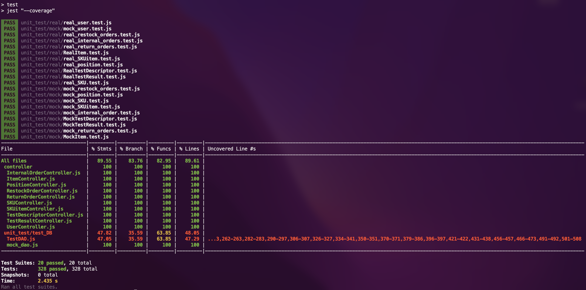

# Unit Testing Report

**Authors**:
 * Riccardo Medina
 * Simran Singh
 * Davide Arcolini
 * Giuseppe Atanasio

**Date**: 25 May 2022

**Version**: `1.0`

| Version number | Change |
| ----------------- |:-----------|
| 1.0 | Added first version of Unit Test Report document. | 

# Contents

- [Black Box Unit Tests](#black-box-unit-tests)

- [White Box Unit Tests](#white-box-unit-tests)

# Black Box Unit Tests

- [Class UserController](#class-usercontroller)
- [Class PositionController](#class-positioncontroller)
- [Class SKUitemController](#class-skuitemcontroller)
- [Class SKUController](#class-skucontroller)
- [Class InternalOrderController](#class-internalordercontroller)
- [Class ItemController](#class-itemcontroller)
- [Class RestockOrderController](#class-restockordercontroller)
- [Class ReturnOrderController](#class-returnordercontroller)
- [Class TestDescriptorController](#class-testdescriptorcontroller)
- [Class TestResultController](#class-testresultcontroller)

## **Class UserController**

### Class *UserController* - method **getStoredUsers**

**Criteria for method *getStoredUsers:***

- Database is reachable

**Predicates for method *getStoredUsers*:**

| Criteria | Predicate |
| -------- | --------- |
| Database is reachable | Yes |
|                       | No|

**Combination of predicates**:

Please note: There are users in the database

| Database is reachable | Valid / Invalid | Description of the test case | Jest test case |
|-------|-------|-------|-------|
| Yes | Valid | `getStoredUsers_TEST()` terminates retrieving the expected list of users | `function`<br> getStoredUsers_TEST(name, expected) |
| No | Invalid | `getStoredUsers_TEST()` catch 500 and terminates with that error| `function`<br> getStoredUsers_TEST(name, expected) |

### Class *UserController* - method **getSuppliers**

**Criteria for method *getSuppliers:***

- Database is reachable

**Predicates for method *getSuppliers*:**

| Criteria | Predicate |
| -------- | --------- |
| Database is reachable | Yes |
|                       | No|

**Combination of predicates**:

Please note: There are users in the database

| Database is reachable | Valid / Invalid | Description of the test case | Jest test case |
|-------|-------|-------|-------|
| Yes | Valid | `getSuppliers_TEST()` terminates retrieving the expected list of users | `function`<br> getSuppliers_TEST(name, expected) |
| No | Invalid | `getSuppliers_TEST()` catch 500 and terminates with that error| `function`<br> getSuppliers_TEST(name, expected) |

### **Class *UserController* - method *newUser***

**Criteria for method *newUser*:**

- req is not empty
- `username` is *unique* in the database

**Predicates for method *newUser*:**

| Criteria | Predicate |
| -------- | --------- |
| req not empty |Valid|
|          | undefined |
| `username` is *unique* in the database | True |
|          | False |
|          | undefined |

**Combination of predicates**:

| req not empty | `username` is *unique* in the database | Valid / Invalid | Description of the test case | Jest test case |
|-------|-------|-------|-------|-------|
| Valid | True | Valid | `newUser_TEST()` terminates with 201 | `function`<br>newUser_TEST("user ok", { <br>username : "clerk1@ezwh.com",<br>name: "Donald",<br>surname: "Trump",<br>type: "clerk",<br>password: "testpassword"<br>}, 201)|
| Valid | False | Invalid | `newUser_TEST()` terminates with 409 | `function`<br>newUser_TEST("user ok", { <br>username : "clerk1@ezwh.com",<br>name: "Donald",<br>surname: "Trump",<br>type: "clerk",<br>password: "testpassword"<br>}, 201) <br><br>newUser_TEST("user ok", { <br>username : "clerk1@ezwh.com",<br>name: "Donald",<br>surname: "Trump",<br>type: "clerk",<br>password: "testpassword"<br>}, 409) |
| undefined | undefined | Invalid | `newUser_TEST()` terminates with 503 | `function`<br>newUser_TEST("bad request", undefined, 503)|


### **Class *UserController* - method *getUser***

**Criteria for method *getUser*:**

- `username` is *unique* in the database
- Password valid
- req not empty

**Predicates for method *getUser*:**

| Criteria | Predicate |
| -------- | --------- |
| `username` is *unique* in the database | True |
|          | False |
|          | undefined |
| `password` valid | Yes |
|          | No |
|| undefined |
| req not empty | Valid |
|| undefined |

**Combination of predicates**

User already exists in the db:

```
{ 
    username: "mj@ezwh.com", 
    name: "Mary",
    surname: "Jane",
    password: "testpassword",
    type: "supplier"
}
```

| `username` is *unique* in the database | `password` valid | req not empty | Valid / Invalid | Description of the test case | Jest test case |
|-------|-------|-------|-------|-------|-------|
| True | Yes | Yes | Valid | `getUser_TEST()` terminates returning the exact expected value | `function`<br>getUser_TEST("ok",<br>{username: "mj@ezwh.com",<br>password: "testpassword"},<br>{id:1,<br>username: "mj@ezwh.com",<br>name: "Mary"}) |
| True | No | Yes | Invalid | `getUser_TEST()` terminates with 401 | `function`<br>getUser_TEST("wrong password", {id:1, username: "mj@ezwh.com", password: "ciaociao"}, 401) -> failed|
| False | Yes | Yes | Invalid | `getUser_TEST()` terminates with 401 | `function`<br>getUser_TEST("wrong username", {id:1, username: "customer1@ezwh.com", password: "testpassword"}, 401) |
| undefined | undefined | undefined | Invalid | `getUser_TEST()` terminates with `undefined`| `function`<br>getUser_TEST("bad request", undefined, undefined) |

### **Class *UserController* - method *editUser***

**Criteria for method *editUser*:**

- `username` exists in the database
- req not empty
- param not empty

**Predicates for method *editUser*:**

| Criteria | Predicate |
| -------- | --------- |
| `username` exists in the database | True |
|          | False |
|          | undefined |
| req not empty | Yes |
|          | No |
| param not empty | Yes |
|          | No |

**Combination of predicates**:

| `username` exists in the database | req not empty | param not empty | Valid / Invalid | Description of the test case | Jest test case |
|-------|-------|-------|-------|-------|-------|
| True | Yes | Yes | Valid | `editUser_TEST()` terminates with 200 | `function`<br>editUser_TEST("edited ok", {<br>"oldType" : "clerk",<br>"newType" : "qualityEmployee"},<br>"mj@ezwh.com",200) |
| False | Yes | Yes | Invalid | `editUser_TEST()` terminates with 404 | `function`<br>editUser_TEST("user not found",{<br>"oldType" : "clerk",<br>"newType" : "qualityEmployee"},<br>"user2@ezwh.com",404) |
| undefined | No | No | Invalid | `editUser_TEST()` terminates with 503 | `function`<br>editUser_TEST("bad request", undefined, "mj@ezwh.com", 503)|
| undefined | No | No | Invalid |`editUser_TEST()` terminates with 503 | `function`<br>editUser_TEST("bad request", {"oldType" : "clerk",<br>"newType" : "qualityEmployee"},<br>undefined, 503) |

### **Class *UserController* - method *deleteUser***

**Criteria for method *deleteUser*:**

- `username` exists in the database
- `type` corresponds to inserted user
- param not empty

**Predicates for method *name*:**

| Criteria | Predicate |
| -------- | --------- |
| `username` exists in the database | True |
|          | False |
|          | undefined |
| `type` corresponds to inserted user | True |
|| False |
|| undefined |
| param not empty | Yes |
|          | No |

**Combination of predicates**:

User already inserted:
```
{ 
    username: "mj@ezwh.com", 
    name: "Mary",
    surname: "Jane",
    password: "testpassword",
    type: "supplier"
}
```

| `username` exists in the database | `type` corresponds to inserted user | param not empty | Valid / Invalid | Description of the test case | Jest test case |
|-------|-------|-------|-------|-------|-------|
| True | True | Yes | Valid | `deleteUser_TEST()` terminates with 204 | `function`<br> deleteUser_TEST("deleted ok", {type: "supplier", username : "mj@ezwh.com"}, 204)|
| True | False | Yes | Invalid | `deleteUser_TEST()` terminates with 503 | `function`<br> deleteUser_TEST("type didn't match with user", {type: "clerk", username : "mj@ezwh.com"}, 503)|
| False | True | Yes | Invalid |  `deleteUser_TEST()` terminates with 503 | `function`<br> deleteUser_TEST("username not found", {type: "supplier", username : "pippo@ezwh.com"}, 503)|
| undefined | undefined | No | Invalid | `deleteUser_TEST()` terminates with 503 | `function`<br> deleteUser_TEST("bad request", undefined, 503)|

## **Class PositionController**
### **Class *PositionController* - method *getPositions()***
**Criteria for method *getPositions()*:**
 - Database is reachable

**Predicates for method *getPositions()*:**

| Criteria              | Predicate |
| :--------:            | :---------: |
| Database is reachable | *true* |
|                       | *false*|

**Combination of predicates**:
| Database is reachable | Valid / Invalid | Description of the test case | Jest test case |
|:-------:|:-------:|:-------:|:-------:|
| *true* | valid |`getPositions_TEST()` terminates with <br>`{code: 200}`|`function` <br>`getPositions_TEST(describe_NAME, expectedResult)`|
|*false*|invalid|`getPositions_TEST()` catch `TypeError` and terminates with <br>`{code: 500, message: "Internal Server Error"}`|`function` <br>`getPositions_TEST(describe_NAME, expectedResult)`|

### **Class *PositionController* - method *newPosition()***
**Criteria for method *newPosition()*:**
 - Database is reachable
 - `positionID` is *unique* in the database

**Predicates for method *newPosition()*:**
| Criteria              | Predicate |
| :--------:            | :---------: |
| Database is reachable | *true* |
|                       | *false*|
| `positionID` is *unique* in the database|*true*|
||*false*|

**Combination of predicates**:
| Database is reachable |`positionID` is *unique* in the database| Valid / Invalid | Description of the test case | Jest test case |
|:-------:|:-------:|:-------:|:-------:|:-------:|
| *true* |*true*| valid |`newPosition_TEST()` terminates with <br>`{code: 201, message: "CREATED"}` |`function` <br>`newPosition_TEST(describe_NAME, request, expectedResult)`|
| *true* |*false*| invalid |`newPosition_TEST()` catch `TypeError` and terminates with <br>`{code: 503, message: "Service Unavailable"}`|`function` <br>`newPosition_TEST(describe_NAME, request, expectedResult)`|
| *false* |*true*| invalid |`newPosition_TEST()` catch `TypeError` and terminates with <br>`{code: 503, message: "Service Unavailable"}`|`function` <br>`newPosition_TEST(describe_NAME, request, expectedResult)`|
| *false* |*false*| invalid |`newPosition_TEST()` catch `TypeError` and terminates with <br>`{code: 503, message: "Service Unavailable"}`|`function` <br>`newPosition_TEST(describe_NAME, request, expectedResult)`|


### **Class *PositionController* - method *editPosition()***
**Criteria for method *editPosition()*:**
 - Database is reachable
 - `positionID` *exists* in the database
 - **Position** associated to **SKU** satisfies `maxWeight` and `maxVolume` constraints

**Predicates for method *editPosition()*:**
 | Criteria              | Predicate |
| :--------:            | :---------: |
| Database is reachable | *true* |
|                       | *false*|
| `positionID` *exists* in the database|*true*|
||*false*|
|**Position** associated to **SKU** satisfies `maxWeight` and `maxVolume` constraints|*true*|
||*false*|

**Combination of predicates**:
| Database is reachable |`positionID` *exists* in the database|**Position** associated to **SKU** satisfies `maxWeight` and `maxVolume` constraints| Valid / Invalid | Description of the test case | Jest test case |
|:-------:|:-------:|:-------:|:-------:|:-------:|:-------:|
| *true* |*true*|*true*| valid |`editPosition_TEST()` terminates with <br>`{code: 200, message: "OK"}` |`function` <br>`editPosition_TEST(describe_NAME, params, request, expectedResult)`|
| *true* |*true*|*false*| invalid |`editPosition_TEST()` terminates with <br>`{code: 422, message: "Unprocessable Entity"}` |`function` <br>`editPosition_TEST(describe_NAME, params, request, expectedResult)`|
| *true* |*false*|*/*| invalid |`editPosition_TEST()` terminates with <br>`{code: 404, message: "Not Found"}` |`function` <br>`editPosition_TEST(describe_NAME, params, request, expectedResult)`|
| *false* |*/*|*/*| invalid |`editPosition_TEST()` catch `TypeError` and terminates with <br>`{code: 503, message: "Service Unavailable"}` |`function` <br>`editPosition_TEST(describe_NAME, params, request, expectedResult)`|


### **Class *PositionController* - method *editPositionID()***
**Criteria for method *editPositionID()*:**
 - Database is reachable
 - `positionID` *exists* in the database
 - `newPositionID` is *unique* in the database

**Predicates for method *editPositionID()*:**
 | Criteria              | Predicate |
| :--------:            | :---------: |
| Database is reachable | *true* |
|                       | *false*|
| `positionID` *exists* in the database|*true*|
||*false*|
|`newPositionID` is *unique* in the database|*true*|
||*false*|

**Combination of predicates**:
| Database is reachable |`positionID` *exists* in the database|`newPositionID` is *unique* in the database| Valid / Invalid | Description of the test case | Jest test case |
|:-------:|:-------:|:-------:|:-------:|:-------:|:-------:|
| *true* |*true*|*true*| valid |`editPositionID_TEST()` terminates with <br>`{code: 200, message: "OK"}` |`function` <br>`editPositionID_TEST(describe_NAME, params, request, expectedResult)`|
| *true* |*true*|*false*| invalid |`editPositionID_TEST()` catch `TypeError` and terminates with <br>`{code: 503, message: "Service Unavailable"}` |`function` <br>`editPositionID_TEST(describe_NAME, params, request, expectedResult)`|
| *true* |*false*|*/*| invalid |`editPositionID_TEST()` terminates with <br>`{code: 404, message: "Not Found"}` |`function` <br>`editPositionID_TEST(describe_NAME, params, request, expectedResult)`|
| *false* |*/*|*/*| invalid |`editPositionID_TEST()` catch `TypeError` and terminates with <br>`{code: 503, message: "Service Unavailable"}` |`function` <br>`editPositionID_TEST(describe_NAME, params, request, expectedResult)`|


### **Class *PositionController* - method *deletePosition()***
**Criteria for method *deletePosition()*:**
 - Database is reachable

**Predicates for method *deletePosition()*:**
 | Criteria              | Predicate |
| :--------:            | :---------: |
| Database is reachable | *true* |
|                       | *false*|

**Combination of predicates**:
| Database is reachable | Valid / Invalid | Description of the test case | Jest test case |
|:-------:|:-------:|:-------:|:-------:|
| *true* | valid |`deletePosition_TEST()` terminates with <br>`{code: 204, message: "NO CONTENT"}` |`function` <br>`deletePosition_TEST(describe_NAME, params, expectedResult)`|
|*false*| valid |`deletePosition_TEST()` catch `TypeError` and terminates with <br>`{code: 503, message: "Service Unavailable"}` |`function` <br>`deletePosition_TEST(describe_NAME, params, expectedResult)`|


## **Class SKUitemController**
### **Class *SKUitemController* - method *getSKUitems()***
**Criteria for method *getSKUitems()*:**
 - Database is reachable

**Predicates for method *getSKUitems()*:**

| Criteria              | Predicate |
| :--------:            | :---------: |
| Database is reachable | *true* |
|                       | *false*|

**Combination of predicates**:
| Database is reachable | Valid / Invalid | Description of the test case | Jest test case |
|:-------:|:-------:|:-------:|:-------:|
| *true* | valid |`getSKUitems_TEST()` terminates with <br>`{code: 200}`|`function` <br>`getSKUitems_TEST(describe_NAME, expectedResult)`|
|*false*| invalid |`getSKUitems_TEST()` catch `TypeError` and terminates with <br>`{code: 500, message: "Internal Server Error"}` |`function` <br>`getSKUitems_TEST(describe_NAME, expectedResult)`|


### **Class *SKUitemController* - method *getSKUitemsBySKUId()***
**Criteria for method *getSKUitemsBySKUId()*:**
 - Database is reachable
 - `SKUid` *exists* in the database

**Predicates for method *getSKUitemsBySKUId()*:**

| Criteria              | Predicate |
| :--------:            | :---------: |
| Database is reachable | *true* |
|                       | *false*|
|`SKUid` *exists* in the database|*true*|
||*false*|

**Combination of predicates**:
| Database is reachable |`SKUid` *exists* in the database| Valid / Invalid | Description of the test case | Jest test case |
|:-------:|:-------:|:-------:|:-------:|:-------:|
| *true* | *true* | valid |`getSKUitemsBySKUId_TEST()` terminates with <br>`{code: 200}`|`function` <br>`getSKUitemsBySKUId_TEST(describe_NAME, params, expectedResult)`|
| *true* | *false* | invalid |`getSKUitemsBySKUId_TEST()` terminates with <br>`{code: 404, message: "Not Found"}`|`function` <br>`getSKUitemsBySKUId_TEST(describe_NAME, params, expectedResult)`|
| *false* | */* | invalid |`getSKUitemsBySKUId_TEST()` catch `TypeError` and terminates with <br>`{code: 500, message: "Internal Server Error"}`|`function` <br>`getSKUitemsBySKUId_TEST(describe_NAME, params, expectedResult)`|


### **Class *SKUitemController* - method *getSKUitemsByRFID()***
**Criteria for method *getSKUitemsByRFID()*:**
 - Database is reachable
 - `RFID` *exists* in the database

**Predicates for method *getSKUitemsByRFID()*:**

| Criteria              | Predicate |
| :--------:            | :---------: |
| Database is reachable | *true* |
|                       | *false*|
|`RFID` *exists* in the database|*true*|
||*false*|

**Combination of predicates**:
| Database is reachable |`RFID` *exists* in the database| Valid / Invalid | Description of the test case | Jest test case |
|:-------:|:-------:|:-------:|:-------:|:-------:|
| *true* | *true* | valid |`getSKUitemsByRFID_TEST()` terminates with <br>`{code: 200}`|`function` <br>`getSKUitemsByRFID_TEST(describe_NAME, params, expectedResult)`|
| *true* | *false* | invalid |`getSKUitemsByRFID_TEST()` terminates with <br>`{code: 404, message: "Not Found"}`|`function` <br>`getSKUitemsByRFID_TEST(describe_NAME, params, expectedResult)`|
| *false* | */* | invalid |`getSKUitemsByRFID_TEST()` catch `TypeError` and terminates with <br>`{code: 500, message: "Internal Server Error"}`|`function` <br>`getSKUitemsByRFID_TEST(describe_NAME, params, expectedResult)`|

### **Class *SKUitemController* - method *newSKUitem()***
**Criteria for method *newSKUitem()*:**
 - Database is reachable
 - `SKUid` *exists* in the database
 - `RFID` is *unique* in the database

**Predicates for method *newSKUitem()*:**

| Criteria              | Predicate |
| :--------:            | :---------: |
| Database is reachable | *true* |
|                       | *false*|
|`SKUid` *exists* in the database|*true*|
||*false*|
|`RFID` is *unique* in the database|*true*|
||*false*|

**Combination of predicates**:
| Database is reachable |`SKUid` *exists* in the database|`RFID` is *unique* in the database| Valid / Invalid | Description of the test case | Jest test case |
|:-------:|:-------:|:-------:|:-------:|:-------:|:-------:|
| *true* | *true* |*true*| valid |`newSKUitem_TEST()` terminates with <br>`{code: 201, message: "CREATED"}`|`function` <br>`newSKUitem_TEST(describe_NAME, request, expectedResult)`|
| *true* | *true* |*false*| invalid |`newSKUitem_TEST()` catch `TypeError` and terminates with <br>`{code: 503, message: "Service Unavailable"}`|`function` <br>`newSKUitem_TEST(describe_NAME, request, expectedResult)`|
| *true* | *false* |*/*| invalid |`newSKUitem_TEST()` terminates with <br>`{code: 404, message: "Not Found"}`|`function` <br>`newSKUitem_TEST(describe_NAME, request, expectedResult)`|
| *false* | */* |*/*| invalid |`newSKUitem_TEST()` catch `TypeError` and terminates with <br>`{code: 503, message: "Service Unavailable"}`|`function` <br>`newSKUitem_TEST(describe_NAME, request, expectedResult)`|


### **Class *SKUitemController* - method *editSKUitem()***
**Criteria for method *editSKUitem()*:**
 - Database is reachable
 - `RFID` *exists* in the database

**Predicates for method *editSKUitem()*:**

| Criteria              | Predicate |
| :--------:            | :---------: |
| Database is reachable | *true* |
|                       | *false*|
|`RFID` *exists* in the database|*true*|
||*false*|

**Combination of predicates**:
| Database is reachable |`RFID` *exists* in the database|Valid / Invalid| Description of the test case | Jest test case |
|:-------:|:-------:|:-------:|:-------:|:-------:|
| *true* | *true* | valid |`editSKUitem_TEST()` terminates with <br>`{code: 201, message: "CREATED"}`|`function` <br>`editSKUitem_TEST(describe_NAME, params, request, expectedResult)`|
| *true* | *false* | invalid |`editSKUitem_TEST()` terminates with <br>`{code: 404, message: "Not Found"}`|`function` <br>`editSKUitem_TEST(describe_NAME, params, request, expectedResult)`|
| *false* | */* | invalid |`editSKUitem_TEST()` catch `TypeError` and terminates with <br>`{code: 503, message: "Service Unavailable"}`|`function` <br>`editSKUitem_TEST(describe_NAME, params, request, expectedResult)`|


### **Class *SKUitemController* - method *deleteSKUitem()***
**Criteria for method *deleteSKUitem()*:**
 - Database is reachable

**Predicates for method *deleteSKUitem()*:**

| Criteria              | Predicate |
| :--------:            | :---------: |
| Database is reachable | *true* |
|                       | *false*|

**Combination of predicates**:
| Database is reachable |Valid / Invalid| Description of the test case | Jest test case |
|:-------:|:-------:|:-------:|:-------:|
| *true* | valid |`deleteSKUitem_TEST()` terminates with <br>`{code: 204, message: "No Content"}`|`function` <br>`deleteSKUitem_TEST(describe_NAME, params, expectedResult)`|
| *false* | invalid |`deleteSKUitem_TEST()` catch `TypeError` and terminates with <br>`{code: 503, message: "Service Unavailable"}`|`function` <br>`deleteSKUitem_TEST(describe_NAME, params, expectedResult)`|


## **Class SKUController**
### **Class *SKUController* - method *getStoredSKUs()***
**Criteria for method *getStoredSKUs()*:**
 - Database is reachable

**Predicates for method *getStoredSKUs()*:**

| Criteria              | Predicate |
| :--------:            | :---------: |
| Database is reachable | *true* |
|                       | *false*|

**Combination of predicates**:
| Database is reachable | Valid / Invalid | Description of the test case | Jest test case |
|:-------:|:-------:|:-------:|:-------:|
| *true* | valid |`getStoredSKUs_TEST()` terminates with <br>`{code: 200}`|`function` <br>`getStoredSKUs_TEST(describe_NAME, expectedResult)`|
|*false*| invalid |`getStoredSKUs_TEST()` catch `TypeError` and terminates with <br>`{code: 500, message: "Internal Server Error"}` |`function` <br>`getStoredSKUs_TEST(describe_NAME, expectedResult)`|

### **Class *SKUController* - method *getStoredSKUById()***
**Criteria for method *getStoredSKUById()*:**
 - Database is reachable
 - `SKUid` *exists* in the database

**Predicates for method *getStoredSKUById()*:**

| Criteria              | Predicate |
| :--------:            | :---------: |
| Database is reachable | *true* |
|                       | *false*|
|`SKUid` *exists* in the database|*true*|
||*false*|

**Combination of predicates**:
| Database is reachable |`SKUid` *exists* in the database | Valid / Invalid | Description of the test case | Jest test case |
|:-------:|:-------:|:-------:|:-------:|:-------:|
| *true* |*true*| valid |`getStoredSKUById_TEST()` terminates with <br>`{code: 200}`|`function` <br>`getStoredSKUById_TEST(describe_NAME, params, expectedResult)`|
| *true* |*false*| invalid |`getStoredSKUById_TEST()` terminates with <br>`{code: 404, message: "Not Found"}`|`function` <br>`getStoredSKUById_TEST(describe_NAME, params, expectedResult)`|
| *false* |*/*| invalid |`getStoredSKUById_TEST()` catch `TypeError` and terminates with <br>`{code: 500, message: "Internal Server Error"}`|`function` <br>`getStoredSKUById_TEST(describe_NAME, params, expectedResult)`|


### **Class *SKUController* - method *newSKU()***
**Criteria for method *newSKU()*:**
 - Database is reachable

**Predicates for method *newSKU()*:**

| Criteria              | Predicate |
| :--------:            | :---------: |
| Database is reachable | *true* |
|                       | *false*|

**Combination of predicates**:
| Database is reachable | Valid / Invalid | Description of the test case | Jest test case |
|:-------:|:-------:|:-------:|:-------:|
| *true* | valid |`newSKU_TEST()` terminates with <br>`{code: 201, message: "CREATED"}`|`function` <br>`newSKU_TEST(describe_NAME, request, expectedResult)`|
| *false* | invalid |`newSKU_TEST()` catch `TypeError` and terminates with <br>`{code: 503, message: "Unprocessable Entity"}`|`function` <br>`newSKU_TEST(describe_NAME, request, expectedResult)`|


### **Class *SKUController* - method *editSKU()***
**Criteria for method *editSKU()*:**
 - Database is reachable
 - `SKUid` *exists* in the database
 - **Position** associated to **SKU** satisfies `maxWeight` and `maxVolume` constraints

**Predicates for method *editSKU()*:**

| Criteria              | Predicate |
| :--------:            | :---------: |
| Database is reachable | *true* |
|                       | *false*|
|`SKUid` *exists* in the database|*true*|
||*false*|
|**Position** associated to **SKU** satisfies `maxWeight` and `maxVolume` constraints|*true*|
||*false*|

**Combination of predicates**:
| Database is reachable |`SKUid` *exists* in the database |**Position** associated to **SKU** satisfies `maxWeight` and `maxVolume` constraints| Valid / Invalid | Description of the test case | Jest test case |
|:-------:|:-------:|:-------:|:-------:|:-------:|:-------:|
| *true* | *true* | *true* | valid |`editSKU_TEST()` terminates with <br>`{code: 200}`|`function` <br>`editSKU_TEST(describe_NAME, params, request, expectedResult)`|
| *true* | *true* | *false* | invalid |`editSKU_TEST()` terminates with <br>`{code: 422, message: "Unprocessable Entity"}`|`function` <br>`editSKU_TEST(describe_NAME, params, request, expectedResult)`|
| *true* | *false* | */* | invalid |`editSKU_TEST()` terminates with <br>`{code: 404, message: "Not Found"}`|`function` <br>`editSKU_TEST(describe_NAME, params, request, expectedResult)`|
| *false* | */* | */* | invalid |`editSKU_TEST()` catch `TypeError` and terminates with <br>`{code: 503, message: "Service Unavailable"}`|`function` <br>`editSKU_TEST(describe_NAME, params, request, expectedResult)`|


### **Class *SKUController* - method *addOrEditPositionSKU()***
**Criteria for method *addOrEditPositionSKU()*:**
 - Database is reachable
 - `positionID` is already assigned to **SKU**
 - `SKUid` *exists* in the database
 - `positionID` *exists* in the database
 - **Position** associated to **SKU** satisfies `maxWeight` and `maxVolume` constraints

**Predicates for method *editSKU()*:**

| Criteria              | Predicate |
| :--------:            | :---------: |
| Database is reachable | *true* |
|                       | *false*|
|`positionID` is already assigned to **SKU**|*true*|
||*false*|
|`SKUid` *exists* in the database|*true*|
||*false*|
|`positionID` *exists* in the database|*true*|
||*false*|
|**Position** associated to **SKU** satisfies `maxWeight` and `maxVolume` constraints|*true*|
||*false*|

**Combination of predicates**:
| Database is reachable |`positionID` is already assigned to **SKU** |`SKUid` *exists* in the database|`positionID` *exists* in the database|**Position** associated to **SKU** satisfies `maxWeight` and `maxVolume` constraints| Valid / Invalid | Description of the test case | Jest test case |
|:-------:|:-------:|:-------:|:-------:|:-------:|:-------:|:-------:|:-------:|
| *true* | *false* | *true* | *true* | *true* | valid |`addOrEditPositionSKU_TEST()` terminates with <br>`{code: 200}`|`function` <br>`addOrEditPositionSKU_TEST(describe_NAME, params, request, expectedResult)`|
| *true* | *false* | *true* | *true* | *false* | invalid |`addOrEditPositionSKU_TEST()` terminates with <br>`{code: 422, message: "Unprocessable Entity"}`|`function` <br>`addOrEditPositionSKU_TEST(describe_NAME, params, request, expectedResult)`|
| *true* | *false* | *true* | *false* | */* | invalid |`addOrEditPositionSKU_TEST()` terminates with <br>`{code: 404, message: "Not Found"}`|`function` <br>`addOrEditPositionSKU_TEST(describe_NAME, params, request, expectedResult)`|
| *true* | *false* | *false* | */* | */* | invalid |`addOrEditPositionSKU_TEST()` terminates with <br>`{code: 404, message: "Not Found"}`|`function` <br>`addOrEditPositionSKU_TEST(describe_NAME, params, request, expectedResult)`|
| *true* | *true* | */* | */* | */* | invalid |`addOrEditPositionSKU_TEST()` terminates with <br>`{code: 422, message: "Unprocessable Entity"}`|`function` <br>`addOrEditPositionSKU_TEST(describe_NAME, params, request, expectedResult)`|
| *false* | */* | */* | */* | */* | invalid |`addOrEditPositionSKU_TEST()` catch `TypeError` and terminates with <br>`{code: 503, message: "Service Unavailable"}`|`function` <br>`addOrEditPositionSKU_TEST(describe_NAME, params, request, expectedResult)`|

### **Class *SKUController* - method *deleteSKU()***
**Criteria for method *deleteSKU()*:**
 - Database is reachable
 - **SKU** is associated with **TestDescriptors**
 - **SKU** is associated with **SKUItems**

**Predicates for method *deleteSKU()*:**

| Criteria              | Predicate |
| :--------:            | :---------: |
| Database is reachable | *true* |
|                       | *false*|
|**SKU** is associated with **TestDescriptors**|*true*|
||*false*|
|**SKU** is associated with **SKUItems**|*true*|
||*false*|


**Combination of predicates**:
| Database is reachable |**SKU** is associated with **TestDescriptors** |**SKU** is associated with **SKUItems**| Valid / Invalid | Description of the test case | Jest test case |
|:-------:|:-------:|:-------:|:-------:|:-------:|:-------:|
| *true* | *false* | *false* | valid |`deleteSKU_TEST()` terminates with <br>`{code: 204, message: "No Content"}`|`function` <br>`deleteSKU_TEST(describe_NAME, params, expectedResult)`|
| *true* | *true* | *false* | invalid |`deleteSKU_TEST()` terminates with <br>`{code: 422, message: "Unprocessable Entity"}`|`function` <br>`deleteSKU_TEST(describe_NAME, params, expectedResult)`|
| *true* | *false* | *true* | invalid |`deleteSKU_TEST()` terminates with <br>`{code: 422, message: "Unprocessable Entity"}`|`function` <br>`deleteSKU_TEST(describe_NAME, params, expectedResult)`|
| *true* | *false* | *false* | invalid |`deleteSKU_TEST()` terminates with <br>`{code: 422, message: "Unprocessable Entity"}`|`function` <br>`deleteSKU_TEST(describe_NAME, params, expectedResult)`|
| *false* | */* | */* | invalid |`deleteSKU_TEST()` catch `TypeError` and terminates with <br>`{code: 503, message: "Service Unavailable"}`|`function` <br>`deleteSKU_TEST(describe_NAME, params, expectedResult)`|


## **Class InternalOrderController**


**Criteria for method *getInternalOrders*:**
    
 - Database is reachable


**Predicates for method *getInternalOrders*:**
| Criteria              | Predicate |
| :--------:            | :---------: |
| Database is reachable | *true* |
|                       | *false*|


**Combination of predicates**:


| Database is reachable | Valid / Invalid | Description of the test case | Jest test case |
|:-------:|:-------:|:-------:|:-------:|
| *true* | valid |`getInternalOrders(expected)` returns <br>an array of the internal orders retrieved |`function` <br>`getInternalOrders(expected)`|
|*false*|invalid|`getInternalOrders(expected)` catch `TypeError` and terminates with <br>`{code: 500, message: "Internal Server Error"}`|`function` <br>`getInternalOrders(expected)`|


### **Class *InternalOrderController* - method *getInternalOrdersIssued***


**Criteria for method *getInternalOrdersIssued*:**
    
 - Database is reachable


**Predicates for method *getInternalOrdersIssued*:**

| Criteria              | Predicate |
| :--------:            | :---------: |
| Database is reachable | *true* |
|                       | *false*|


**Combination of predicates**:


| Database is reachable | Valid / Invalid | Description of the test case | Jest test case |
|:-------:|:-------:|:-------:|:-------:|
| *true* | valid |`getInternalOrdersIssued(expected)` returns <br>an array of the internal orders retrieved |`function` <br>`getInternalOrdersIssued(expected)`|
|*false*|invalid|`getInternalOrdersIssued(expected)` catch `TypeError` and terminates with <br>`{code: 500, message: "Internal Server Error"}`|`function` <br>`getInternalOrdersIssued(expected)`|


### **Class *InternalOrderController* - method *getInternalOrdersAccepted***


**Criteria for method *getInternalOrdersAccepted*:**
    
 - Database is reachable


**Predicates for method *getInternalOrdersAccepted*:**

| Criteria              | Predicate |
| :--------:            | :---------: |
| Database is reachable | *true* |
|                       | *false*|


**Combination of predicates**:


| Database is reachable | Valid / Invalid | Description of the test case | Jest test case |
|:-------:|:-------:|:-------:|:-------:|
| *true* | valid |`getInternalOrdersAccepted(expected)` returns <br>an array of the internal orders retrieved |`function` <br>`getInternalOrdersAccepted(expected)`|
|*false*|invalid|`getInternalOrdersAccepted(expected)` catch `TypeError` and terminates with <br>`{code: 500, message: "Internal Server Error"}`|`function` <br>`getInternalOrdersAccepted(expected)`|


### **Class *InternalOrderController* - method *getInternalOrderById***


**Criteria for method *getInternalOrderById*:**
- Database is reachable 
- Internal order associated to the `id` *exists* in the db


**Predicates for method *getInternalOrderById*:**

| Criteria | Predicate |
| :--------: | :---------: |
| Database is reachable | *true* |
|                       | *false*|
| internal order associated to the `id` *exists* in the database|*true*|
||*false*|


**Combination of predicates**:


| Database reachable | `id` *exists* in the database | Valid / Invalid | Description of the test case | Jest test case |
|:-------:|:-------:|:-------:|:-------:|:-------:|
| *true* | *true* | valid | `getInternalOrderById` retrieves the <br>internal order associated to the `id` |`function` <br>` getInternalOrderById(req,expected)` |
| *true* | *false* | invalid | `getInternalOrderById` terminates with <br>`{message: "Not Found"}`|  `function` <br> `getInternalOrderById(req,expected)` |
| *false* | */* | invalid | `getInternalOrderById` catch `TypeError` and terminates with <br>`{code: 500, message: "Internal Server Error"}` | `function` <br>` getInternalOrderById(req,expected)` |

### **Class *InternalOrderController* - method *createInternalOrder***


### **Class *InternalOrderController* - method *createInternalOrder***


**Criteria for method *createInternalOrder*:**

- Database is reachable
- `issueDate` saved in the db as expected
- `customerId` saved in the db as expected
- `products` saved in the db as expected


**Predicates for method *createInternalOrder*:**

| Criteria              | Predicate |
| :--------:            | :---------: |
| Database is reachable | *true* |
|                       | *false*|
| `issueDate` | *true* |
|                       | *false*|
| `customerId` | *true* |
|                       | *false*|
| `products` | *true* |
|                       | *false*|


**Combination of predicates**:


| Database is reachable | `issueDate` | `customerId` | `products` | Valid / Invalid | Description of the test case | Jest test case |
|:-------:|:-------:|:-------:|:-------:|:-------:|:-------:|:-------:|
| *true* | *true* |*true* |*true* | valid | `createInternalOrder(issueDate,products,customerId,expected)` creates a new internal order and it retrieves the new internal order to compare with the one expected  |`function` <br>`createInternalOrder(issueDate,products,customerId,expected)`|
| *true* | *false* |*true* |*true* | invalid | `createInternalOrder(issueDate,products,customerId,expected)` creates a new internal order but the internal order's the `issueDate` is not as expected therefore the test failes |`function` <br>`createInternalOrder(issueDate,products,customerId,expected)`|
| *true* | *true* |*false* |*true* | invalid | `createInternalOrder(issueDate,products,customerId,expected)` creates a new internal order but the internal order's the `customerId` is not as expected  |`function` <br>`createInternalOrder(issueDate,products,customerId,expected)`|
| *true* | *true* |*true* |*false* | invalid | `createInternalOrder(issueDate,products,customerId,expected)` creates a new internal order but the internal order's the `products` is not as expected  |`function` <br>`createInternalOrder(issueDate,products,customerId,expected)`|
| *false* | *true* |*true* |*true* | invalid | `createInternalOrder(issueDate,products,customerId,expected)` catch `TypeError` and terminates with <br>`{code: 503, message: "Service Unavailable"}`  |`function` <br>`createInternalOrder(issueDate,products,customerId,expected)`|


### **Class *InternalOrderController* - method *modifyInternalOrderState***


**Criteria for method *modifyInternalOrderState*:**
    
 - Database is reachable
 - internal order associated to the `id`  *exists* in the database
 - `newState` constraint


**Predicates for method *modifyInternalOrderState*:**

| Criteria              | Predicate |
| :--------:            | :---------: |
| Database is reachable | *true* |
|                       | *false*|
|`id` *exists* in the database|*true*|
||*false*|
| `newState`|"ISSUED"|
| |"ACCEPTED"|
| |"REFUSED"|
| |"CANCELED"|
| |"COMPLETED"|
| `products` are defined |*true*|
||*false*|


**Combination of predicates**:


| Database is reachable |`id` *exists* in the database| `newState` |  `products`| Valid / Invalid | Description of the test case | Jest test case |
|:-------:|:-------:|:-------:|:-------:|:-------:|:-------:|:-------:|
| *true* | *true* | "ISSUED"  | *false* |  valid |`modifyInternalOrderState(id,newState,products,expected)` returns the `id` of the internal order successfully edited|`function` <br>`modifyInternalOrderState(id,newState,products,expected)` |
| *true* | *true* | "ACCEPTED"  | *false* |  valid |`modifyInternalOrderState(id,newState,products,expected)` returns the `id` of the internal order successfully edited|`function` <br>`modifyInternalOrderState(id,newState,products,expected)` |
| *true* | *true* | "REFUSED"  | *false* |  valid |`modifyInternalOrderState(id,newState,products,expected)` returns the `id` of the internal order successfully edited|`function` <br>`modifyInternalOrderState(id,newState,products,expected)` |
| *true* | *true* | "CANCELED"  | *false* |  valid |`modifyInternalOrderState(id,newState,products,expected)` returns the `id` of the internal order successfully edited|`function` <br>`modifyInternalOrderState(id,newState,products,expected)` |
| *true* | *true* | "COMPLETED"  | *true* |  valid |`modifyInternalOrderState(id,newState,products,expected)` returns the `id` of the internal order successfully edited|`function` <br>`modifyInternalOrderState(id,newState,products,expected)` |
| *true* | *true* | "COMPLETED"  | *false* |  invalid |`modifyInternalOrderState(id,newState,products,expected)` returns `{Unprocessable}`|`function` <br>`modifyInternalOrderState(id,newState,products,expected)` |
| *true* | *false* | "COMPLETED"  | *true* |  invalid |`modifyInternalOrderState(id,newState,products,expected)` returns `{message: "Not Found"}`|`function` <br>`modifyInternalOrderState(id,newState,products,expected)` |
| *true* | *false* | "ISSUED"  | *false* |  invalid |`modifyInternalOrderState(id,newState,products,expected)` returns `{message: "Not Found"}`|`function` <br>`modifyInternalOrderState(id,newState,products,expected)` |
| *true* | *false* | "ACCEPTED"  | *false* |  invalid |`modifyInternalOrderState(id,newState,products,expected)` returns `{message: "Not Found"}`|`function` <br>`modifyInternalOrderState(id,newState,products,expected)` |
| *true* | *false* | "CANCELED"  | *false* |  invalid |`modifyInternalOrderState(id,newState,products,expected)` returns `{message: "Not Found"}`|`function` <br>`modifyInternalOrderState(id,newState,products,expected)` |
| *true* | *false* | "REFUSED"  | *false* |  invalid |`modifyInternalOrderState(id,newState,products,expected)` returns `{message: "Not Found"}`|`function` <br>`modifyInternalOrderState(id,newState,products,expected)` |
| *false* | *true* | "ISSUED"  | *false* |  invalid |`modifyInternalOrderState(id,newState,products,expected)` catch `TypeError` and terminates with <br>`{code: 503, message: "Service Unavailable"}`|`function` <br>`modifyInternalOrderState(id,newState,products,expected)` |
| *false* | *true* | "ACCEPTED"  | *false* |  invalid |`modifyInternalOrderState(id,newState,products,expected)` catch `TypeError` and terminates with <br>`{code: 503, message: "Service Unavailable"}`|`function` <br>`modifyInternalOrderState(id,newState,products,expected)` |
| *false* | *true* | "REFUSED"  | *false* |  invalid |`modifyInternalOrderState(id,newState,products,expected)` catch `TypeError` and terminates with <br>`{code: 503, message: "Service Unavailable"}`|`function` <br>`modifyInternalOrderState(id,newState,products,expected)` |
| *false* | *true* | "CANCELED"  | *false* |  invalid |`modifyInternalOrderState(id,newState,products,expected)` catch `TypeError` and terminates with <br>`{code: 503, message: "Service Unavailable"}`|`function` <br>`modifyInternalOrderState(id,newState,products,expected)` |
| *false* | *true* | "COMPLETED"  | *true* |  invalid |`modifyInternalOrderState(id,newState,products,expected)` catch `TypeError` and terminates with <br>`{code: 503, message: "Service Unavailable"}`|`function` <br>`modifyInternalOrderState(id,newState,products,expected)` |


### **Class *InternalOrderController* - method *deleteInternalOrder***


**Criteria for method *deleteInternalOrder*:**
    
 - Database is reachable


**Predicates for method *deleteInternalOrder*:**

| Criteria              | Predicate |
| :--------:            | :---------: |
| Database is reachable | *true* |
|                       | *false*|


**Combination of predicates**:


| Database is reachable | Valid / Invalid | Description of the test case | Jest test case |
|:-------:|:-------:|:-------:|:-------:|
| *true* | valid |`deleteInternalOrder(req)` return the `id` of the internal order deleted successfully|`function` <br>`deleteInternalOrder(req)`|
| *false* | invalid |`deleteInternalOrder(req)` catch `TypeError` and terminates with <br>`{code: 503, message: "Unprocessable Entity"}`|`function` <br>`deleteInternalOrder(req)`|

## **Class ItemController**
### **Class *ItemController* - method *getItems***


**Criteria for method *getItems*:**
    

 - Database is reachable


**Predicates for method *getItems*:**

| Criteria | Predicate |
| -------- | --------- |
|  DB is reachable        | true          |
|          |    false       |


**Combination of predicates**:


| DB is reachable  | Valid / Invalid | Description of the test case | Jest test case |
|-------|-------|-------|-------|
|true|valid|getItems() terminates with results returned|function getItems([{id:1,description : "a new item",price : 10.99, SKUId : 1, supplierId : 2},{id:2, description : "another item", price : 12.99, SKUId : 2, supplierId : 1}]) |
|false|invalid|getItems() catches an error and return 500 |function getItems(500)|


### **Class *ItemController*- method *getItemById***


**Criteria for method *getItemById*:**
    

 - Database is reachable  
 - id is unique in the DB


**Predicates for method *getItemById*:**

| Criteria | Predicate |
| -------- | --------- |
|    DB is reachable        |     true      |
|          |    false       |
|    id exists in the DB      |     true      |
|          |    false       |


**Combination of predicates**:


| DB is reachable | Id exists in the DB |  Valid / Invalid | Description of the test case | Jest test case |
|-------|-------|------|-------|-------|
|true|true|     valid                   |getItemById() terminates with result returned|function getItemById({id: 1},{id:1, description :"a new item", price : 10.99, SKUId : 1, supplierId : 2})|
|true|false|invalid                     |getItemById() fails on id check and return 404 |function getItemById({id: 2}, 404)|
|false|true|     invalid                           |getItemById() catches an error and return 500|function getItemById(undefined, 500)|
|false|true|            invalid                    |getItemById() catches an error and return 500|function getItemById(undefined, 500)|

### **Class *ItemController*- method *createItem***


**Criteria for method *createItem*:**
    

 - Database is reachable
 - SKUId exists in database
 - supplier doesn't sell same id
 - supplier doesn't sell same SKUid


**Predicates for method *createItem*:**

| Criteria | Predicate |
| -------- | --------- |
|    DB is reachable      |      true     |
|          |    false       |
|    SKUId exists in the DB      |   true        |
|          |    false       |
|supplier doesn't sell same id|true|
|          |    false       |
|supplier doesn't sell same SKUId|true|
|          |    false       |


**Combination of predicates**:


| DB is reachable | SKUId exists in the DB|supplier doesn't sell same id|supplier doesn't sell same SKUId| Valid / Invalid | Description of the test case | Jest test case |
|-------|-------|-------|-------|-------|-------|-------|
|true|true|true|true|valid|createItem() terminates with 201|function createItem( 201, {id : 12, description : "a new item", price : 10.99, SKUId : 25, supplierId : 2})|
|true|true|true|false|invalid|createItem() fails on SKUid check|function createItem( 404, {  id : 12, description : "a new item", price : 10.99,  SKUId : 30,  supplierId : 2})|
|true|true|false|/|invalid|createItem() fails on id check|function createItem(422, { id : 13, description : "a new item", price : 10.99, SKUId : 28, supplierId : 2})|
|true|false|/|/|invalid|createItem() fails on SKUId check|function createItem( 404, {  id : 12, description : "a new item", price : 10.99, SKUId : 30, supplierId : 2})|
|false|/|/|/|invalid|createItem() catches an error and return 503|function createItem(503, undefined)|

### **Class *ItemController*- method *modifyItem***


**Criteria for method *modifyItem*:**
    

 - Database is reachable
 - id exists in the database


**Predicates for method *modifyItem*:**

| Criteria | Predicate |
| -------- | --------- |
|   DB is reachable       |   true        |
|          |    false       |
|  id exists in the DB        |   true        |
|          |    false       |


**Combination of predicates**:


| DB is reachable | id exists in the DB | Valid / Invalid | Description of the test case | Jest test case |
|-------|-------|-------|-------|-------|
|true|true|valid|modifytestDescriptor() terminates with 200|function modifyItem(200, { newDescription : "a new sku", newPrice : 10.99}, {id: 13})|
|true|false|invalid|modifyItem() fails on id search|function modifyItem(404,{ newDescription : "a new sku", newPrice : 10.99}, {id: 12})
|false|/|invalid|modifyItem() catches an error and return 503|function modifyItem(503, undefined, undefined)|

### **Class *ItemController*- method *deleteItem***


**Criteria for method *deleteItem*:**
    

 - Database is reachable
 - 


**Predicates for method *deleteItem*:**

| Criteria | Predicate |
| -------- | --------- |
|     DB is reachable     |      true     |
|          |    false       |


**Combination of predicates**:


| DB is reachable|Valid / Invalid | Description of the test case | Jest test case |
|-------|-------|-------|-------|
|true|valid|deleteItem() terminates with 204|function deleteItem(204,{id: 13})|
|false|invalid|deleteItem catches an error and return 503|function deleteItem(503,undefined)|


## **Class RestockOrderController**


### **Class *RestockOrderController* - method *getRestockOrders***


**Criteria for method *getRestockOrders*:**
    
 - Database is reachable


**Predicates for method *getRestockOrders*:**

| Criteria              | Predicate |
| :--------:            | :---------: |
| Database is reachable | *true* |
|                       | *false*|


**Combination of predicates**:


| Database is reachable | Valid / Invalid | Description of the test case | Jest test case |
|:-------:|:-------:|:-------:|:-------:|
| *true* | valid |`getRestockOrders(expected)` returns <br>an array of the restock orders retrieved |`function` <br>`getRestockOrders(expected)`|
|*false*|invalid|`getRestockOrders(expected)` catch `TypeError` and terminates with <br>`{code: 500, message: "Internal Server Error"}`|`function` <br>`getRestockOrders(expected)`|


### **Class *RestockOrderController* - method *getRestockOrdersIssued***


**Criteria for method *getRestockOrdersIssued*:**
    
 - Database is reachable


**Predicates for method *getRestockOrdersIssued*:**

| Criteria              | Predicate |
| :--------:            | :---------: |
| Database is reachable | *true* |
|                       | *false*|

**Combination of predicates**:

| Database is reachable | Valid / Invalid | Description of the test case | Jest test case |
|:-------:|:-------:|:-------:|:-------:|
| *true* | valid |`getRestockOrdersIssued(expected)` returns <br>an array of the restock orders issued retrieved |`function` <br>`getRestockOrdersIssued(expected)`|
|*false*|invalid|`getRestockOrders(expected)` catch `TypeError` and terminates with <br>`{code: 500, message: "Internal Server Error"}`|`function` <br>`getRestockOrdersIssued(expected)`|
### **Class *RestockOrderController* - method *getRestockOrderById***


**Criteria for method *getRestockOrderById*:**
- Database is reachable 
- restock order associated to the `id` *exists* in the db


**Predicates for method *getRestockOrderById*:**

| Criteria | Predicate |
| :--------: | :---------: |
| Database is reachable | *true* |
|                       | *false*|
| restock order associated to the `id` *exists* in the database|*true*|
||*false*|


**Combination of predicates**:


| Database reachable | `id` *exists* in the database | Valid / Invalid | Description of the test case | Jest test case |
|:-------:|:-------:|:-------:|:-------:|:-------:|
| *true* | *true* | valid | `getRestockOrderById` retrieves the <br>restock order associated to the `id` |`function` <br>` getRestockOrderById(req,expected)` |
| *true* | *false* | invalid | `getRestockOrderById` terminates with <br>`{message: "Not Found"}`|  `function` <br> `getRestockOrderById(req,expected)` |
| *false* | */* | invalid | `getRestockOrderById` catch `TypeError` and terminates with <br>`{code: 500, message: "Internal Server Error"}` | `function` <br>` getRestockOrderById(req,expected)` |


### **Class *RestockOrderController* - method *createRestockOrder***


**Criteria for method *createRestockOrder*:**
    
- Database is reachable
- `issueDate` saved in the db as expected
- `supplierId` saved in the db as expected
- `products` saved in the db as expected


**Predicates for method *createRestockOrder*:**

| Criteria              | Predicate |
| :--------:            | :---------: |
| Database is reachable | *true* |
|                       | *false*|
| `issueDate` | *true* |
|                       | *false*|
| `supplierId` | *true* |
|                       | *false*|
| `products` | *true* |
|                       | *false*|


**Combination of predicates**:


| Database is reachable | `issueDate` | `supplierId` | `products` | Valid / Invalid | Description of the test case | Jest test case |
|:-------:|:-------:|:-------:|:-------:|:-------:|:-------:|:-------:|
| *true* | *true* |*true* |*true* | valid | `createRestockOrder(issueDate,supplierId,products,expected)` creates a new restock order and it retrieves the new restock  order to compare with the one expected  |`function` <br>`createRestockOrder(issueDate,supplierId,products,expected)`|
| *true* | *false* |*true* |*true* | invalid | `createRestockOrder(issueDate,supplierId,products,expected)` creates a new restock  order but the restock  order's the `issueDate` is not as expected therefore the test failes |`function` <br>`createRestockOrder(issueDate,supplierId,products,expected)`|
| *true* | *true* |*false* |*true* | invalid | `createRestockOrder(issueDate,supplierId,products,expected)` creates a new restock order but the restock  order's the `supplierId` is not as expected  |`function` <br>`createRestockOrder(issueDate,supplierId,products,expected)`|
| *true* | *true* |*true* |*false* | invalid | `createRestockOrder(issueDate,supplierId,products,expected)` creates a new restock  order but the restock  order's the `products` is not as expected  |`function` <br>`createRestockOrder(issueDate,supplierId,products,expected)`|
| *false* | *true* |*true* |*true* | invalid | `createRestockOrder(issueDate,supplierId,products,expected)` catch `TypeError` and terminates with <br>`{code: 503, message: "Service Unavailable"}`  |`function` <br>`createRestockOrder(issueDate,supplierId,products,expected)`|

### **Class *RestockOrderController* - method *modifyRestockOrderState***


**Criteria for method *modifyRestockOrderState*:**
    
 - Database is reachable
 - internal order associated to the `id`  *exists* in the database
 - `newState` 


**Predicates for method *modifyRestockOrderState*:**

| Criteria              | Predicate |
| :--------:            | :---------: |
| Database is reachable | *true* |
|                       | *false*|
|`id` *exists* in the database|*true*|
||*false*|
| `newState`|"ISSUED"|
| |"DELIVERY"|
| |"DELIVERED"|
| |"TESTED"|
| |"COMPLETEDRETURN"|
| |"COMPLETED"|


**Combination of predicates**:


| Database is reachable |`id` *exists* in the database| `newState` | Valid / Invalid | Description of the test case | Jest test case |
|:-------:|:-------:|:-------:|:-------:|:-------:|:-------:|
| *true* | *true* | "ISSUED"  | valid |`modifyRestockOrderState(id,newState,expected)` returns the `id` of the restock order successfully edited|`function` <br>`modifyRestockOrderState(id,newState,expected)` |
| *true* | *true* | "DELIVERY"  | valid |`modifyRestockOrderState(id,newState,expected)` returns the `id` of the restock order successfully edited|`function` <br>`modifyRestockOrderState(id,newState,expected)` |
| *true* | *true* | "DELIVERED"  | valid |`modifyRestockOrderState(id,newState,expected)` returns the `id` of the restock order successfully edited|`function` <br>`modifyRestockOrderState(id,newState,expected)` |
| *true* | *true* | "TESTED"  | valid |`modifyRestockOrderState(id,newState,expected)` returns the `id` of the restock order successfully edited|`function` <br>`modifyRestockOrderState(id,newState,expected)` |
| *true* | *true* | "COMPLETED"  | valid |`modifyRestockOrderState(id,newState,expected)` returns the `id` of the restock order successfully edited|`function` <br>`modifyRestockOrderState(id,newState,expected)` |
| *true* | *true* | "COMPLETEDRETURN"  | valid |`modifyRestockOrderState(id,newState,expected)` returns the `id` of the restock order successfully edited|`function` <br>`modifyRestockOrderState(id,newState,expected)` |
| *true* | *false* | "ISSUED"  | invalid |`modifyRestockOrderState(id,newState,expected)` returns returns `{message: "Not Found"}`|`function` <br>`modifyRestockOrderState(id,newState,expected)` |
| *true* | *false* | "DELIVERY"  | invalid |`modifyRestockOrderState(id,newState,expected)` returns returns `{message: "Not Found"}`|`function` <br>`modifyRestockOrderState(id,newState,expected)` |
| *true* | *false* | "DELIVERED"  | invalid |`modifyRestockOrderState(id,newState,expected)` returns returns `{message: "Not Found"}`|`function` <br>`modifyRestockOrderState(id,newState,expected)` |
| *true* | *false* | "TESTED"  | invalid |`modifyRestockOrderState(id,newState,expected)` returns returns `{message: "Not Found"}`|`function` <br>`modifyRestockOrderState(id,newState,expected)` |
| *true* | *false* | "COMPLETED"  | invalid |`modifyRestockOrderState(id,newState,expected)` returns returns `{message: "Not Found"}`|`function` <br>`modifyRestockOrderState(id,newState,expected)` |
| *true* | *false* | "COMPLETEDRETURN"  | invalid |`modifyRestockOrderState(id,newState,expected)` returns returns `{message: "Not Found"}`|`function` <br>`modifyRestockOrderState(id,newState,expected)` |
| *false* | *true* | "ISSUED"  | invalid |`modifyRestockOrderState(id,newState,expected)` catch `TypeError` and terminates with <br>`{code: 503, message: "Service Unavailable"}`|`function` <br>`modifyRestockOrderState(id,newState,expected)` |
| *false* | *true* | "DELIVERY"  | invalid |`modifyRestockOrderState(id,newState,expected)` catch `TypeError` and terminates with <br>`{code: 503, message: "Service Unavailable"}`|`function` <br>`modifyRestockOrderState(id,newState,expected)` |
| *false* | *true* | "DELIVERED"  | invalid |`modifyRestockOrderState(id,newState,expected)` catch `TypeError` and terminates with <br>`{code: 503, message: "Service Unavailable"}`|`function` <br>`modifyRestockOrderState(id,newState,expected)` |
| *false* | *true* | "TESTED"  | invalid |`modifyRestockOrderState(id,newState,expected)` catch `TypeError` and terminates with <br>`{code: 503, message: "Service Unavailable"}`|`function` <br>`modifyRestockOrderState(id,newState,expected)` |
| *false* | *true* | "COMPLETED"  | invalid |`modifyRestockOrderState(id,newState,expected)` catch `TypeError` and terminates with <br>`{code: 503, message: "Service Unavailable"}`|`function` <br>`modifyRestockOrderState(id,newState,expected)` |
| *false* | *true* | "COMPLETEDRETURN"  | invalid |`modifyRestockOrderState(id,newState,expected)` catch `TypeError` and terminates with <br>`{code: 503, message: "Service Unavailable"}`|`function` <br>`modifyRestockOrderState(id,newState,expected)` |


### **Class *RestockOrderController* - method *addTransportNote***


**Criteria for method *addTransportNote*:**
    
- Database is reachable
- restock order associated to the `id`  *exists* in the database
- restock order's `state` = "DELIVERY"
- `deliveryDate` after `issueDate`


**Predicates for method *addTransportNote*:**
| Criteria              | Predicate |
| :--------:            | :---------: |
| Database is reachable | *true* |
|                       | *false*|
|`id` *exists* in the database|*true*|
||*false*|
| `newState`|"DELIVERY"|
| | other|
| `deliveryDate` after `issueDate` | *true* |
|                       | *false*|


**Combination of predicates**:


| Database is reachable |`id` *exists* in the database| `newState` |   `deliveryDate` after `issueDate` | Valid / Invalid | Description of the test case | Jest test case |
|:-------:|:-------:|:-------:|:-------:|:-------:|:-------:|:-------:|
| *true* | *true* | "DELIVERY"  | *true* |  valid |`addTransportNote(id,transportNote,expected)` returns the `id` of the restock order successfully edited|`function` <br>`addTransportNote(id,transportNote,expected)` |
| *true* | *true* | other  | *true* |  invalid |`addTransportNote(id,transportNote,expected)` returns `{unprocessable: "Cannot put transport note"}`|`function` <br>`addTransportNote(id,transportNote,expected)` |
| *true* | *true* | "DELIVERY"  | *false* |  invalid |`addTransportNote(id,transportNote,expected)` returns `{unprocessable: "Cannot put transport note"}`|`function` <br>`addTransportNote(id,transportNote,expected)` |
| *true* | *false* | "DELIVERY"  | *true* |  invalid |`addTransportNote(id,transportNote,expected)` returns `{message: "Not Found"}`|`function` <br>`addTransportNote(id,transportNote,expected)` |
| *false* | *true* | "DELIVERY"  | *true* |  invalid |`addTransportNote(id,transportNote,expected)` catch `TypeError` and terminates with <br>`{code: 503, message: "Service Unavailable"}`|`function` <br>`addTransportNote(id,transportNote,expected)` |


### **Class *RestockOrderController* - method *addSkuItems***


**Criteria for method *addSkuItems*:**
    
- Database is reachable
- restock order associated to the `id`  *exists* in the database
- restock order's `state` = "DELIVERED"


**Predicates for method *addSkuItems*:**

| Criteria              | Predicate |
| :--------:            | :---------: |
| Database is reachable | *true* |
|                       | *false*|
|`id` *exists* in the database|*true*|
||*false*|
| `newState`|"DELIVERED"|
| | other|


**Combination of predicates**:


| Database is reachable |`id` *exists* in the database| `newState` |Valid / Invalid | Description of the test case | Jest test case |
|:-------:|:-------:|:-------:|:-------:|:-------:|:-------:|
| *true* | *true* | "DELIVERED"  |  valid |`addSkuItems(id,skuItems,expected)` returns the `id` of the restock order successfully edited|`function` <br>`addSkuItems(id,skuItems,expected)` |
| *true* | *true* | other  |  invalid |`addSkuItems(id,skuItems,expected)` returns `{unprocessable: "Cannot put transport note"}` <br>`addSkuItems(id,skuItems,expected)` |`function` <br>`addSkuItems(id,skuItems,expected)` |
| *true* | *false* | "DELIVERED"   |  invalid |`addSkuItems(id,skuItems,expected)` returns `{message: "Not Found"}` <br>`addSkuItems(id,skuItems,expected)` |`function` <br>`addSkuItems(id,skuItems,expected)` |
| *false* | *true* | "DELIVERED"   |  invalid |`addSkuItems(id,skuItems,expected)` returns `{code: 503, message: "Service Unavailable"}` |`function` <br>`addSkuItems(id,skuItems,expected)` |


### **Class *RestockOrderController* - method *deleteRestockOrder***


**Criteria for method *deleteRestockOrder*:**
    
 - Database is reachable


**Predicates for method *deleteRestockOrder*:**

| Criteria              | Predicate |
| :--------:            | :---------: |
| Database is reachable | *true* |
|                       | *false*|


**Combination of predicates**:


| Database is reachable | Valid / Invalid | Description of the test case | Jest test case |
|:-------:|:-------:|:-------:|:-------:|
| *true* | valid |`deleteRestockOrder(req)` return the `id` of the restock order deleted successfully|`function` <br>`deleteRestockOrder(req)`|
| *false* | invalid |`deleteRestockOrder(req)` catch `TypeError` and terminates with <br>`{code: 503, message: "Unprocessable Entity"}`|`function` <br>`deleteRestockOrder(req)`|

## **Class ReturnOrderController**

**Criteria for method *getReturnOrders*:**
    
 - Database is reachable


**Predicates for method *getReturnOrders*:**
| Criteria              | Predicate |
| :--------:            | :---------: |
| Database is reachable | *true* |
|                       | *false*|


**Combination of predicates**:


| Database is reachable | Valid / Invalid | Description of the test case | Jest test case |
|:-------:|:-------:|:-------:|:-------:|
| *true* | valid |`getReturnOrders(expected)` returns <br>an array of the return orders retrieved |`function` <br>`getReturnOrders(expected)`|
|*false*|invalid|`getReturnOrders(expected)` catch `TypeError` and terminates with <br>`{code: 500, message: "Internal Server Error"}`|`function` <br>`getReturnOrders(expected)`|

### **Class *ReturnOrderController* - method *getReturnOrderById***


**Criteria for method *getReturnOrderById*:**
- Database is reachable 
- Return order associated to the `id` *exists* in the db


**Predicates for method *getReturnOrderById*:**

| Criteria | Predicate |
| :--------: | :---------: |
| Database is reachable | *true* |
|                       | *false*|
| return order associated to the `id` *exists* in the database|*true*|
||*false*|


**Combination of predicates**:


| Database reachable | `id` *exists* in the database | Valid / Invalid | Description of the test case | Jest test case |
|:-------:|:-------:|:-------:|:-------:|:-------:|
| *true* | *true* | valid | `getReturnOrderById` retrieves the <br>return order associated to the `id` |`function` <br>` getReturnOrderById(req,expected)` |
| *true* | *false* | invalid | `getReturnOrderById` terminates with <br>`{message: "Not Found"}`|  `function` <br> `getReturnOrderById(req,expected)` |
| *false* | */* | invalid | `getReturnOrderById` catch `TypeError` and terminates with <br>`{code: 500, message: "Internal Server Error"}` | `function` <br>` getReturnOrderById(req,expected)` |


### **Class *ReturnOrderController* - method *createReturnOrder***


**Criteria for method *createReturnOrder*:**


- Database is reachable
- `returnDate` saved in the db as expected
- `restockOrderId` saved in the db as expected
- `products` saved in the db as expected


**Predicates for method *createReturnOrder*:**

| Criteria              | Predicate |
| :--------:            | :---------: |
| Database is reachable | *true* |
|                       | *false*|
| `returnDate` | *true* |
|                       | *false*|
| `restockOrderId` | *true* |
|                       | *false*|
| `products` | *true* |
|                       | *false*|


**Combination of predicates**:


| Database is reachable | `returnDate` | `restockOrderId` | `products` | Valid / Invalid | Description of the test case | Jest test case |
|:-------:|:-------:|:-------:|:-------:|:-------:|:-------:|:-------:|
| *true* | *true* |*true* |*true* | valid | `createReturnOrder(returnDate,restockOrderId,products,expected)` creates a new return order and it retrieves the new return order to compare with the one expected  |`function` <br>`createReturnOrder(returnDate,restockOrderId,products,expected)`|
| *true* | *false* |*true* |*true* | invalid | `createReturnOrder(returnDate,restockOrderId,products,expected)` creates a new return order but the return order's the `returnDate` is not as expected therefore the test failes |`function` <br>`createReturnOrder(returnDate,restockOrderId,products,expected)`|
| *true* | *true* |*false* |*true* | invalid | `createReturnOrder(returnDate,restockOrderId,products,expected)` creates a new return order but the return order's the `restockOrderId` is not as expected  |`function` <br>`createReturnOrder(returnDate,restockOrderId,products,expected)`|
| *true* | *true* |*true* |*false* | invalid | `createReturnOrder(returnDate,restockOrderId,products,expected)` creates a new return order but the return order's the `products` is not as expected  |`function` <br>`createReturnOrder(returnDate,restockOrderId,products,expected)`|
| *false* | *true* |*true* |*true* | invalid | `createReturnOrder(returnDate,restockOrderId,products,expected)` catch `TypeError` and terminates with <br>`{code: 503, message: "Service Unavailable"}`  |`function` <br>`createReturnOrder(returnDate,restockOrderId,products,expected)`|

### **Class *ReturnOrderController* - method *deleteReturnOrder***


**Criteria for method *deleteReturnOrder*:**
    
 - Database is reachable


**Predicates for method *deleteReturnOrder*:**

| Criteria              | Predicate |
| :--------:            | :---------: |
| Database is reachable | *true* |
|                       | *false*|


**Combination of predicates**:


| Database is reachable | Valid / Invalid | Description of the test case | Jest test case |
|:-------:|:-------:|:-------:|:-------:|
| *true* | valid |`deleteReturnOrder(req)` returns the `id` of the return order deleted successfully|`function` <br>`deleteReturnOrder(req)`|
| *false* | invalid |`deleteReturnOrder(req)` catch `TypeError` and terminates with <br>`{code: 503, message: "Unprocessable Entity"}`|`function` <br>`deleteReturnOrder(req)`|

## **Class TestDescriptorController**
### **Class *TestDescriptorController* - method *getTestDescriptors***


**Criteria for method *getTestDescriptors*:**
    

 - Database is reachable 


**Predicates for method *getTestDescriptors*:**

| Criteria | Predicate |
| -------- | --------- |
|  DB is reachable        | true          |
|          |    false       |


**Combination of predicates**:


| DB is reachable  | Valid / Invalid | Description of the test case | Jest test case |
|-------|-------|-------|-------|
|true|valid|getTestDescriptors() terminates with results returned|function getTestDescriptors([{ id: 1,  name: "test descriptor 3",  procedureDescription: "This test is described by...",  idSKU: 1},{ id: 2,  name: "test descriptor 4",  procedureDescription: "test2",  idSKU: 1}])|
|false|invalid|getTestDescriptors() catches an error and return 500 |function getTestDescriptors(500)|


### **Class *TestDescriptorController* - method *getTestDescriptorById***


**Criteria for method *getTestDescriptorById*:**
    

 - Database is reachable  
 - id is unique in the DB


**Predicates for method *getTestDescriptorById*:**

| Criteria | Predicate |
| -------- | --------- |
|    DB is reachable        |     true      |
|          |    false       |
|    id exists in the DB      |     true      |
|          |    false       |


**Combination of predicates**:


| DB is reachable | Id exists in the DB |  Valid / Invalid | Description of the test case | Jest test case |
|-------|-------|------|-------|-------|
|true|true|     valid                   |getTestDescriptorById() terminates with result returned|function getTestDescriptorById({id: 1}, {  id: 1,  name: "test descriptor 3",  procedureDescription: "This test is described by...",  idSKU: 1})|
|true|false|invalid                     |getTestDescriptorById() fails on id check and return 404 |function getTestDescriptorById({id: 2}, 404)|
|false|true|     invalid                           |getTestDescriptorById() catches an error and return 500|function getTestDescriptorById(undefined, 500)|
|false|true|            invalid                    |getTestDescriptorById() catches an error and return 500|function getTestDescriptorById(undefined, 500)|

### **Class *TestDescriptorController* - method *createTestDescriptor***


**Criteria for method *createTestDescriptor*:**
    

 - Database is reachable
 - idSKU exists in database


**Predicates for method *createTestDescriptor*:**

| Criteria | Predicate |
| -------- | --------- |
|    DB is reachable      |      true     |
|          |    false       |
|    idSKU exists in the DB      |   true        |
|          |    false       |


**Combination of predicates**:


| DB is reachable | idSKU exists in the DB| Valid / Invalid | Description of the test case | Jest test case |
|-------|-------|-------|-------|-------|
|true|true|valid| `createTestDescriptor()` terminates with 201|`function createTestDescriptor(201, {  name: "test descriptor 3", procedureDescription: "This test is described by...",  idSKU: 32})`|
|true|false|invalid|`createTestDescriptor()` fails on idSKU check|`function createTestDescriptor( 404, { name: "test descriptor 3", procedureDescription: "This test is described by...", idSKU: 37})`|
|false|true|invalid| `createTestDescriptor()` catches an error and return `503`|`function createTestDescriptor(503, undefined)`|
|false|false|invalid|`createTestDescriptor(3)` catches an error and return `503`|function `createTestDescriptor(503, undefined)`|

### **Class *TestDescriptorController* - method *modifyTestDescriptor***


**Criteria for method *modifyTestDescriptor*:**
    

 - Database is reachable
 - id exists in the database
 - newidSKU exists in the database


**Predicates for method *modifyTestDescriptor*:**

| Criteria | Predicate |
| -------- | --------- |
|   DB is reachable       |   true        |
|          |    false       |
|  id exists in the DB        |   true        |
|          |    false       |
|newidSKU exist in the DB|true|
||false|


**Combination of predicates**:


| DB is reachable | id exists in the DB |newidSKU exist in the DB| Valid / Invalid | Description of the test case | Jest test case |
|-------|-------|-------|-------|-------|-------|
|true|true|true|valid|modifytestDescriptor() terminates with 200|function modifyTestDescriptor(200, { newName: "test descriptor 1",  newProcedureDescription: "put successful", newIdSKU :33}, {id: 1})|
|true|true|false|invalid|modifyTestDescriptor() fails on newidSKU check|function modifyTestDescriptor(404, {  newName: "test descriptor 1",  newProcedureDescription: "This test is described by...",  newIdSKU :39}, {id: 1})|
|true|false|true|invalid|modifyTestDescriptor() fails on id search|function modifyTestDescriptor(404, {  newName: "test descriptor 1", newProcedureDescription: "This test is described by...",  newIdSKU :1}, {id: 2})|
|true|false|false|invalid|modifyTestDescriptor() fails on newidSKU check|function modifyTestDescriptor(404, { newName: "test descriptor 1", newProcedureDescription: "This test is described by...", newIdSKU :39}, {id: 1})|
|false|true|true|invalid|modifyTestDescriptor() catches an error and return 503|function modifyTestDescriptor(503, undefined, {id: 1})|
|false|true|false|invalid|modifyTestDescriptor() catches an error and return 503|function modifyTestDescriptor(503, undefined, {id: 1})|
|false|false|true|invalid|modifyTestDescriptor() catches an error and return 503|function modifyTestDescriptor(503, undefined, {id: 1})|
|false|false|false|invalid|modifyTestDescriptor() catches an error and return 503|function modifyTestDescriptor(503, undefined, {id: 1})|

### **Class *TestDescriptorController* - method *deleteTestDescriptor***


**Criteria for method *deleteTestDescriptor*:**
    

 - Database is reachable


**Predicates for method *deleteTestDescriptor*:**

| Criteria | Predicate |
| -------- | --------- |
|     DB is reachable     |      true     |
|          |    false       |


**Combination of predicates**:


| DB is reachable|Valid / Invalid | Description of the test case | Jest test case |
|-------|-------|-------|-------|
|true|valid|deleteTestDescriptor() terminates with 204|function deleteTestDescriptor(204,{id: 1})|
|false|invalid|deleteTestDescriptor catches an error and return 503|function deleteTestDescriptor(503,undefined)|


## **Class TestResultController**
### **Class *TestResultController* - method *getTestResults***


**Criteria for method *getTestResults*:**
    

 - Database is reachable
 - rfid exist in the database


**Predicates for method *getTestResults*:**

| Criteria | Predicate |
| -------- | --------- |
|     DB is reachable     |  true         |
|          |    false       |
|     rfid exists in the DB     |   true        |
|          |   false        |


**Combination of predicates**:


| DB is reachable | rfid exists in the DB   | Valid / Invalid | Description of the test case | Jest test case |
|-------|-------|-------|-------|-------|
|true|true|valid|getTestResults()terminates with result returned|function getTestResults([{ id: 1, idTestDescriptor: 12, Date: "2021/11/28", Result: false},{  id: 2,  idTestDescriptor: 13,  Date: "2021/11/28",  Result: true}],{rfid: "40"})|
|true|false|invalid|getTestResults() fails on rfid check and return 404|function getTestResults(404, {rfid: "47"})|
|false|true|invalid|getTestResults() catches an error and return 500|function getTestResults(500, undefined)|
|false|false|invalid|getTestResults() catches an error and return 500|function getTestResults(500, undefined)|


### **Class *TestResultController* - method *getTestResultById***


**Criteria for method *getTestResultById*:**
    

 - Database is reachable
 - rfid exists in the database
 -id exists in the database


**Predicates for method *getTestResultById*:**

| Criteria | Predicate |
| -------- | --------- |
|     DB is reachable     |  true         |
|          |    false       |
|   rfid exist in the DB       |     true      |
|          |   false        |
|id exists in the DB|true|
||false|


**Combination of predicates**:


| DB is reachable |  rfid exist in the DB    |  id exist in the DB    | Valid / Invalid | Description of the test case | Jest test case |
|-------|-------|-------|-------|-------|-------|
|true|true|true|valid|getTestResultById() terminates with result returned|function getTestResultById({ id: 2, idTestDescriptor: 14, Date: "2021/11/28",  Result: true},{rfid: "43", id: 2})|
|true|true|false|invalid|getTestResultById() fails on id check and return 404|function getTestResultById(404, {rfid: "43", id: 0})|
|true|false|true|invalid|getTestResultById() fails on rfid check and return 404|function getTestResultById(404,{rfid: "47", id: 1})|
|true|false|false|invalid|getTestResultById() fails on rfid check and return 404|function getTestResultById(404,{rfid: "47", id: 1})|
|false|true|true|invalid|getTestResultById() catches an error and return 500|function getTestResultById(500,undefined)|
|false|true|false|invalid|getTestResultById() catches an error and return 500|function getTestResultById(500,undefined)|
|false|false|true|invalid|getTestResultById() catches an error and return 500|function getTestResultById(500,undefined)|
|false|false|false|invalid|getTestResultById() catches an error and return 500|function getTestResultById(500,undefined)|


### **Class *TestResultController* - method *createTestResult***


**Criteria for method *createTestResult*:**
    

 - Database is reachable


**Predicates for method *createTestResult*:**

| Criteria | Predicate |
| -------- | --------- |
|     DB is reachable     |  true         |
|          |    false       |
|   rfid exist in the DB        | true          |
|          |   false        |
|idTestDescriptor exists in the DB|true|
||false|


**Combination of predicates**:


| DB is reachable |rfid exist in the DB  |idTestDescriptor exists in the DB | Valid / Invalid | Description of the test case | Jest test case |
|-------|-------|-------|-------|-------|-------|
|true|true|true|valid|createTestResult() terminates with 201 returned|function createTestResult(201,{ rfid: "44", idTestDescriptor: 28, Date: "2021/11/28", Result: true})|
|true|true|false|invalid|createTestResult() fails on idTestDescriptor check and return 404|function createTestResult(404,{ rfid: "44", idTestDescriptor: 29, Date: "2021/11/28", Result: true})|
|true|false|true|invalid|createTestResult() fails on rfid check and return 404|function createTestResult(404,{ rfid: "47", idTestDescriptor: 28, Date: "2021/11/28", Result: true})|
|true|false|false|invalid|createTestResult() fails on rfidcheck and return 404|function createTestResult(404,{  rfid: "47",  idTestDescriptor: 28,  Date: "2021/11/28", Result: true})|
|false|true|true|invalid|createTestResult() catches an error and return 503|function createTestResult(503,undefined)|
|false|true|false|invalid|createTestResult() catches an error and return 503|function createTestResult(503,undefined)|
|false|false|true|invalid|createTestResult() catches an error and return 503|function createTestResult(503,undefined)|
|false|false|false|invalid|createTestResult() catches an error and return 503|function createTestResult(503,undefined)|


### **Class *TestResultController* - method *modifyTestResult***


**Criteria for method *modifyTestResult*:**
    

 - Database is reachable
 - rfid exists in database
 - newIdTestDescriptor exist in the database
 - id exist in the database


**Predicates for method *modifyTestResult*:**

| Criteria | Predicate |
| -------- | --------- |
|     DB is reachable     |  true         |
|          |    false       |
|   rfid exists DB       | true          |
|          |    false       |
|   id exists in DB     |      true     |
|          |    false       |
|newIdTestDescriptor exist in the DB|true|
|          |    false       |


**Combination of predicates**:


| DB is reachable |   rfid exists DB   |newIdTestDescriptor exist in the DB    | id exists in DB| Valid / Invalid | Description of the test case | Jest test case |
|-------|-------|-------|-------|-------|-------|-------|
|true|true|true|true|valid|modifyTestResult() terminates with 200 returned|function modifyTestResult(200,{id: 1, rfid: "45"},{  newIdTestDescriptor:31, newDate:"2021/11/28", newResult: true})|
|true|true|true|false|invalid|modifyTestResult() fails on id check and return 404|function modifyTestResult(404,{id: 12, rfid: "45"},{ newIdTestDescriptor:31, newDate:"2021/11/28", newResult: true})|
|true|true|false|/|invalid|modifyTestResult() fails on newIdTestDescriptor check and return 404|function modifyTestResult(404,{id: 1, rfid: "45"},{ newIdTestDescriptor:47,newDate:"2021/11/28", newResult: true})|
|true|false|/|/|invalid|modifyTestResult() fails on rfid check and return 404|function modifyTestResult(404,{id: 1, rfid: "47"},{ newIdTestDescriptor:31, newDate:"2021/11/28", newResult: true})|
|false|/|/|/|invalid|modifyTestResult() catches an error and return 503|function modifyTestResult(503,undefined,{  newIdTestDescriptor:2, newDate:"2021/11/28", newResult: true})|


### **Class *TestResultController* - method *deleteTestResult***


**Criteria for method *deleteTestResult*:**
    

 - Database is reachable


**Predicates for method *deleteTestResult*:**

| Criteria | Predicate |
| -------- | --------- |
|     DB is reachable     |  true         |
|          |    false       |


**Combination of predicates**:


| DB is reachable |  Valid / Invalid | Description of the test case | Jest test case |
|-------|-------|-------|-------|
|true|valid|deleteTestResult() terminates with 204 returned|function deleteTestResult(204,{id: 1, rfid: "1"})|
|false|invalid|deleteTestResult() catches an error and return 503|function deleteTestResult(503,undefined)|


# White Box Unit Tests

### Test cases definition

| Unit name | Jest test case |
|--|--|
| Class **UserController.js** method `getStoredUsers()` | `getStoredUsers_TEST()` |
| Class **UserController.js** method `getSuppliers()` | `getSuppliers_TEST()` |
| Class **UserController.js** method `newUser()` | `newUser_TEST()` |
| Class **UserController.js** method `getUser()` | `getUser_TEST()` |
| Class **UserController.js** method `editUser()` | `editUser_TEST()` |
| Class **UserController.js** method `deleteUser()` | `deleteUser_TEST()` |
| Class **PositionController.js** method `getPositions()` | `getPositions_TEST()` |
| Class **PositionController.js** method `newPosition()` | `newPosition_TEST()` |
| Class **PositionController.js** method `editPosition()` | `editPosition_TEST()` |
| Class **PositionController.js** method `editPositionID()` | `editPositionID_TEST()` |
| Class **PositionController.js** method `deletePosition()` | `deletePosition_TEST()` |
| Class **SKUitemController.js** method `getSKUitems()` | `getSKUitems_TEST()` |
| Class **SKUitemController.js** method `getSKUitemsBySKUId()` | `getSKUitemsBySKUId_TEST()` |
| Class **SKUitemController.js** method `getSKUitemsByRFID()` | `getSKUitemsByRFID_TEST()` |
| Class **SKUitemController.js** method `newSKUitem()` | `newSKUitem_TEST()` |
| Class **SKUitemController.js** method `editSKUitem()` | `editSKUitem()` |
| Class **SKUitemController.js** method `deleteSKUitem()` | `deleteSKUitem_TEST()` |
| Class **SKUController.js** method `getStoredSKUs()` | `getStoredSKUs_TEST()` |
| Class **SKUController.js** method `getStoredSKUById()` | `getStoredSKUById_TEST()` |
| Class **SKUController.js** method `newSKU()` | `newSKU_TEST()` |
| Class **SKUController.js** method `editSKU()` | `editSKU_TEST()` |
| Class **SKUController.js** method `addOrEditPositionSKU()` | `addOrEditPositionSKU_TEST()` |
| Class **SKUController.js** method `deleteSKU()` | `deleteSKU_TEST()` |
| Class **RestockOrderController.js** method `createRestockOrder()` | `createRestockOrder()` |
| Class **RestockOrderController.js** method `getRestockOrderById()` | `getRestockOrderById()` |
| Class **RestockOrderController.js** method `getRestockOrders()` | `getRestockOrders()` |
| Class **RestockOrderController.js** method `getRestockOrdersIssued()` | `getRestockOrdersIssued()` |
| Class **RestockOrderController.js** method `modifyRestockOrderState()` | `modifyRestockOrderState()` |
| Class **RestockOrderController.js** method `addTransportNote()` | `addTransportNote()` |
| Class **RestockOrderController.js** method `setSkuItems()` | `addSkuItems()` |
| Class **RestockOrderController.js** method `deleteRestockOrder()` | `deleteRestockOrder()` |
| Class **InternalOrderController.js** method `createInternalOrder()` | `createInternalOrder()` |
| Class **InternalOrderController.js** method `getInternalOrders()` | `getInternalOrders()` |
| Class **InternalOrderController.js** method `getInternalOrdersIssued()` | `getInternalOrdersIssued()` |
| Class **InternalOrderController.js** method `getInternalOrdersAccepted()` | `getInternalOrdersAccepted()` |
| Class **InternalOrderController.js** method `modifyInternalOrderState()` | `modifyInternalOrderState()` |
| Class **InternalOrderController.js** method `deleteInternalOrder()` | `deleteInternalOrder()` |
| Class **ReturnOrderController.js** method `createReturnOrder()` | `createReturnOrder()` |
| Class **ReturnOrderController.js** method `getReturnOrderById()` | `getReturnOrderById()` |
| Class **ReturnOrderController.js** method `getReturnOrders()` | `getReturnOrders()` |
| Class **ReturnOrderController.js** method `deleteReturnOrder()` | `deleteReturnOrder()` |
| Class **ItemController.js** method `getItems()`| `getItems()`|
| Class **ItemController.js** method `getItemById()`| `getItemById()`|
| Class **ItemController.js** method `createItem()`| `createItem()`|
| Class **ItemController.js** method `modifyItem()`| `modifyItem()`|
| Class **ItemController.js** method `deleteItem()`| `deleteItem()`|
| Class **TestDescriptorController.js** method `getTestDescriptors()`| `getTestDescriptors()`|
| Class **TestDescriptorController.js** method `getTestDescriptorById()`| `getTestDescriptorById()`|
| Class **TestDescriptorController.js** method `createTestDescriptor()`| `createTestDescriptor()`|
| Class **TestDescriptorController.js** method `modifyTestDescriptor()`| `modifyTestDescriptor()`|
| Class **TestDescriptorController.js** method `deleteTestDescriptor()`| `deleteTestDescriptor()`|
| Class **TestResultController.js** method `getTestResults()`| `getTestResults()`|
| Class **TestResultController.js** method `getTestResultById()`| `getTestResultById()`|
| Class **TestResultController.js** method `createTestResult()`| `createTestResult()`|
| Class **TestResultController.js** method `modifyTestResult()`| `modifyTestResult()`|
| Class **TestResultController.js** method `deleteTestResult()`| `deleteTestResult()`|


### Code coverage report


    

### Loop coverage analysis

| Unit name | Loop rows | Number of iterations | Jest test case |
|---|---|---|---|
| Class **RestockOrderController.js**  method `createRestockOrder()`        | 27-35 | products.length | `createRestockOrder_TEST(issueDate,supplierId,products,expected)` |
| Class **RestockOrderController.js**  method `setSkuItems()`               | 201-2015 | skuItems.length | `addSkuItems(id,skuItems,expected)` |
| Class **RestockOrderController.js**  method `getRestockOrders()`          | 56-63 | one for each restock order retrieved | `getRestockOrders(id,skuItems,expected)` |
| Class **InternalOrderController.js** method `createInternalOrder()`       | 26-34 | products.length | `createInternalOrder(issueDate,products,customerId,expected)` |
| Class **InternalOrderController.js** method `modifyInternalOrderState()`  | 188-193 | products.length | `modifyInternalOrderState(id,newState,products,expected)` |
| Class **InternalOrderController.js** method `getInternalOrders()`         | 51-63 | products.length | ` getInternalOrders(expected)` |
| Class **InternalOrderController.js** method `getInternalOrdersIssued()`   | 86-97 | products.length | ` getInternalOrdersIssued(expected)` |
| Class **InternalOrderController.js** method `getInternalOrdersAccepted()` | 113-123 | products.length | ` getInternalOrdersAccepted(expected)` |
| Class **SKUController.js**           method `getStoredSKUs()`             | 80-86 | number of SKUS in the DB | `getStoredSKUs_TEST(testName, expectedResult)` |
| Class **TestResultController.js**    method `getTestResults()`            | 30     |number of Test Result retrieved|`getTestResults(expected,rfid)`|
| Class **ReturnOrderController.js**   method `createReturnOrder()`         | 24 | products.length | `createInternalOrder(issueDate,products,customerId,expected)` |
| Class **TestResultController.js**    method `modifyTestResult()`          | 136    |number of Test Result retrieved|`modifyTestResult(expected,req1,req2)`|


