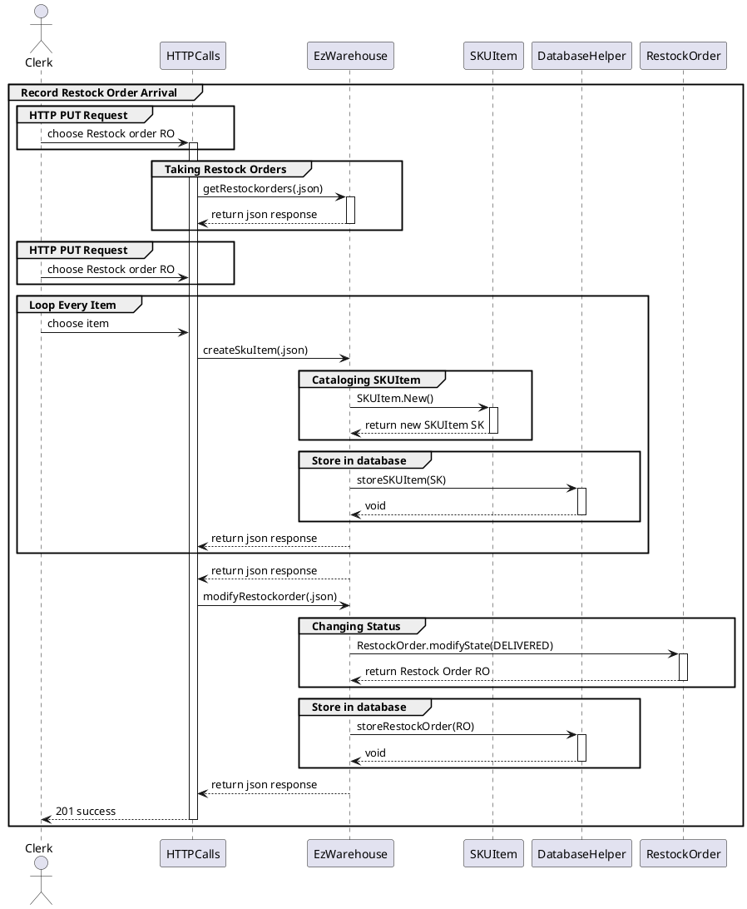

# Design Document

Authors:

Date:

Version:

# Contents

- [Design Document](#design-document)
- [Contents](#contents)
- [Instructions](#instructions)
- [High level design](#high-level-design)
  - [Package Diagram](#package-diagram)
- [Low level design](#low-level-design)
- [Verification traceability matrix](#verification-traceability-matrix)
- [Verification sequence diagrams](#verification-sequence-diagrams)

# Instructions

The design must satisfy the Official Requirements document, notably functional and non functional requirements, and be consistent with the APIs

# High level design

## Package Diagram

```plantuml
database it.polito.ezwh.data as EzWhData
package it.polito.ezwh.exceptions as EzWhExceptions
package it.polito.ezwh.model as EzWhModel
package it.polito.ezwh.gui as EZWhView
package it.polito.ezwh.controller as EZWhController

EzWhData -- EzWhModel
EzWhExceptions -left- EzWhModel
EZWhView -- EZWhController
EzWhModel -- EZWhController
```

We have implemented a MVC architecture:
- **EzWhModel**: manage the data of the application;
- **EZWhView**: manage the DOM and the interface of the application. We consider this package for granted;
- **EZWhController**: manage the interactions between model and view exploiting event listener and callbacks from the view.

<discuss architectural styles used, if any>
<report package diagram, if needed>
Description package here.
We use a MVC pattern because the user of EZWH application can modify data and, consequently, views has to change. Besides EZWH complies with the 3-tier pattern, since it manages data saved on the file system ("data" tier) via application functions ("application" tier) and a GUI ("presentation" tier).

# Low level design

<for each package in high level design, report class diagram. Each class should detail attributes and operations>

## it.polito.ezwh.controller

```plantuml
package it.polito.ezwh.controller{
  class EzWarehouse {
    - reset(): void
    -- Local Data --
    - users: Array of User
    - items: Array of Item
    - restockOrders: Array of RestockOrder
    - returnOrders: Array of ReturnOrder
    - internalOrders: Array of Item + Qty_per_Item
    - skus: Array of SKU
    - skuItems: Array of SKUItem
    - testDescriptors: Array of TestDescriptor
    - testResult: Array of TestResult
    - positions: Array of Position

    -- Remote Data --
    - databaseHelper: Object of DatabaseHelper
    
    -- SKU Management --
    + getSKUs() : Array
    + getSKUByID(ID : String) : Object
    + createSKU(description: String, weight : number , volume: number, notes : String, price : number, availableQuantity : number) : Void
    + modifySKU(ID: String, newDescription: String, newWeight: number, newVolume: number, newNotes: String, newPrice: number, newAvailableQuantity: number)
    + updateSKUPosition(ID: number, positionID: String)
    
    -- SKUItem Management --
    + getSKUItems() : Array
    + getBySkuID(ID: String) : Object
    + getByRFID(RFID: String) : Object
    + createSkuItem(RFID: String, SKUID: number, DateOfStock: Date) : void
    + modifySkuItem(newRFID: String, newAvailable: Boolean, newDateOfStock: Date) : void
    + deleteSkuItem(RFID: String) : void

    -- TestResult Management --
    + getTests() : Array
    + getTestByRFID(RFID : number) : Object
    + createTestResult(idTestDescriptor : number, Date : String, Result : boolean) : void
    + modifyTestResult(newTestDescriptor : number, newDate : String, newResult : boolean) : void
    + deleteTestResult(id : number) : void
    
    -- Position Management --
    + getPositions() : Array
    + createPosition(positionID : String, aisleID : String, row : String, col : String, maxWeight : number, maxVolume : number, occupiedWeight=0,occupiedVolume=0) : void
    + modifyPosition(P: Position, positionID: String, newAisleID : String, newRow : String, newCol : String, newMaxWeight : number, newMaxVolume : number, newOccupiedWeight : number, newOccupiedVolume : number) : void
    + updatePID(positionID: String, newPositionId : String) : void
    + decreaseOccupation(skus : array) : void
    + increaseOccupation(skus:) : void
    + deletePosition(positionID : String) : void
    
    -- Test Descriptor Management --
    + getTestDescriptors() : Array
    + getTestDescriptorByID(id : number) : Object
    + createTestDescriptor(name : String, procedureDescription : String, idSKU : number) : void
    + modifyTestDescriptor(id: number, newName : String, newProcedureDescription : String, newIdSKU : number) : void
    + deleteTestDescriptor(id : number) : void

    -- User Management --
    + getUserByID(ID : String) : Object
    + getSuppliers() : Array
    + getUsers() : Array
    + createUser(ID : String, username : String, name : String, surname : String, type : String) : void
    + login(username : String, password : String) : Object
    + modifyUserPermissions(username: String, newType : String) : void
    + deleteUser(username : String, type : String) : void
    
    -- Restock Order Management --
    + getRestockOrders(void) : Array
    + getRestockOrdersIssued(void) : Array
    + getRestockOrderByID(ID: number) : Object
    + getReturnItems(ID: number) : Array
    + getSKUitems(ID: number) : Array
    + createRestockOrder(issueDate : Date, products : Array, supplierID : number) : void
    + modifyState( ID: number, newState : number) : void
    + addItems(ID: number, items : List) : void
    + addTransportNote( ID: number, transportNote : String ) : void
    + setSkuItems(ID: number, skuItems: Array): Void
    + deleteRestockOrder(ID : String) : void

    -- Return Order Management --
    + getReturnOrders() : Array
    + getReturnOrder(id : number) : Object
    + createReturnOrder(returnDate : String, products : Array, restockOrderId : number) : void
    + deleteReturnOrder(id : number) : void
    
    -- Internal Order Management --
    + getInternalOrders(void) : Array
    + getInternalOrdersIssued(void) : Array
    + getInternalOrdersAccepted(void) : Array
    + getInternalOrderByID(ID: number) : Object
    + createInternalOrder(issueDate : Date, products : Array, customerID : number) : void
    + modifyInternalOrder(newState : number, products : Array) : Array
    + deleteInternalOrder(ID : number) : void
    
    -- Item Management --
    + getItems() : Array
    + getItemByID(ID: String) : Object
    + createItem(ID: String, description : string, price : number, SKUId: String, supplierId : String) : void
    + modifyItem(ID: String, description : string, price : number) : void
    + deleteItem(ID : String) : void
  }
}
```

## it.polito.ezwh.model
N.B. All the classes are linked to the class `DataImpl`of `it.polito.ezwh.controller`

```plantuml
package it.polito.ezwh.model {
  top to bottom direction

  class DatabaseHelper {
    - databaseName: String
    - createConnection(): Connection
    - closeConnection(): Void
    - resetConnection(): Connection
    - createTable(): Void

    -- Load from DB --
    + loadItems(): Array
    + loadUsers(): Array
    + loadInternalOrders(): Array
    + loadRestockOrders(): Array
    + loadSKUs(): Array
    + loadSKUItems(): Array
    + loadTestDescriptors(): Array 
    + loadTestResults(): Array
    + loadPositions(): Array

    -- Store to DB --
    + storeItem(item: Item): Void
    + storeUser(user: User): Void
    + storeInternalOrder(order: InternalOrder): Void
    + storeRestockOrder(order: RestockOrder): Void
    + storeSKU(sku: SKU): Void
    + storeSKUItem(skuitem: SKUItem): Void
    + storeTestDescriptor(test: TestDescriptor): Void
    + StoreTestResult(test: TestResult): Void
    + StorePosition(position: Position): Void

    -- Update DB --
    + updateItem(item: Item): Void
    + updateUser(user: User): Void
    + updateInternalOrder(order: InternalOrder): Void
    + updateRestockOrder(order: RestockOrder): Void 
    + updateSKU(sku: SKU): Void
    + updateSKUItem(skuitem: SKUItem): Void
    + updateTestDescriptor(test: TestDescriptor): Void
    + updateTestResult(test: TestResult): Void
    + updatePosition(position: Position): Void
  }

  enum userType {
    SUPPLIER
    CUSTOMER
    CLERK
    MANAGER
    DELIVERY_EMPLOYEE
    QUALITY_EMPLOYEE
  }

  class User {
    + ID: number
    + name: String
    + surname: String
    + username: String
    + type: userType
  }

  class Item {
    + ID : String
    + description : String
    + price : number
    + SKUId: number
    + supplierID: number
  }

  enum enumState {
    ISSUED
    DELIVERY
    DELIVERED
    TESTED
    COMPLETED
    RETURN
    COMPLETED
  }

  class RestockOrder {
    + ID : String
    + issueDate: Date
    + state: enumState
    + products : Array
    + supplierID: number
    + transportNote: Array
    + skuItems: Array
    + returnItems: Array
  }

  class ReturnOrder {
    + ID : String
    + returnDate: Date
    + products : Array
    + restockOrderID: number
  }

  class Qty_per_Item {
    + qty: number
  }

  class SKU {
    + ID : number
    + description : String
    + weight: number
    + volume : number
    + price : number
    + notes : String
    + availableQuantity : number
    + position: String 
    + testDescriptors : Array<number>
  }

  class SKUItem {
    + RFID : String
    + Available : boolean
    + DateOfStock : String
    + SKUID: number
  }

  class TestDescriptor {
    + ID : String
    + name : String
    + procedureDescription : String
    + idSKU : number
  }

  class TestResult {
    + ID: number
    + RFID : String
    + idTestDescriptor: number
    + date : Date
    + result: boolean
  }

  class Position {
    + positionID : String
    + aisle : String
    + row : String
    + col : String
    + max_weight : number
    + max_volume : number
    + occupied_weight : number
    + occupied_volume : number
  }

  enum internalOrderState {
    ISSUED
    ACCEPTED
    REFUSED
    CANCELED
    COMPLETED
  }

  class InternalOrder {
    ID : number
    issueDate : Date
    state: internalOrderState
    customerID : number
    products : Array
  }
}

enumState "1"-- "1" RestockOrder
internalOrderState "1"--"1" InternalOrder
Qty_per_Item -- "*" Item
Qty_per_Item -- "*" RestockOrder
Qty_per_Item -- "*" InternalOrder
userType -- User

```

## it.polito.ezwh.exceptions

```plantuml
package it.polito.ezshop.exceptions {
    class "Exceptions" as E

    notLoggedInException -down-|> E
    unauthorizedAccessException -down-|> E
    internalServerErrorException -down--|> E
    serviceUnavailableException -down--|> E
    userConflictException -down---|> E

    nonExistingObjectException -up--|> E
    
    volumeConstraintException -up-|> E
    WeightConstraintException -up-|> E
    userConstraintException -up--|> E

    invalidRequestBodyException -down--|> E
    invalidOrderIDException -down-|> E
    invalidObjectIDException -down-|> E
    invalidOrderDateException -down--|> E 
}
```

# Verification traceability matrix

\<for each functional requirement from the requirement document, list which classes concur to implement it>

|| EzWarehouse | User: Supplier | User: Customer | Item | RestockOrder | ReturnOrder | InternalOrder | SKU | SKUitem | TestDescriptor | TestResult | Position |
|:--|:--:|:--:|:--:|:--:|:--:|:--:|:--:|:--:|:--:|:--:|:--:|:--:|
| **FR1**: *manage users and rights* | X | X | X |||||||
| **FR2**: *manage SKU* | X ||||||| X | X ||X|
| **FR3**: *manage Warehouse* | X | X | ||||||| X | X | X |
| **FR4**: *manage internal customers* | X || X |||||
| **FR5**: *manage a restock order* | X | X | X | X | X | X || X | X | X | X |
| **FR6**: *manage internal orders* | X || X | X ||| X | X | X ||||
| **FR7**: *manage Items* | X | X || X |||| X | X |

# Verification sequence diagrams

## **SC1.1**: *Create SKU*

```plantuml
actor Manager as Manager
participant HTTPCalls as HTTPCalls
participant EzWarehouse as EzWarehouse
participant SKU as SKU
participant DatabaseHelper as DatabaseHelper

group create SKU
group HTTP POST Request
Manager -> HTTPCalls: insert SKU description
activate HTTPCalls
Manager -> HTTPCalls: insert SKU weight
Manager -> HTTPCalls: insert SKU volume
Manager -> HTTPCalls: insert SKU notes
Manager -> HTTPCalls: confirm data
end

HTTPCalls -> EzWarehouse: createSKU(.json)
activate EzWarehouse
group creating SKU object
EzWarehouse -> SKU: new SKU(description, weight, volume, notes, price, availableQuantity)
activate SKU
SKU --> EzWarehouse: return SKU S
deactivate SKU
end

group Store SKU in database
EzWarehouse -> DatabaseHelper: StoreSKU(S)
activate DatabaseHelper
DatabaseHelper --> EzWarehouse: Void
deactivate DatabaseHelper
end

EzWarehouse --> HTTPCalls: return response.json
deactivate EzWarehouse
HTTPCalls --> Manager: 201 Created (success)
deactivate HTTPCalls
end
```

## **SC1.2**: *Modify SKU Location*

```plantuml
actor Manager as Manager
participant HTTPCalls as HTTPCalls
participant EzWarehouse as EzWarehouse

group Modify SKU Location
group HTTP GET Request
Manager -> HTTPCalls: insert SKU ID
activate HTTPCalls
end

group retrieve SKU by ID
HTTPCalls -> EzWarehouse: getSKUbyID(.json)
activate EzWarehouse
EzWarehouse --> HTTPCalls: return SKU S
EzWarehouse --> HTTPCalls: return Array of Position
deactivate EzWarehouse
end
HTTPCalls --> Manager: return response.json
deactivate HTTPCalls

Manager -> HTTPCalls: select new position
activate HTTPCalls
group update SKU position
HTTPCalls -> EzWarehouse: updateSKUPosition(.json)
activate EzWarehouse
EzWarehouse -> SKU: S.setPosition()
activate SKU
SKU --> EzWarehouse: return modified SKU
deactivate SKU
EzWarehouse -> Position: P.updateWeight()
activate Position
EzWarehouse -> Position: P.updateVolume()
Position --> EzWarehouse: return modified Position
deactivate Position

group update database
EzWarehouse -> DatabaseHelper: updatePosition()
activate DatabaseHelper
DatabaseHelper --> EzWarehouse: void
EzWarehouse -> DatabaseHelper: updateSKU()
DatabaseHelper --> EzWarehouse: void
deactivate DatabaseHelper
end
end
EzWarehouse --> HTTPCalls: response.json
deactivate EzWarehouse
HTTPCalls --> Manager: 200 OK (success)
deactivate HTTPCalls
end
```

## **SC2.1**: *Create Position*

```plantuml
actor Manager as Manager
participant HTTPCalls as HTTPCalls
participant EzWarehouse as EzWarehouse
participant Position as Position
participant DatabaseHelper as DatabaseHelper

group create Position
group HTTP POST Request
Manager -> HTTPCalls: insert: PositionID
activate HTTPCalls
Manager -> HTTPCalls: insert: AisleID
Manager -> HTTPCalls: insert: Row number
Manager -> HTTPCalls: insert: Column number
Manager -> HTTPCalls: insert: Maximum weight value
Manager -> HTTPCalls: insert: Maximum volume value
Manager -> HTTPCalls: confirm data
end

HTTPCalls -> EzWarehouse: createPosition(.json)
activate EzWarehouse
group creating Position object
EzWarehouse -> Position: new Position(PositionID, AisleID, Row, Column, MaxWeight, MaxVolume)
activate Position
Position --> EzWarehouse: return Position P
deactivate Position
end

group Store position in database
EzWarehouse -> DatabaseHelper: StorePosition(P)
activate DatabaseHelper
DatabaseHelper --> EzWarehouse: Void
deactivate DatabaseHelper
end

EzWarehouse --> HTTPCalls: return response.json
deactivate EzWarehouse
HTTPCalls --> Manager: 201 Created (success)
deactivate HTTPCalls
end
```

## **SC2.3**: *Modify weight and volume of Position*

```plantuml
actor Manager as Manager
participant HTTPCalls as HTTPCalls
participant EzWarehouse as EzWarehouse
participant Position as Position
participant DatabaseHelper as DatabaseHelper

group modify Position
group HTTP PUT Request
Manager -> HTTPCalls: HEADER: PositionID
activate HTTPCalls
Manager -> HTTPCalls: insert: new aisleID
Manager -> HTTPCalls: insert: new row number
Manager -> HTTPCalls: insert: new column number
Manager -> HTTPCalls: insert: new maximum weight value
Manager -> HTTPCalls: insert: new maximum volume value
Manager -> HTTPCalls: insert: new weight value
Manager -> HTTPCalls: insert: new volume value
Manager -> HTTPCalls: confirm data
end

HTTPCalls -> EzWarehouse: modifyPosition(.json)
activate EzWarehouse
note over EzWarehouse: retrieve Position P given PositionID

group modifying Position object
EzWarehouse -> Position: P.setPosition()
activate Position
Position --> EzWarehouse: return modified Position P
deactivate Position
end

group Store position in database
EzWarehouse -> DatabaseHelper: StorePosition(P)
activate DatabaseHelper
DatabaseHelper --> EzWarehouse: void
deactivate DatabaseHelper
end

EzWarehouse --> HTTPCalls: return response.json
deactivate EzWarehouse
HTTPCalls --> Manager: '200 OK (success)'
deactivate HTTPCalls
end
```

## **SC3.1**: *Restock Order of SKU S issued by quantity*

```plantuml
actor Manager 
participant HTTPCalls
participant EzWarehouse
participant RestockOrder
participant DatabaseHelper

group Create RestockOrder
group HTTP PUT request
Manager->HTTPCalls: Insert product
activate HTTPCalls
Manager->HTTPCalls: Insert quantity
end

HTTPCalls->EzWarehouse: getSuppliers(.json)
activate EzWarehouse
EzWarehouse->HTTPCalls: .json 
deactivate EzWarehouse

group HTTP PUT request
Manager->HTTPCalls: Select supplier
Manager->HTTPCalls: Confirm data
end

HTTPCalls->EzWarehouse: createRestockOrder(.json)
activate EzWarehouse

group Creating RestockOrder
EzWarehouse->RestockOrder: RestockOrder.new(.json)
RestockOrder-->EzWarehouse: return new RestockOrder RO
end

group Store RestockOrder in database
EzWarehouse->DatabaseHelper: storeRestockOrder(object RO)
activate DatabaseHelper
DatabaseHelper-->EzWarehouse: void
deactivate DatabaseHelper
end

EzWarehouse-->HTTPCalls: return response .json
deactivate EzWarehouse
HTTPCalls-->Manager: 201 success
deactivate HTTPCalls
end
```

## **SC4.1**: *Create user and define rights*

```plantuml
actor Admin 
participant HTTPCalls
participant EzWarehouse
participant User
participant DatabaseHelper

group create User
group HTPP put request
Admin->HTTPCalls: Insert ID
activate HTTPCalls
Admin->HTTPCalls: Insert name
Admin->HTTPCalls: Insert surname
Admin->HTTPCalls: Insert username
Admin->HTTPCalls: Insert type
Admin->HTTPCalls: Insert permission
Admin->HTTPCalls: Confirm data
end

HTTPCalls->EzWarehouse: createUser(.json)

group Creating user
activate EzWarehouse
EzWarehouse->User: User.newUser()
activate User
User-->EzWarehouse: Return new User U
deactivate User
end

group Store in database
EzWarehouse->DatabaseHelper: storeUser(U)
activate DatabaseHelper
DatabaseHelper-->EzWarehouse: void
deactivate DatabaseHelper
end

EzWarehouse-->HTTPCalls: retunr response json
deactivate EzWarehouse
HTTPCalls-->Admin: 201 success
deactivate HTTPCalls
end
```
## **SC5.1.1**: *Record restock order arrival*


## **SC5.2.1**: *Record positive test results of all SKU items of a RestockOrder*

```plantuml
actor QualityEmployee 
participant HTTPCalls
participant EzWarehouse
participant TestResult
participant RestockOrder
participant DatabaseHelper

group Test Item in Restock Order
group HTTP PUT Request
QualityEmployee->HTTPCalls: choose to test restock order
activate HTTPCalls
end

group Taking Restock Orders
HTTPCalls->EzWarehouse:   getRestockorders()
activate EzWarehouse
EzWarehouse-->HTTPCalls: return json response
deactivate EzWarehouse
end

group Taking tests
HTTPCalls->EzWarehouse: getTests()
EzWarehouse-->HTTPCalls: return json response
deactivate EzWarehouse
end

group HTTP PUT Request
QualityEmployee->HTTPCalls: choose RestockOrder Ro
end

group Loop for every item
QualityEmployee ->HTTPCalls: Select item and test and give result
HTTPCalls->EzWarehouse: createTestResult(.json)
activate EzWarehouse

group Creating test result
EzWarehouse->TestResult: TestResult.New()
activate TestResult
TestResult-->EzWarehouse: return new TestResult TR
deactivate TestResult
end

group Store in database
EzWarehouse->DatabaseHelper: storeTestResult(object TestResult)
activate DatabaseHelper
DatabaseHelper-->EzWarehouse: void
deactivate DatabaseHelper
end
end

EzWarehouse-->HTTPCalls: return json response
HTTPCalls->EzWarehouse: modifyRestockorder(.json)

group Changing Status
EzWarehouse->RestockOrder: RestockOrder.modifyState(TESTED)
RestockOrder-->EzWarehouse: return Restock Order RO
end

group Store in database
EzWarehouse->DatabaseHelper: storeRestockOrder(RO)
activate DatabaseHelper
DatabaseHelper-->EzWarehouse: void
deactivate DatabaseHelper
end

EzWarehouse-->HTTPCalls: return json response
deactivate EzWarehouse
HTTPCalls->QualityEmployee : 201 Success
deactivate HTTPCalls
end
```

## **SC5.3.1**: *Stock all SKU items of a RO*

```plantuml
group Stock all SKU items of a RO
actor Clerk
participant HTTPCalls as HTTPCalls
participant EzWarehouse as EzWarehouse
participant Position as Position
participant SKU as SKU
participant RestockOrder
participant DatabaseHelper as DatabaseHelper
group HTTPRequest PUT
Clerk -> HTTPCalls : select RFID
Clerk -> HTTPCalls : select RFID
Clerk -> HTTPCalls : select RFID
activate HTTPCalls
end


group for each RFID selected
group retrieve SKU
HTTPCalls -> EzWarehouse : getSKUItemByRFID(RFID)
activate EzWarehouse
HTTPCalls <- EzWarehouse : return SKUItem as SI
deactivate EzWarehouse
HTTPCalls->EzWarehouse: getSKUByID(SI.SKUId)
activate EzWarehouse
HTTPCalls <- EzWarehouse: return SKU as S
deactivate EzWarehouse
end

group update Position
HTTPCalls->EzWarehouse: getPositionById(S.position)
activate EzWarehouse
HTTPCalls<-EzWarehouse: Position as P
deactivate EzWarehouse
HTTPCalls->EzWarehouse: modifyPosition(.json)
activate EzWarehouse 
group modify Position object
EzWarehouse->Position:P.setPosition()
activate Position
EzWarehouse<-Position: return P modified
deactivate Position
end
group Store Position in database
EzWarehouse -> DatabaseHelper: StorePosition(P)
activate DatabaseHelper
DatabaseHelper --> EzWarehouse: void
deactivate DatabaseHelper
end
EzWarehouse->HTTPCalls: return response.json
deactivate EzWarehouse
end

group update SKU's available quantity
HTTPCalls->EzWarehouse : modifySKU(.json)
activate EzWarehouse
group modify SKU object
EzWarehouse->SKU:S.setSKUQuantity()
activate SKU
EzWarehouse<-SKU: return S modified
deactivate SKU
end
group Store SKU in database
EzWarehouse -> DatabaseHelper: StoreSKU(S)
activate DatabaseHelper
DatabaseHelper --> EzWarehouse: void
deactivate DatabaseHelper
end
activate EzWarehouse
EzWarehouse->HTTPCalls: return response.json
deactivate EzWarehouse
end


group update RO's state
HTTPCalls->EzWarehouse : modifyState( RO.id, enumState.COMPLETED) 
activate EzWarehouse
group modify RO object
EzWarehouse->RestockOrder:RO.setState()
activate RestockOrder
EzWarehouse<-RestockOrder: return RO modified
deactivate RestockOrder
end
group Store RO in database
EzWarehouse -> DatabaseHelper: StoreRestockOrder(RO)
activate DatabaseHelper
DatabaseHelper --> EzWarehouse: void
deactivate DatabaseHelper
end
EzWarehouse->HTTPCalls: return response.json
deactivate EzWarehouse
end
end
HTTPCalls->Clerk: '201 Success'
deactivate HTTPCalls
end
```

## **SC6.1** *Return order of SKU items that failed quality test*

```plantuml
group Manage return order of SKU items
actor Manager
participant HTTPCalls as HTTPCalls
participant EzWarehouse as EzWarehouse
participant SKUItem 
participant ReturnOrder
participant DatabaseHelper as DatabaseHelper

group HTTP Request GET
Manager -> HTTPCalls : insert RO.ID
activate HTTPCalls
end
HTTPCalls->EzWarehouse: getReturnItems(RO.ID)
activate EzWarehouse
HTTPCalls<-EzWarehouse: RI.RFID
deactivate EzWarehouse
deactivate HTTPCalls

group HTTP Request PUT
Manager -> HTTPCalls : select RFID  
Manager -> HTTPCalls : select RFID
Manager -> HTTPCalls : confirm 
activate HTTPCalls
end


group for each RFID selected
group update SKUItem availability
HTTPCalls -> EzWarehouse : getSKUItemByRFID(RFID)
activate EzWarehouse
HTTPCalls <- EzWarehouse : return SKUItem as SI
deactivate EzWarehouse
HTTPCalls->EzWarehouse: modifySkuItem(SI.RFID, False, undefined)
group modifying SKUItem object
EzWarehouse -> SKUItem: SI.setSKUItem()
activate SKUItem
SKUItem --> EzWarehouse: return modified SKUItem
deactivate SKUItem
end

group Store SKUItem in database
EzWarehouse -> DatabaseHelper: StoreSKUItem(SI)
activate DatabaseHelper
DatabaseHelper --> EzWarehouse: void
deactivate DatabaseHelper
end

activate EzWarehouse
HTTPCalls <- EzWarehouse: return response.json
deactivate EzWarehouse
end
end
group create REO
HTTPCalls->EzWarehouse: createReturnOrder(today, products : Array, RO.ID) 
activate EzWarehouse
group create a new ReturnOrder
EzWarehouse->ReturnOrder: new ReturnOrder
activate ReturnOrder
EzWarehouse<-ReturnOrder: return ReturnOrder as REO
deactivate ReturnOrder
end 
group store REO 
EzWarehouse->DatabaseHelper: storeReturnOrder(REO)
activate DatabaseHelper
EzWarehouse<-DatabaseHelper: void
deactivate DatabaseHelper
end
HTTPCalls<-EzWarehouse: return response.json
deactivate EzWarehouse
end

HTTPCalls->Manager: '201 Success'
deactivate HTTPCalls

end
``` 

## **SC6.1** *Login*

```plantuml
group Login
actor User

group HTTP Request PUT
User -> HTTPCalls : insert username
User -> HTTPCalls : insert password
end 

activate HTTPCalls
HTTPCalls-> EzWarehouse : login(username, password)
activate EzWarehouse
HTTPCalls <- EzWarehouse : UserSession
deactivate EzWarehouse


deactivate HTTPCalls

HTTPCalls->User: return response.json
end
```


## **SC9.1** *Internal Order IO accepted*

```plantuml
group Internal Order IO accepted
actor Customer
actor Manager
participant HTTPCalls as HTTPCalls
participant EzWarehouse as EzWarehouse
participant SKUItem 
participant InternalOrder
participant Position
participant SKU
participant DatabaseHelper as DatabaseHelper


group Customer creates an InternalOrder
group HTTP Request PUT
Customer -> HTTPCalls : insert add SKU
Customer -> HTTPCalls : insert add quantity
Customer -> HTTPCalls : insert add SKU
Customer -> HTTPCalls : insert add quantity
end

group create IO

HTTPCalls->EzWarehouse: createInternalOrder(today, products , customer.ID) 
activate HTTPCalls
activate EzWarehouse
group create new InternalOrder
EzWarehouse->InternalOrder: new InternalOrder
activate InternalOrder
EzWarehouse<-InternalOrder: InternalOrder as IO
deactivate InternalOrder
end
group store IO
EzWarehouse->DatabaseHelper: storeInternalOrder(IO)
activate DatabaseHelper
EzWarehouse<-DatabaseHelper: void
deactivate DatabaseHelper
end

EzWarehouse->HTTPCalls: return response.json
deactivate EzWarehouse
group HTTPRequest PUT
Customer ->HTTPCalls : Confirm
end
HTTPCalls->EzWarehouse: modifyInternalOrder(ISSUED, IO.products)

group modifying InternalOrder object
EzWarehouse -> InternalOrder: IO.setInternalOrder()
activate InternalOrder
InternalOrder --> EzWarehouse: return modified IO
deactivate InternalOrder
end

group Store IO in database
EzWarehouse -> DatabaseHelper: StoreInternalOrder(IO)
activate DatabaseHelper
DatabaseHelper --> EzWarehouse: return response.json
deactivate DatabaseHelper
end

activate EzWarehouse
HTTPCalls<- EzWarehouse: '201 Success'
deactivate EzWarehouse
deactivate HTTPCalls
end
end

group for each SKU S ordered

group update Position
HTTPCalls->EzWarehouse: getPositionById(S.position)
activate EzWarehouse
HTTPCalls<-EzWarehouse: Position as P
deactivate EzWarehouse
HTTPCalls->EzWarehouse: modifyPosition(.json) 
activate EzWarehouse
group modifying Position object
EzWarehouse -> Position: P.setPosition()
activate Position
Position --> EzWarehouse: return modified Position P
deactivate Position
end

group Store position in database
EzWarehouse -> DatabaseHelper: StorePosition(P)
activate DatabaseHelper
DatabaseHelper --> EzWarehouse: void
deactivate DatabaseHelper
end
EzWarehouse --> HTTPCalls: '201 Success'
deactivate EzWarehouse

group update SKU's available quantity
HTTPCalls->EzWarehouse : modifySKU(.json)
activate EzWarehouse
group modify SKU object
EzWarehouse->SKU:S.setSKUQuantity()
activate SKU
EzWarehouse<-SKU: return S modified
deactivate SKU
end
group Store SKU in database
EzWarehouse -> DatabaseHelper: StoreSKU(S)
activate DatabaseHelper
DatabaseHelper --> EzWarehouse: void
deactivate DatabaseHelper
end
activate EzWarehouse
EzWarehouse->HTTPCalls: '201 Success'
deactivate EzWarehouse
deactivate EzWarehouse
end
end
end 

group manager confirms the order
group HTTPRequest PUT
Manager->HTTPCalls: confirm IO
activate HTTPCalls
end

HTTPCalls->EzWarehouse: modifyInternalOrder(ACCEPTED, IO.products)
group modifying InternalOrder object
EzWarehouse -> InternalOrder: IO.setInternalOrder
activate InternalOrder
InternalOrder --> EzWarehouse: return modified IO
deactivate InternalOrder
end

group Store IO in database
EzWarehouse -> DatabaseHelper: StoreInternalOrder(IO)
activate DatabaseHelper
DatabaseHelper --> EzWarehouse: void
deactivate DatabaseHelper
end


activate EzWarehouse
HTTPCalls<- EzWarehouse: 201 Success
deactivate EzWarehouse
deactivate HTTPCalls

end
end
```

## **SC9.3 : *Internal Order IO cancelled***

```plantuml
actor Customer as C
actor Manager as M

participant HTTPCalls as H
participant EzWarehouse as ezwh
participant InternalOrder as I
participant SKU as S
participant Position as P
participant DatabaseHelper as DH

C -> H : starts internal order
activate H
H -> ezwh : getSKUItems()
activate ezwh
ezwh -> H : 200 ok, items
deactivate ezwh
deactivate H

C -> H : create order
activate H
H -> ezwh : createInternalOrder(json)
activate ezwh
ezwh -> I : InternalOrder(json)
activate I
ezwh <- I : order
deactivate I
ezwh -> DH : storeInternalOrder(order)
activate DH
ezwh <- DH : void
deactivate DH

loop for each sku and relative position
ezwh -> S : sku.setAvailability()
activate S
S -> ezwh : void
deactivate S
ezwh -> P : position.setOccupation()
activate P
P -> ezwh : void
deactivate P
ezwh -> DH : updateSKU(sku)
activate DH
DH -> ezwh : void
deactivate DH
ezwh -> DH : updatePosition(position)
activate DH
DH -> ezwh : void
deactivate DH
end
ezwh -> H : 201 created
deactivate ezwh
deactivate H

M -> H : refuse order
activate H
H -> ezwh : modifyInternalOrder(params)
activate ezwh
ezwh -> DH : updateInternalOrder(params)
activate DH
ezwh <- DH: void
deactivate DH

loop for each sku and relative position, same operations as before
ezwh -> ezwh
end
deactivate ezwh
ezwh -> H : 200 OK
deactivate H
```

## **SC10.1: *Internal Order IO Completed***

```plantuml
actor DeliveryEmployee as D
participant HTTPCalls
participant EzWarehouse as ezwh
participant InternalOrder as I
participant SKUItem as S
participant DatabaseHelper as DH

D -> HTTPCalls : select internal order
activate HTTPCalls
HTTPCalls -> ezwh : getInternalOrder(params.id)
activate ezwh
ezwh -> HTTPCalls : response
deactivate ezwh
deactivate HTTPCalls

D -> HTTPCalls : retrieve rfid for each skuid
activate HTTPCalls

HTTPCalls -> ezwh : getBySKUId(params.id)
activate ezwh
ezwh -> HTTPCalls : skuitem
deactivate ezwh
deactivate HTTPCalls

D -> HTTPCalls : set skuitems as not available
activate HTTPCalls
loop for each skuitem
HTTPCalls -> ezwh : modifySKUitem(params)
activate ezwh
ezwh -> S : skuitem.setAvailability(0)
activate S
S -> ezwh : void
deactivate S
ezwh -> DH : updateSKUItem(skuitem)
activate DH
DH -> ezwh : void
deactivate DH
deactivate ezwh
ezwh -> HTTPCalls : 200 OK
deactivate HTTPCalls
end

D -> HTTPCalls : check internal order as COMPLETED
activate HTTPCalls
HTTPCalls -> ezwh : modifyInternalOrder(id,"COMPLETED",products)
activate ezwh
ezwh -> I : internalOrder.setState()
activate I
ezwh <- I : void
deactivate I
ezwh -> I : internalOrder.setProducts()
activate I
ezwh <- I : void
deactivate I
ezwh->DH : updateInternalOrder(internalOrder)
activate DH
DH -> ezwh: void
deactivate DH

ezwh -> HTTPCalls : 200 OK
deactivate ezwh
deactivate HTTPCalls
```

## **SC11.1: *Create Item I***

```plantuml
actor Supplier as S
participant HTTPCalls as H
participant EzWarehouse as ezwh
participant Item as I
participant DatabaseHelper as DH

S -> H : insert item description
S -> H : insert SKUid
S -> H : insert price
S -> H : confirm inserted data
activate H
H -> ezwh : createItem(params)

activate ezwh
ezwh -> I : new Item(params)
activate I
I -> ezwh : item
deactivate I
deactivate ezwh

ezwh -> DH : storeItem(item)
activate DH
activate ezwh
DH -> ezwh : void
deactivate DH
ezwh -> H : 201 created
deactivate ezwh
deactivate H
```

## **SC12.1: *Create test description***

```plantuml
actor Manager as M
participant HTTPCalls as H
participant EzWarehouse as ezwh
participant TestDescriptor as T
participant DatabaseHelper as DH

M -> H : insert name
M -> H : insert SKU id
M -> H : insert procedure description
M -> H : confirm inserted data
H -> ezwh : createTestDescriptor(name, procedureDescription, idSKU)
activate H
activate ezwh
ezwh -> T : TestDescriptor(name, procedureDescription, idSKU) 
activate T
ezwh <- T : test
deactivate T
ezwh -> DH : storeTestDescriptor(test)
activate DH
ezwh <- DH : void
deactivate DH
H <- ezwh : 201 Created
deactivate H
deactivate ezwh
```
