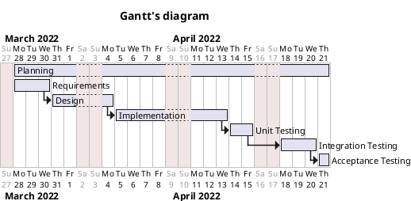

# Project Estimation  
**Date**: Wednesday, 13 April 2022\
**Version**: `1.0`

# Estimation approach
## Estimate by size
|             | Estimate                        |             
| ----------- | ------------------------------- |  
| NC =  Estimated number of classes to be developed   | 18 |             
|  A = Estimated average size per class, in LOC       | 200 | 
| S = Estimated size of project, in LOC (= NC * A) | 3.600 |
| E = Estimated effort, in person hours (here use productivity 10 LOC per person hour)  | 360 |   
| C = Estimated cost, in euro (here use 1 person hour cost = 30 euro) | €10.800 | 
| Estimated calendar time, in calendar weeks (Assume team of 4 people, 8 hours per day, 5 days per week ) | 12 |               

## Estimate by product decomposition
> Assumption: we are considering a team of 4 experts in their field, for this reason the following estimations rely on Delphi Expert Estimation technique.

|         component name    | Estimated effort (person hours)   |             
| ----------- | ------------------------------- | 
| Requirement Document    | 46 |
| GUI prototype | 25 |
| Design Document | 54 |
| Code | 180 |
| Unit tests | 49 |
| API tests | 44 |
| Management Documents  | 19 |

## Estimate by activity decomposition 
|         Activity name    | Estimated effort (person hours)   |             
| ----------- | ------------------------------- | 
| Planning | 6 |
| Requirements | 90 |
| Design | 72 |
| Implementation | 226 |
| Unit testing | 52 |
| Integration testing | 83 |
| Acceptance testing | 10 |

# Gantt's Diagram

>

# Summary
1. The results obtained through *estimation by size* does not take into account the project management and documentation parts. Although it has the least estimated effort overall, it is exclusively dependent by the **Lines Of Code** (LOC). 

2. The results obtained through *estimation by product decomposition* do take into accounts the project management and documentation parts. However, the results may be *under-estimated* due to the application of the **Delphi** method, which considers expert of the field to compute the effort.

3. The results obtained through *estimation by activity decomposition* take into account only the **qualitative** aspect of the project, due to the lack of data from the company itself and the lack of previous experiences of the team in the field.

|             | Estimated effort | Estimated duration |          
| ----------- | ------------------------------- | ---------------|
| estimate by size | 360 *ph* | 90 hours |
| estimate by product decomposition | 417 *ph* | 104.25 hours |
| estimate by activity decomposition | 539 *ph* | 134.75 hours | 
