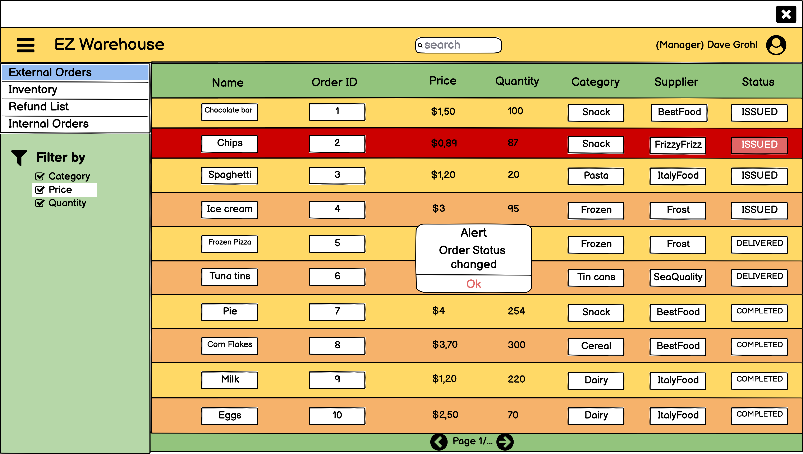

# Graphical User Interface Prototype  

**Authors**:
 * Riccardo Medina
 * Simran Singh
 * Davide Arcolini
 * Giuseppe Atanasio

**Date**: 13 April 2022

**Version**: 1.0

# Table of contents
- [Graphical User Interface Prototype](#graphical-user-interface-prototype)
- [Table of contents](#table-of-contents)
- [**UC1 user management**](#uc1-user-management)
  - [UC1.1 Creation of a new user](#uc11-creation-of-a-new-user)
  - [UC1.2 Removal of an existing user](#uc12-removal-of-an-existing-user)
  - [UC1.3 Update user permissions](#uc13-update-user-permissions)
- [**UC2 user login**](#uc2-user-login)
  - [UC2.1 Authentication succeeded](#uc21-authentication-succeeded)
  - [UC2.2 Authentication succeeded with credentials expired](#uc22-authentication-succeeded-with-credentials-expired)
  - [UC2.4 Authentication failed, user not authenticated](#uc24-authentication-failed-user-not-authenticated)
- [**UC3 Warehouse orders management**](#uc3-warehouse-orders-management)
  - [UC3.1 Create order to a supplier](#uc31-create-order-to-a-supplier)
  - [UC3.2 Accept Organisational Unit order](#uc32-accept-organisational-unit-order)
  - [UC3.4 Refund order](#uc34-refund-order)
  - [UC3.5 Deliver order](#uc35-deliver-order)
  - [UC3.6 Reject order due to lack of items](#uc36-reject-order-due-to-lack-of-items)
  - [UC3.7 Reject order due to lack of suppliers](#uc37-reject-order-due-to-lack-of-suppliers)
- [**UC4 Execute testing**](#uc4-execute-testing)
  - [UC4.1 Select test for specific item](#uc41-select-test-for-specific-item)
  - [UC4.2 Execute quality test](#uc42-execute-quality-test)
  - [UC4.3 Confirm order for approved items](#uc43-confirm-order-for-approved-items)
  - [UC4.4 Discard order for rejected items](#uc44-discard-order-for-rejected-items)
  - [UC4.5 No test available for the item selected](#uc45-no-test-available-for-the-item-selected)
- [**UC5 Manage testing**](#uc5-manage-testing)
  - [UC5.3 Delete test](#uc53-delete-test)
  - [UC5.4 Update test](#uc54-update-test)
- [**UC6 Map management**](#uc6-map-management)
  - [UC6.1 Create map](#uc61-create-map)
  - [UC6.2 Load map](#uc62-load-map)
  - [UC6.3 Remove map](#uc63-remove-map)
  - [UC6.4 Update maps](#uc64-update-maps)
  - [UC6.5 Map constraints not satisfied, reload map](#uc65-map-constraints-not-satisfied-reload-map)
  - [UC6.6 Map deletion failed](#uc66-map-deletion-failed)
- [**UC7 Items management**](#uc7-items-management)
  - [UC7.1 Shows item information](#uc71-shows-item-information)
  - [UC7.2 Store new item](#uc72-store-new-item)
  - [UC7.3 Delete existing item](#uc73-delete-existing-item)
  - [UC7.5 Show space available](#uc75-show-space-available)
  - [UC7.6 Show route to item](#uc76-show-route-to-item)
- [**UC8 Manage Organisational Unit order**](#uc8-manage-organisational-unit-order)
  - [UC8.1 Create OU order](#uc81-create-ou-order)
  - [UC8.2 Confirm OU order arrival](#uc82-confirm-ou-order-arrival)

# **UC1 user management**
## UC1.1 Creation of a new user

## UC1.2 Removal of an existing user

## UC1.3 Update user permissions

# **UC2 user login**

## UC2.1 Authentication succeeded

## UC2.2 Authentication succeeded with credentials expired

## UC2.3 Authentication failed with wrong credentials

## UC2.4 Authentication failed, user not authenticated

# **UC3 Warehouse orders management** 
## UC3.1 Create order to a supplier

## UC3.2 Accept Organisational Unit order

## UC3.3 Confirm Supplier Order arrival

## UC3.4 Refund order

## UC3.5 Deliver order

## UC3.6 Reject order due to lack of items

## UC3.7 Reject order due to lack of suppliers

# **UC4 Execute testing**
## UC4.1 Select test for specific item

## UC4.2 Execute quality test

## UC4.3 Confirm order for approved items

## UC4.4 Discard order for rejected items

## UC4.5 No test available for the item selected

# **UC5 Manage testing**
## UC5.1 Create a new test

## UC5.2 Load a test

## UC5.3 Delete test

## UC5.4 Update test

## UC5.5 Test file's constrains not satisfied

# **UC6 Map management**
## UC6.1 Create map
.png)
.png)
.png)
.png)
.png)
## UC6.2 Load map
.png)
.png)
.png)
## UC6.3 Remove map
.png)
.png)
.png)
## UC6.4 Update maps
%20.png)
.png)
## UC6.5 Map constraints not satisfied, reload map
.png)
## UC6.6 Map deletion failed
.png)

# **UC7 Items management**
## UC7.1 Shows item information
.png)
.png)
## UC7.2 Store new item
.png)
.png)
.png)
.png)
## UC7.3 Delete existing item
.png)
.png)
## UC7.5 Show space available
.png)
## UC7.6 Show route to item
.png)

# **UC8 Manage Organisational Unit order**
## UC8.1 Create OU order

## UC8.2 Confirm OU order arrival

