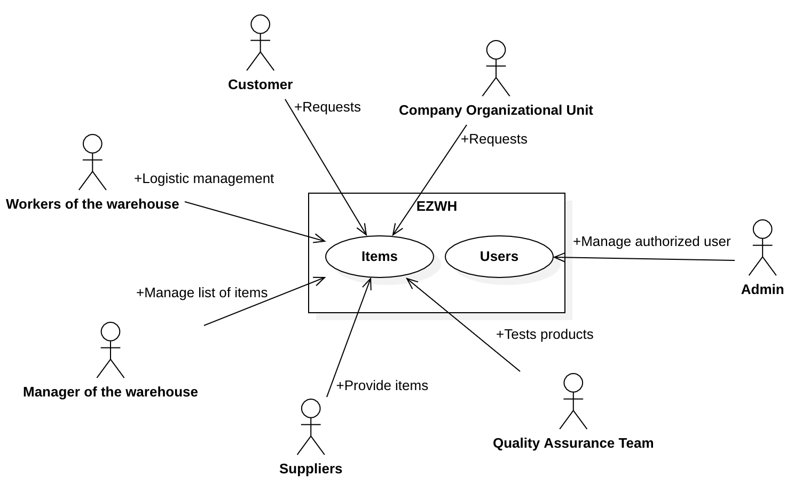
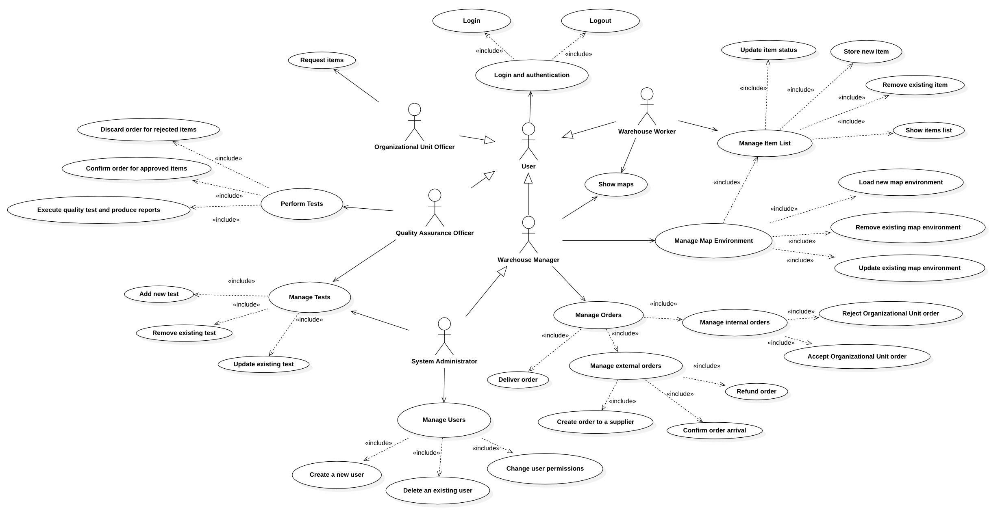
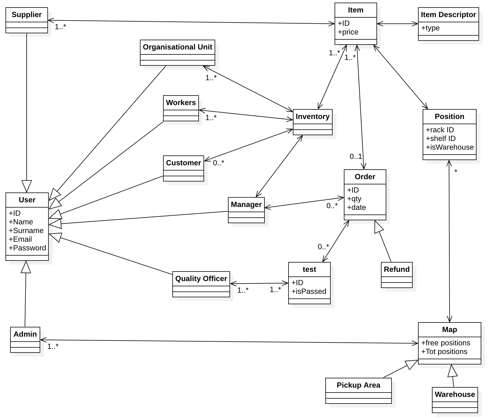
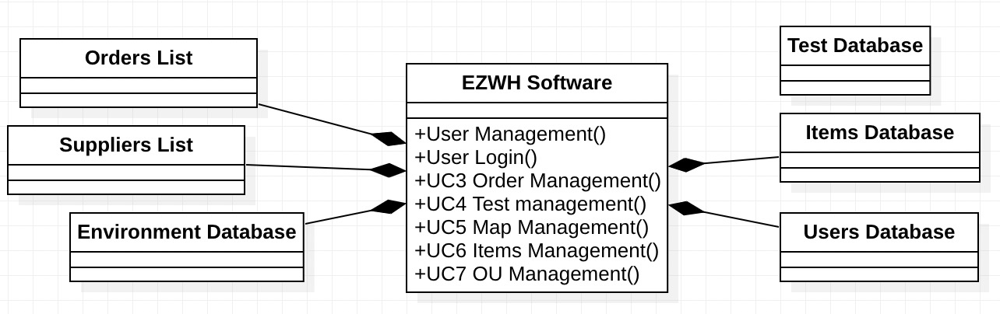
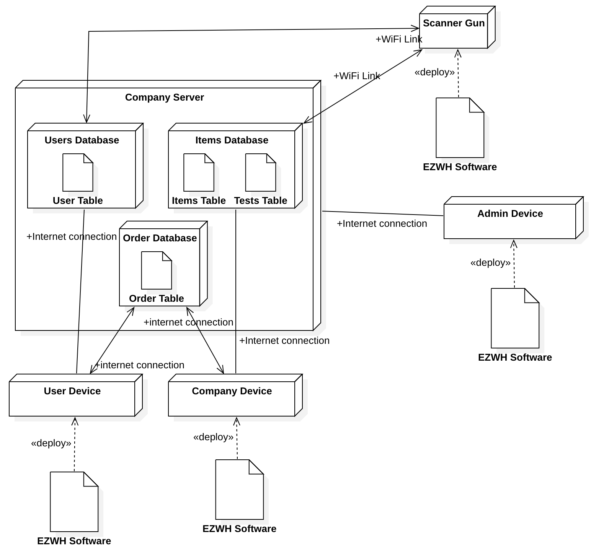

# Requirements Document 

Date: 22 march 2022

Version: 0.0

 
| Version number | Change |
| ----------------- |:-----------|
| | | 

# Contents

- [Informal description](#informal-description)
- [Stakeholders](#stakeholders)
- [Context Diagram and interfaces](#context-diagram-and-interfaces)
	+ [Context Diagram](#context-diagram)
	+ [Interfaces](#interfaces) 
	
- [Stories and personas](#stories-and-personas)
- [Functional and non functional requirements](#functional-and-non-functional-requirements)
	+ [Functional Requirements](#functional-requirements)
	+ [Non functional requirements](#non-functional-requirements)
- [Use case diagram and use cases](#use-case-diagram-and-use-cases)
	+ [Use case diagram](#use-case-diagram)
	+ [Use cases](#use-cases)
    	+ [Relevant scenarios](#relevant-scenarios)
- [Glossary](#glossary)
- [System design](#system-design)
- [Deployment diagram](#deployment-diagram)

# Informal description
Medium companies and retailers need a simple application to manage the relationship with suppliers and the inventory of physical items stocked in a physical warehouse. 
The warehouse is supervised by a manager, who supervises the availability of items. When a certain item is in short supply, the manager issues an order to a supplier. In general the same item can be purchased by many suppliers. The warehouse keeps a list of possible suppliers per item. 

After some time the items ordered to a supplier are received. The items must be quality checked and stored in specific positions in the warehouse. The quality check is performed by specific roles (quality office), who apply specific tests for item (different items are tested differently). Possibly the tests are not made at all, or made randomly on some of the items received. If an item does not pass a quality test it may be rejected and sent back to the supplier. 

Storage of items in the warehouse must take into account the availability of physical space in the warehouse. Further the position of items must be traced to guide later recollection of them.

The warehouse is part of a company. Other organizational units (OU) of the company may ask for items in the warehouse. This is implemented via internal orders, received by the warehouse. Upon reception of an internal order the warehouse must collect the requested item(s), prepare them and deliver them to a pick up area. When the item is collected by the other OU the internal order is completed. 

EZWH (EaSy WareHouse) is a software application to support the management of a warehouse.

# Stakeholders
## Glossary 
| Name | Description |
| ----- | ------ |
| Internal | Exist inside the business and are directly affected by the project outcome |
| External | Have an interest in the success of a business but do not have a direct affiliation with the projects at an organization |
| Role: Primary | Have the highest level of interest in the outcome of a project because they are directly affected by the outcome. They actively contribute to a project |
| Role: Secondary | Help to complete projects, but on a lower, general level. These types of stakeholders help with administrative processes, financial, and legal matters. | 
| Direct | Constantly involved with the activities of the project |
| Indirect | More interested in the outcome and usability of the project rather than the process of completing it |

| Stakeholder name  | Internal/External | Role | Direct/Indirect | Description | 
| ----------------- |:-----------:|:-----------:|:-----------:|:-----------:|
| **Manager** of the warehouse | Internal | Primary | Direct | It is in charge of the management of the warehouse by creating internal and external orders, managing maps, adding suppliers into the system supervising the availability of items inside the warehouse. |
| **Suppliers** | External | Secondary | Indirect | At the foundation of the supply chain, provides items to the warehouse when the manager requests it. |
| **Manager** of the company | External | Secondary | Indirect | CEO of the company the warehouse is a part of. |
| **Project team** | External | Primary | Direct | Develop and maintain the warehouse EZWH software application. |
| **Logistic transport unit** | External | Secondary | Indirect | Contributes to the supply chain by providing the necessary services to transport the items from the supplier to the warehouse. |
| **Quality assurance team** | Internal | Primary | Direct | Applies specific tests on random items in order to assure the quality standard established. |
| **Workers** | Internal | Primary | Direct | Work inside the warehouse, providing the management of items location and transport. |
| **Organizational units** of the company | Internal | Secondary | Indirect | May request items stored in the warehouse by means of internal orders. |
| **Financiers** | External | Secondary | Indirect | Bank or venture capital which finance the development and maintenance of the software. |
| **Competitors** | External | - | - | Other software applications which compete with EZWH. |
| **Customers** | External | Secondary | - | May request items stored in the warehouse by means of external orders. |
| **Web service provider / App Store** | External | - | - | Provides the infrastructure to sell the application to the managers of the warehouses. |
| **Analytics team** | Internal | Secondary | Direct | Provides useful data for better managing the project applications |
| **Cloud services** | External | - | Indirect | Provides servers to store useful data. |
| **Internal warehouse environment** | Internal | - | Direct |  |
| **Pick-up area** | - | - | - |  |
| **Government** | External | Secondary | Indirect | Law-related |
| **Security** | External | Secondary | Direct | Provides security services to the overall management |
| **Admin** | Internal | - | Direct | Provides IT management of the app |

# Context Diagram and interfaces

## Context Diagram

## Interfaces
| Actor | Logical Interface | Physical Interface  |
| ------------- |:-------------:| :-----:|
| **Warehouse** | Inventory, Supply Request | PC, Smartphone, Wifi connection |
| **Workers** | View Inventory, Insert items in inventory, Remove Items, Move Items in another position of the map | Scanner gun, Smartphone, Internet connection, Bar code, QR code |
| **Organizational Unit** | Inventory, Supply Request, Supply Management | PC, Smartphone, Internet Connection |
| **Quality Officer** | Checklist for each item, List of items checked | Scanner Gun, QR Code, Bar Code, Smartphone, PC, internet connection |
| **System Admin** | Accounts management | DBMS, PC, smartphone, internet connection |

# Stories and personas
\<A Persona is a realistic impersonation of an actor. Define here a few personas and describe in plain text how a persona interacts with the system>

\<Persona is-an-instance-of actor>

\<stories will be formalized later as scenarios in use cases>

1. Admin
2. Manager
3. Worker
4. Quality Officer

# Functional and non functional requirements

## Functional Requirements

| ID | Description |
| ------------- |:-------------:| 
| **FR 1** | User management |
| --> FR 1.1 | Register a new user in the system |
| --> FR 1.2 | Delete an existing user from the system |
| --> FR 1.3 | Update user permissions |
| **FR 2** | User authentication |
| --> FR 2.1 | Login |
| --> FR 2.2 | Logout |
| **FR 3** | Orders management |
| --> FR 3.1 | Manage internal orders |
| -- -- --> FR 3.1.1 | Accept requests from Organizational Units to EZWH |
| -- -- --> FR 3.1.2 | Rejects requests from Organizational Units to EZWH |
| --> FR 3.2 | Manage external orders |	
| -- -- --> FR 3.2.1 | Create requests from EZWH to Supplier |
| -- -- --> FR 3.2.2 | Confirm order arrival |
| -- -- --> FR 3.2.3 | Refund order |
| **FR 4** | Tests execution |
| --> FR 4.1 | Select test for specific item |	
| --> FR 4.2 | Execute quality test and produce reports |	
| -- -- --> FR 3.2.1| Test approved and item stored in the warehouse |
| -- -- --> FR 3.2.2| Test rejected and item stored in pickup area |
| **FR 5** | Tests management|
| --> FR 5.1 | Create a new test |	
| --> FR 5.2 | Remove an existing test |
| --> FR 5.3 | Update an existing test |
| **FR 6** | Warehouse management |
| --> FR 6.1 | Manage map environment |	
| -- -- --> FR 6.1.1| Load new environment |
| -- -- --> FR 6.1.2| Update an existing environment |
| -- -- --> FR 6.1.3| Delete an existing environment |
| -- -- --> FR 6.1.4 | Show map |
| --> FR 6.2 | Manage items list |	
| -- --> FR 6.2.1 | Show items list |	
| -- --> FR 6.2.2 | Store a new item in the list |	
| -- --> FR 6.2.3 | Remove an existing item from the list |	
| -- --> FR 6.2.4 | Update item status from the list |
| **FR 7** | Suppliers management |	
| --> FR 7.1 | Add new supplier |
| --> FR 7.2 | Remove an existing supplier |	
| **FR 8** | Pick-Up Area |
| --> FR 8.1 | Receive item from warehouse |
| --> FR 8.2 | Set item status as READY |	

## Non Functional Requirements

| ID | Type (efficiency, reliability, ..) | Description  | Refers to |
| ------------- |:-------------:| :-----:| -----:|
| **NFR1.1** | Efficiency | User creation performance < 0.25 seconds | User management |
| **NFR1.2** | Efficiency | User deletion performance < 0.25 seconds | User management |
| **NFR1.3** | Efficiency | User permission changes performance < 0.1 seconds | User management |
| **NFR2.1** | Efficiency | User login performance < 0.25 seconds | User authentication |
| **NFR2.2** | Efficiency | User logout performance < 0.25 seconds | User authentication |
| **NFR3.1** | Efficiency | Manage internal orders performance < 0.25 seconds | Request handling |
| **NFR2.2** | Efficiency | Manage external orders performance < 0.25 seconds | Request handling |
| **NFR4** | Efficiency | Manage result test performance < 0.25 seconds | Tests management |
| **NFR4.1** | Efficiency | Select test for specific items performance < 0.25 seconds | Tests management |
| **NFR4** | Efficiency | Manage result test performance < 0.25 seconds | Tests management |
| **NFR6.1** | Efficiency | Manage map environment performance < 0.5 seconds | Warehouse management |
| **NFR6.1.4** | Efficiency | Show map environment performance < 1 second | Warehouse management |
| **NFR6.2.1** | Efficiency | Show items list performance < 0.25 seconds | Warehouse management |
| **NFR6.2.2** | Efficiency | Manage storage performance < 0.25 seconds | Warehouse management |
| **NFR8.2** | Efficiency | Manage pick-up area performance < 0.25 seconds | Pick-Up Area |
| **NFR** | Privacy | Confidential data should not be disclosed to non-authorized users | Data management |
| **NFR** | Security | User data should be handled only by authorized users | Data management |
| **NFR** | Security | Authentication (Log in) of users should respect the industry standards | User activity |
| **NFR** | Usability | Users should be able to perform operations inside the system without encountering any issues | User activity |
| **NFR** | Usability | Users' interfaces should be user-friendly and easy to use | User activity |
| **NFR** | Reliability | Mean Time Between Failures (MTBF) < 2 defect per user per year | Software | 
| **NFR** | Availability | Services provided by the software should work at least for 2 *nines* (i.e. $99\%$ of the time) | Software | 
| **NFR** | Robustness | Errors and failures of the system should not be perceived by users | Software |
| **NFR** | Data integrity | System should be able to recover data in case of failures of the system | Software |
| **NFR** | Maintainability | Software updates should be performed with a MTTR < 6 hours. | Software |
| **NFR** | Durability | Software should be able to work properly for at least 10 years. | Software |
| **NFR** | Portability | Software must be able to work properly on **all** working stations inside the warehouse. Software should be able to work properly on **$99\%$** user devices. | Software |
| **NFR** | Easy of use | Training time for workers ~ 1 day | Workers |

# Use case diagram and use cases
## Use case diagram

## Use case 1 (UC1): user management
| Actors Involved |  |
| ------------- |:-------------| 
|  | Admin |
|  | Users |
|  Precondition     | System is ON. Users Database is reachable and in a reliable state. Admin is authenticated (UC2). |
|  Post condition     | User is registered or removed and granted permission. User Database is modified and in a reliable state.  |
|  Scenarios     |  |
|  | **Nominal (UC1.1)**: creation of a new user |
|  | **Nominal (UC1.2)**: deletion of an existing user |
|  | **Nominal (UC1.3)**: update of user permissions |

| **UC1.1** | *Creation of a new user* |
| ------------- |:-------------:| 
|  Pre-condition     | Admin should be logged-in. User should not be present in the system yet |
|  Post-condition     | User should be now registered in the system and being able to log in |
| **Step #** | **Description**  |
| 1 | Admin gets access to the internet |
| 2 | Admin opens EZWH Software |  
| 3 | Admin authentication (Scenario 1.4) |
| 4 | Admin provides user information |
| 5 | Admin grants user permission |
| 6 | Admin sends an email to the new user requesting to complete the registration with user credentials (i.e. password) |
| 7 | System insert user record in the database |
| 8 | User is registered in the system |

| **UC1.2** | *Removal of an existing user* |
| ------------- |:-------------:| 
|  Pre-condition     | Admin should be logged-in. User should be already present in the system |
|  Post-condition     | User should not be present anymore in the system and not able to log in |
| **Step #** | **Description**  |
| 1 | Admin gets access to the internet |
| 2 | Admin opens EZWH Software |  
| 3 | Admin authentication (Scenario 1.4) |
| 4 | Admin provides user information |
| 5 | System retrieves user record from the database |
| 6 | Admin confirm user deletion |
| 7 | User is removed from the system |

| **UC1.3** | *Update user permissions* |
| ------------- |:-------------:| 
|  Pre-condition     | Admin should be logged-in. User should be already present in the system |
|  Post-condition     | User permission should have changed |
| **Step #** | **Description**  |
| 1 | Admin gets access to the internet |
| 2 | Admin opens EZWH Software |  
| 3 | Admin authentication (Scenario 1.4) |
| 4 | Admin provides user information |
| 5 | System retrieves user record from the database |
| 6 | Admin provides new set of user permissions |
| 7 | System updates user record in the database |

## Use case 2 (UC2): user login
| Actors Involved |  |
| ------------- |:-------------| 
|  | Users |
|  Precondition     | System is ON. Users Database is reachable and in a reliable state. |
|  Post condition     | User is authenticated and granted permission.  |
|  Scenarios     |  |
|  | **Nominal (UC2.1)**: user authentication |
|  | **Variant (UC2.2)**: user authentication with credentials expired |
|  | **Exception (UC2.3)**: user authentication failed with wrong credentials |
|  | **Exception (UC2.4)**: user authentication failed - not authorized |

| **UC2.1** | *Authentication succeeded* |
| ------------- |:-------------:| 
|  Pre-condition     | User should be already registered in the system |
|  Post-condition     | User should be authenticated and authorized to perform properly operations on the system |
| **Step #** | **Description**  |
| 1 | User gets access to the internet |
| 2 | User opens EZWH Software |  
| 3 | User enters the login page |
| 4 | User provides credentials |
| 5 | System confirms authentication and grants permissions to the user |

| **UC2.2** | *Authentication succeeded with credentials expired* |
| ------------- |:-------------:| 
| Pre-condition | User should be already registered in the system |
| Post-condition | User should be authenticated and authorized to perform properly operations on the system and credentials should be updated in the database |
| **Step #** | **Description**  |
| 1 | User gets access to the internet |
| 2 | User opens EZWH Software |  
| 3 | User enters the login page |
| 4 | User provides credentials |
| 5 | System confirms authentication but asks for new credentials |
| 6 | User provides new credentials |
| 7 | System updates credentials in the database |
| 8 | System grants permissions to the user |

| **UC2.3** | *Authentication failed with wrong credentials* |
| ------------- |:-------------:| 
| Pre-condition | User should be already registered in the system |
| Post-condition | User should be authenticated and authorized to perform properly operations on the system |
| **Step #** | **Description**  |
| 1 | User gets access to the internet |
| 2 | User opens EZWH Software |  
| 3 | User enters the login page |
| 4 | User provides credentials |
| 5 | System recognizes user associated with that account but asks for correct credentials |
| 6 | User provides correct credentials |
| 8 | System grants permissions to the user |

| **UC2.4** | *Authentication failed, user not authenticated* |
| ------------- |:-------------:| 
| Pre-condition | User should not be registered in the system |
| Post-condition | User should not be authenticated and authorized to perform properly operations on the system |
| **Step #** | **Description**  |
| 1 | User gets access to the internet |
| 2 | User opens EZWH Software |  
| 3 | User enters the login page |
| 4 | User provides credentials |
| 5 | System recognizes that user is not associated with any accounts |
| 8 | System doesn't grant permissions to the user |

## Use case 3 (UC3): Warehouse management
| Actors Involved | Administrator, Manager |
| ------------- |:-------------|
|  Precondition     | System is ON. List of suppliers is available. Items database is reachable and in a reliable state. Items exists |
|  Post condition     | Items database is modified and in a reliable state. Orders list is updated. Order O exists |
| Nominal Scenario | Manager check items list. If a certain item is in short supply, he issues an order to a supplier. When the order arrives to the shop, Workers records order arrival |
|  Scenarios     |  |
|  | **Nominal (UC3.1)**: user creates order |
|  | **Nominal (UC3.2)**: user accept order request |
|  | **Nominal (UC3.3)**: user confirm order delivered |
|  | **Nominal (UC3.4)**: user create refund order |
|  | **Nominal (UC3.5)**: user sign an order as delivered |
|  | **Exception (UC3.6)**: items list is empty. Order cannot be performed |
|  | **Exception (UC3.7)**: supplier list is empty. Order cannot be performed |
| Variants 		 | Creation of order, Item I does not exist, issue warning |
|  | I has no location assigned when registering an order arrival, issue warning |

| **UC3.1** | *Create order to a supplier* |
| ------------- |:-------------:| 
|  Precondition     | Order O doesn't exists Manager M logged in |
|  Post condition     | Order O exists |
| **Steps #**        | **Description**  |
|  1     | M asks for items list to EZWH |  
|  2     | EZWH retrieves a list of items in short supply |
|  3     | M selects a specific I and its quantity |
|  4	 | EZWH retrieves a suppliers list for that specific I |
|  5	 | M selects a specific supplier for I |
|  6	 | M asks EZWH to create order |
|  7     | EZWH record a order in the order list marking it as ISSUED |

| **UC3.2** | *Accept Organisational Unit order* |
| ------------- |:-------------:| 
|  Precondition     | Order O in the internal orders list, Manager M authenticated, Order O marked as ISSUED in internal orders list |
|  Post condition     | O marked as ISSUED in orders list |
| **Steps #**        | **Description**  |
|  1     | M asks for internal orders to EZWH |  
|  2     | EZWH retrieves internal orders |
|  3     | User asks EZWH to confirm order in the internal orders list |
|  4     | EZWH marks internal order record as DELIVERED |

| **UC3.3** | *Confirm Supplier Order arrival* |
| ------------- |:-------------:| 
|  Precondition     | Order O exists in the orders list, O checked as DELIVERED, Manager M is authenticated |
|  Post condition     | O record signed as COMPLETED |
| **Steps #**        | **Description**  |
|  1     | M asks for External orders list to EZWH |  
|  2     | EZWH retrieves external orders list |
|  3     | M asks EZWH to confirm O in the orders list |
|  4     | EZWH asks M if shure to confirm |
|  5	 | M confirms |
|  6	 | EZWH signs O as COMPLETED |

| **UC3.4** | *Refund order* |
| ------------- |:-------------:| 
|  Precondition     | Item in refunds list, Manager M is authenticated |
|  Post condition     | Item moved from refund list to orders list |
| **Steps #**        | **Description**  |
|  1     | M asks for refund list to EZWH |  
|  2     | EZWH retrieves refund list |
|  3     | M select a refund record and asks EZWH to issue an order |
|  4	 | EZWH asks M if shure to confirm the order |
|  5 	 | M confirms | 
|  6 	 | EZWH create an order marked as REFUND |
|  7     | EZWH moves orders selected from refund list to order list |
|  8 	 | EZWH send a refund email to Supplier |

| **UC3.5** | *Deliver order* |
| ------------- |:-------------:| 
|  Precondition     | Item in orders list, Manager M is authenticated |
|  Post condition     | Item is marked as DELIVERED |
| **Steps #**        | **Description**  |
|  1     | M asks for orders list to EZWH |  
|  2     | EZWH retrieves orders list |
|  3     | M asks EZWH to deliver O in the orders list |
|  4     | EZWH asks M if shure to confirm |
|  5	 | M confirms |
|  6	 | EZWH signs O as DELIVERED |

| **UC3.6** | *Reject order due to lack of items* |
| ------------- |:-------------:| 
|  Precondition     | Items list is empty. User is authenticated. |
|  Post condition     | Order is rejected  |
| **Steps #**        | **Description**  |
|  1     | User asks for items list to EZWH |  
|  2     | EZWH retrieves empty items list |
|  3     | EZWH rejects the order |
|  4     | EZWH suggests to perform the order again later |

| **UC3.7** | *Reject order due to lack of suppliers* |
| ------------- |:-------------:| 
|  Precondition     | Items list is empty. Manager is authenticated. |
|  Post condition     | Order is rejected  |
| **Steps #**        | **Description**  |
|  1     | Manager asks for suppliers list to EZWH  |  
|  2     | EZWH retrieves empty suppliers list |
|  3     | EZWH rejects the order |
|  4     | EZWH suggests to update the suppliers list |

## Use case 4 (UC4): execute testing

| Actors Involved|  |
| ------------- |:-------------| 
|| Quality assurance office |
| Precondition     | The items whose quality is to be checked are in the list of the received items, user is authenticated |  
|  Post condition     | The items are put in the list of the items to be stored or in the refund list according to the result of the tests  |
|  Scenarios     |  |
|  | **Nominal (UC4.1)**: select tests for specific item |
|  | **Nominal (UC4.2)**: execute quality test |
|  | **Nominal (UC4.3)**: tests approved and list of the items to be stored updated |
|  | **Nominal (UC4.4)**: test rejected and refund list updated |
|  | **Exception (UC4.5)**: the item's quality cannot be checked due to unknown value that the system doesn't know how to treat |
| | **Variant (UC4.6)**: user asks EZWH to download the report |
| | **Variant (UC4.7)**: user asks EZWH to print the report |

| **UC4.1** | *Select test for specific item* |
| ------------- |:-------------:| 
| Pre-condition |  The items to be checked are in the received item's list , user is authenticated |
| Post-condition |  The test to be performed on the items are selected |
| **Steps #**        | **Description**   |
|  1     | User asks for items list whose quality is to be checked | 
|  2    | EZWH shows the list of the items received and selects randomly an item for the quality control|  
|  3    | User confirms the item to be checked   |
|  4    | EZWH selects the tests to be performed according to the type of the item and displays them|
|  6    | User performs the tests |

| **UC4.2** | *Execute quality test*  |
| ------------- |:-------------:| 
| Pre-condition | The tests to be performed on the items are selected , user is authenticated|
| Post-condition | The report of the tests is ready  |
| **Steps #**        |  **Description**   |
|  1     | User asks to run the tests |  
|  2     | EZWH runs the tests by comparing the values filled in with the specs required for the item|
|  3 	 | EZWH shows the report |

| **UC4.3** | *Confirm order for approved items*  |
| ------------- |:-------------:| 
| Pre-condition |  The test's result is positive |
| Post-condition |  The items are put in the list of the items to be stored  |
| **Steps #**        |  **Description**   |
|  1     | User asks EZWH to move the items that passed the tests to the list of confirmed orders |  
|  2     | EZWH asks for confirmation |
|  3     | User confirms the operation |
|  4     | EZWH moves the items that passed the tests to the list of confirmed orders |

| **UC4.4** | *Discard order for rejected items* |
| ------------- |:-------------:| 
| Pre-condition |  Test's failure , user is authenticated |
| Post-condition |  The items are put in the refund list |
| **Steps #**        |  **Description**   |
|  1     | User asks EZWH to move the items that failed the tests to the list of refund orders|  
|  3     | User asks for confirmation |
|  3     | User confirms the operation |
|  4     | EZWH moves the items that failed the tests to the list of the refund orders|

| **UC4.5** | *Unknown value for a test: quality check failed* |
| ------------- |:-------------:| 
| Pre-condition | Item is in the received orders list. Type of value unknown. |
| Post-condition | Quality test is not performed |
| **Steps #**        |  **Description**   |
|  1     | User asks to run the tests |  
|  2     | EZWH fails to recognize the value provided for the test |
|  3     | Quality test is not performed |
|  4     | EZWH suggests to retry again |

### Use case 5 (UC5): manage testing
| Actors Involved        | Quality assurance office |
| ------------- |:-------------| 
|  Precondition     | Quality officer is authenticated and the system is on |
|  Post condition     | test database is in a reliable state | 
|  Scenarios   ||  
| | **Nominal (UC5.1):** create a new test |
| | **Nominal (UC5.2)** delete an existing test |
| | **Nominal (UC5.3)** update an existing test |

| UC5.1 | *Create a new test* |
| ------------- |:-------------:| 
|  Precondition     | the test database is reachable and the system is on.  |
|  Post condition     | a new test is created and the test list is updated |
| Step#        | Description  |
|  1     | User asks to create a new test |
|  2  	 | EZWH asks to load a file for the tests |
|  3  	 | User loads a file for the tests |
|  4     | EZWH asks the user to fill the test details |
|  5     | User fills test details and confirms them | 
|  6     | EZWH saves the new test in the database |

| UC5.2 | *Delete test* |
| ------------- |:-------------:| 
|  Precondition     | the test to be deleted is in the list and the system is on |
|  Post condition     | Test is deleted |
| Step#        | Description  |
|  1     | User asks to delete a test |
|  2     | EZWH retrivies the test list |
|  3     | User selects the test to be deleted |
|  4     | EZWH asks for confirmation |

| UC5.5 | *Update test* |
| ------------- |:-------------:| 
|  Precondition     | the test to be updated is in the list and the system is on |
|  Post condition     | Ttest is updated |
| Step#        | Description  |
|  1     | User asks to update an existing test |
|  2     | EZWH retrivies the test list |
|  3     | User selects the test to be updated |
|  4     | EZWH shows the details of the test|
|  5     | User updates the test |
|  6     | EZWH asks for confirmation |

## Use case 6 (UC6): map management
| Use case 6     |  |
| ------------- |:-------------|
| Actor ||
|| Administrator |
|  Precondition     | Warehouse exists |
|  Post condition     | Operation in warehouse is performed correctly |
|  Scenarios     |  |
|  | **Nominal (UC6.1)**: create map in the system |
|  | **Nominal (UC6.2)**: load map in the system |
|  | **Nominal (UC6.3)**: remove map from the system |
|  | **Nominal (UC6.4)**: update map in the system |
|  | **Exception (UC6.5)**: map constraints not satisfied, reload map | 
|  | **Exception (UC6.6)**): map deletion failed |

| **UC6.1** | *Create map* |
| ------------- |:-------------:| 
|  Precondition     | Administrator is authenticated |
|  Post-condition   | Map is in the system |
|  **Steps #**     | **Description** |
|  1     | Administrator asks to create a map file |
|  2     | EZWH load an empty map file plus blocks |
|  3     | Administrator builds the map |
|  4     | EZWH check constrains (type,size) |
|  5     | EZWH asks confirm about the creation |
|  6     | Administrator confirms or rejects the creation |
|  7     | EZWH saves the map file |

| **UC6.2** | *Load map* |
| ------------- |:-------------:| 
|  Precondition     | Map is not in the system, Administrator is authenticated |
|  Post-condition   | Map is in the system |
|  **Steps #**     | **Description** |
|  1     | Administrator chooses and loads map file |
|  2     | EZWH controls type and file size |
|  3     | EZWH asks confirm about the changes |
|  4     | Administrator confirms or rejects the changes |
|  5     | EZWH saves the map file |

| **UC6.3** | *Remove map* |
| ------------- |:-------------:| 
|  Precondition     | Map is in the system, Administrator is authenticated |
|  Post-condition   | Map is not in the system anymore |
|  **Steps #**     | **Description** |
|  1     | Administrator asks to remove map file |
|  2     | EZWH retrieves map file |
|  3     | EZWH asks confirm about the removal |
|  4     | Administrator confirms or rejects the removal |
|  5     | EZWH removes map file if administrator confirms |

| **UC6.4** | *Update maps* | 
| ------------- |:-------------:| 
|  Pre-condition     | Map is in the system, Administrator is authenticated |
|  Post-condition   | Map is updated |
|  **Steps #**     | **Description** |
|  1     | EZWH loads map file|
|  2     | Administrator modifies the map file |
|  3     | EZWH check constrains (type,size) |
|  4     | EZWH asks confirm about the changes |
|  5     | Administrator confirms or rejects the changes |
|  6     | EZWH saves the map file |

| **UC6.5** | *Map constraints not satisfied, reload map* |
| ------------- |:-------------:| 
|  Pre-condition     | Administrator is authenticated. Map  is not in the system |
|  Post-condition   | No changes to the map environment are performed |
|  **Steps #**     | **Description** |
|  1     | Admin loads a new map |
|  2     | EZWH checks map constraints |
|  3     | Map constraints are not satisfied |
|  4     | EZWH asks to reload the map |

| **UC6.6** | *Map deletion failed* |
| ------------- |:-------------:| 
|  Pre-condition     | Map exist, Administrator is authenticated |
|  Post-condition   | No changes to the map environment are performed |
|  **Steps #**     | **Description** |
|  1     | Admin asks to remove the map|
|  2     | EZWH fails to remove the map |
|  3     | EZWH informs the administrator |

## Use case 7 (UC7): items management
| Use case 7     |  |
| ------------- |:-------------|
| Actor ||
|| Worker |
|  Precondition     | Warehouse exists |
|  Post condition     | Operation in warehouse is performed correctly |
|  Scenarios     |  |
|  | **Nominal (UC6.1)**: show item info |
|  | **Nominal (UC6.2)**: store new item |
|  | **Nominal (UC6.3)**: remove existing item |
|  | **Exception (UC6.4)**: update item position |
|  | **Nominal (UC6.5)**: show space availability |

| **UC7.1** | *Shows item information*  |
| ------------- |:-------------:| 
|  Pre-condition     | Item exists, Worker is authenticathed |
|  Post-condition   | item informations is showed |
|  **Steps #**     | **Description** |
|  1     | Worker scans the item |
|  2     | EZWH shows the correspondent informations |

| **UC7.2** | *Store new item* |
| ------------- |:-------------:| 
|  Pre-condition     | Item is scanned, Worker is authenticated |
|  Post-condition   | Item position is saved in the list |
|  **Steps #**     | **Description** |
|  1     | Worker checks map file (UC5.4)|
|  2     | Worker chooses a rack |
|  3     | Worker selects the shelf|
|  4     | EZWH asks for confirm |
|  4     | Worker confirms the action to EZWH|
|  5     | EZWH adds the position on the items list |

| **UC7.3** | *Delete existing item* |
| ------------- |:-------------:| 
|  Pre-condition     | Item is scanned, Item has a position, Worker is authenticated |
|  Post-condition   | Item is deleted |
|  **Steps #**     | **Description** |
|  1     | Worker selects an item |
|  2     | Worker asks to delete the item|
|  3     | EZWH asks for confirm|
|  4     | Worker confirm the deletion|
|  5     | EZWH checks the position and frees the space in the map|
|  6     | EZWH deletes the item from the items list|

| **UC7.4** | *Update item position* |
| ------------- |:-------------:| 
|  Pre-condition     | Item is scanned. Worker is authenticated |
|  Post-condition   | Item position is changed |
|  **Steps #**     | **Description** |
|  1     | Worker selects an item |
|  2     | Worker checks the map |
|  3     | Worker defines a new position for the item |
|  4     | EZWH asks for confirm the new status|
|  5     | Worker confirms or rejects  |
|  6     | EZWH updates item status |

| **UC7.5** | *Show space available* |
| ------------- |:-------------:| 
|  Pre-condition     | Map file exist, Worker is authenticated |
|  Post-condition   | Space is showed|
|  **Steps #**     | **Description** |
|  1     | Worker asks for maps |
|  2     | EZWH loads the maps |
|  3     | EZWH shows the maps with the types of spaces|

## Use case 8 (UC8): Manage Organisational Unit order
| Actors Involved | Administrator, Organisational Unit |
| ------------- |:-------------|
|  Precondition     | System is ON.Items database is reachable and in a reliable state. Items exists. Organisational Unit OU in the system |
|  Post condition     | Orders database is modified and in a reliable state. Orders list is updated. Order O exists |
| Nominal Scenario | Manager check items list. If a certain item is in short supply, he issues an order to a supplier. When the order arrives to the shop, Workers records order arrival |
|  Scenarios     |  |
|  | I has no location assigned when registering an order arrival, issue warning |

| **UC8.1** | *Create OU order* |
| ------------- |:-------------:| 
|  Pre-condition     | Item is in item list. OU is authenticated. |
|  Post-condition   | Order O in the internal orders list |
|  **Steps #**     | **Description** |
|  1     | OU asks for items list to EZWH |  
|  2     | EZWH retrieves a list of items |
|  3     | OU selects a specific I and its quantity |
|  6	 | OU asks EZWH to create order |
|  7     | EZWH record a order in the internal orders list marking it as ISSUED |

| **UC8.2** | *Confirm OU order arrival* |
| ------------- |:-------------:| 
|  Pre-condition     | Order O in the internal orders list. OU is authenticated. |
|  Post-condition   | Order O marked as COMPLETED |
|  **Steps #**     | **Description** |
|  1     | OU asks for delivered internal orders |
|  1     | EZWH retrieves internal orders marked as DELIVERED | 
|  3 	 | OU selects O
|  4	 | OU tells EZWH that order is arrived |
|  5 	 | EZWH marked internal order as COMPLETED |

# Glossary

# System Design

# Deployment Diagram 

