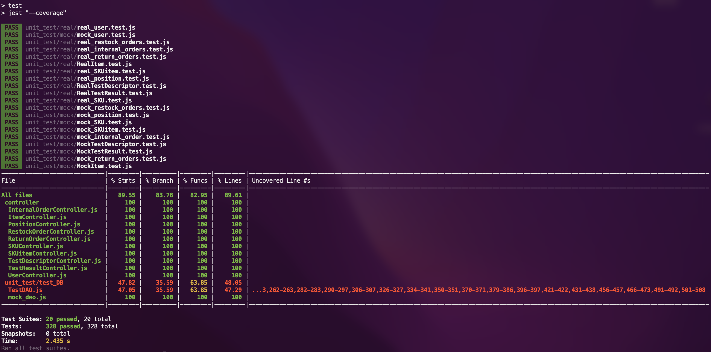

# Unit Testing Report

**Authors**:
 * Riccardo Medina
 * Simran Singh
 * Davide Arcolini
 * Giuseppe Atanasio

**Date**: 08 June 2022

**Version**: `1.0`

| Version number | Change |
| ----------------- |:-----------|
| 1.0 | Added first version of Unit Test Report document. |
| 1.1 | Modifications due to the separation in Controllers and DAOs |
| 2.0 | Remodeled unit tests |

# Contents

- [Black Box Unit Tests](#black-box-unit-tests)

- [White Box Unit Tests](#white-box-unit-tests)

# Black Box Unit Tests

- [Class UserDAO](#class-userdao)
- [Class PositionDAO](#class-positiondao)
- [Class SKUitemDAO](#class-skuitemdao)
- [Class SKUDAO](#class-skudao)
- [Class InternalOrderDAO](#class-internalorderdao)
- [Class ItemDAO](#class-itemdao)
- [Class RestockOrderDAO](#class-restockorderdao)
- [Class ReturnOrderController](#class-returnordercontroller)
- [Class TestDescriptorDAO](#class-testdescriptordao)
- [Class TestResultDAO](#class-testresultdao)

## **Class UserDAO**

### **Class *UserDAO* - method *getUsers***

**Criteria for method *getUsers*:**

- Database is reachable

**Predicates for method *getUsers*:**

| Criteria | Predicate |
| -------- | --------- |
| Database is reachable| True |
|          | False |

**Combination of predicates**:

| Database is reachable | Valid / Invalid | Description of the test case | Jest test case |
|-------|-------|-------|-------|
| True | Valid |`testGetUsers(name, expected, supplier=undefined)` return the expected array of objects |`function`   `testGetUsers(name, expected, supplier=undefined)`|
| False | Invalid |`testGetUsers(name, expected, supplier=undefined)` throws `Error`|`function`   `testGetUsers(name, expected, supplier=undefined)`|

### **Class *UserDAO* - method *createUser***

**Criteria for method *createUser*:**

- Database is reachable
- `username` is *unique* in the database

**Predicates for method *createUser*:**

| Criteria | Predicate |
| -------- | --------- |
| Database is reachable |True|
|          | False |
| `username` is *unique* in the database | True |
|          | False |
|          | undefined |

**Combination of predicates**:

| Database is reachable | `username` is *unique* in the database | Valid / Invalid | Description of the test case | Jest test case |
|-------|-------|-------|-------|-------|
| True | True | Valid | `testNewUser()` terminates correctly | `function` `testNewUser(name, usr, expected)`|
| False | False | Invalid | `testNewUser()` throws `Error` | `function` `testNewUser(name, usr, expected)` |
| False | undefined | Invalid | `testNewUser()` throws `Error` | `function` `testNewUser(name, usr, expected)`|

### **Class *UserDAO* - method *getUser***

**Criteria for method *getUser*:**

- `username` is *unique* in the database
- Password valid
- Database is reachable

**Predicates for method *getUser*:**

| Criteria | Predicate |
| -------- | --------- |
| `username` is *unique* in the database | True |
|          | False |
|          | undefined |
| `password` valid | Yes |
|          | No |
|| undefined |
| Database is reachable | True |
|| False |

**Combination of predicates**

| `username` is *unique* in the database | `password` valid | Database is reachable | Valid / Invalid | Description of the test case | Jest test case |
|-------|-------|-------|-------|-------|-------|
| True | Yes | True | Valid | `testGetUser()` terminates returning the exact expected value | `function` `testGetUser(name, usr, expected)` |
| True | Yes | True | Valid | `testGetUser()` terminates returning the exact expected value | `function` `testGetUser(name, usr, expected)` |
| True | Undefined | False | Invalid | `testGetUser()` throws `Error` | `function` `testGetUser(name, usr, expected)`|

### **Class *UserDAO* - method *modifyPermissions***

**Criteria for method *modifyPermissions*:**

- `username` exists in the database
- Database is reachable

**Predicates for method *modifyPermissions*:**

| Criteria | Predicate |
| -------- | --------- |
| `username` exists in the database | True |
|          | False |
|          | undefined |
| Database is reachable | Yes |
|          | No |
||undefined|
**Combination of predicates**:

| `username` exists in the database |Database is reachable| Valid / Invalid | Description of the test case | Jest test case |
|-------|-------|-------|-------|-------|
| True | Yes | Valid | `testModifyPermissions` retrieve the exact value expected | `function` `testModifyPermissions(name, usr, expected)` |
| False | Yes | Invalid | `testModifyPermissions` terminates with `undefined` | `function`  `testModifyPermissions(name, usr, expected)` |
| False | No | Invalid | `testModifyPermissions` throws `Error` | `function`  `testModifyPermissions(name, usr, expected)`|

### **Class *UserDAO* - method *removeUser***

**Criteria for method *removeUser*:**

- Database is reachable

**Predicates for method *removeUser*:**

| Criteria | Predicate |
| -------- | --------- |
| Database is reachable | True |
|| False |

**Combination of predicates**:

| Database is reachable | Valid / Invalid | Description of the test case | Jest test case |
|-------|-------|-------|-------|
| True  | Valid | `testRemoveUser()` terminates successfully | `function`  `testRemoveUser(name, usr, expected)`|
| False | Invalid | `testRemoveUser()` throws `Error` | `function` `testRemoveUser(name, usr, expected)` |

## **Class PositionDAO**

### **Class *PositionDAO* - method *getPositions()***

**Criteria for method *getPositions()*:**

 - Database is reachable

**Predicates for method *getPositions()*:**

| Criteria              | Predicate |
| :--------:            | :---------: |
| Database is reachable | *true* |
|                       | *false*|

**Combination of predicates**:
| Database is reachable | Valid / Invalid | Description of the test case | Jest test case |
|:-------:|:-------:|:-------:|:-------:|
| *true* | valid |`testGetPositions_REAL()` receives an `Array` object of positions and **passes the test**|`function`  `testGetPositions_REAL(testName, expectedResult)`|
|*false*|invalid|`testGetPositions_REAL()` catches `Error` and **fails the test**|`function`  `testGetPositions_REAL(testName, expectedResult)`|

### **Class *PositionDAO* - method *getPositionByID()***
**Criteria for method *getPositionByID()*:**
 - Database is reachable

**Predicates for method *getPositionByID()*:**

| Criteria              | Predicate |
| :--------:            | :---------: |
| Database is reachable | *true* |
|                       | *false*|

**Combination of predicates**:
| Database is reachable | Valid / Invalid | Description of the test case | Jest test case |
|:-------:|:-------:|:-------:|:-------:|
| *true* | valid |`testGetPositionByID_REAL()` receives position object corresponding to `positionID` and **passes the test**|`function`  `testGetPositionByID_REAL(testName, positionID, expectedResult)`|
|*false*|invalid|`testGetPositionByID_REAL()` catches `Error` and **fails the test**|`function`  `testGetPositionByID_REAL(testName, positionID, expectedResult)`|

### **Class *PositionDAO* - method *newPosition()***
**Criteria for method *newPosition()*:**
 - Database is reachable
 - `positionID` is *unique* in the database

**Predicates for method *newPosition()*:**
| Criteria              | Predicate |
| :--------:            | :---------: |
| Database is reachable | *true* |
|                       | *false*|
| `positionID` is *unique* in the database|*true*|
||*false*|

**Combination of predicates**:
| Database is reachable |`positionID` is *unique* in the database| Valid / Invalid | Description of the test case | Jest test case |
|:-------:|:-------:|:-------:|:-------:|:-------:|
| *true* |*true*| valid |`testNewPosition_REAL()` receives the last `positionID` and **passes the test** |`function`  `testNewPosition_REAL(testName, positionObject, expectedResult)`|
| *true* |*false*| invalid |`testNewPosition_REAL()` catches `Error` and **fails the test**|`function`  `testNewPosition_REAL(testName, positionObject, expectedResult)`|
| *false* |*/*| invalid |`testNewPosition_REAL()` catches `Error` and **fails the test**|`function`  `testNewPosition_REAL(testName, positionObject, expectedResult)`|

### **Class *PositionDAO* - method *updatePositionByPositionID()***
**Criteria for method *updatePositionByPositionID()*:**
 - Database is reachable
 - `positionObject.newPositionID` is *unique* in the database

**Predicates for method *editPosition()*:**
 | Criteria              | Predicate |
| :--------:                                                        | :---------: |
| Database is reachable                                             | *true*    |
|                                                                   | *false*   |
| `positionObject.newPositionID` is *unique* in the database        | *true*    |
|                                                                   | *false*   |

**Combination of predicates**:
| Database is reachable |`positionObject.newPositionID` is *unique* in the database| Valid / Invalid | Description of the test case | Jest test case |
|:-------:|:-------:|:-------:|:-------:|:-------:|
|*true* |*true*| valid |`testUpdatePositionByPositionID_REAL()` receive the last `positionID` and **passes the test** |`function` `testUpdatePositionByPositionID_REAL(testName, positionID, positionObject, expectedResult)`|
|*true* |*false*| invalid |`testUpdatePositionByPositionID_REAL()` catches `Error` and **fails the test** |`function` `testUpdatePositionByPositionID_REAL(testName, positionID, positionObject, expectedResult)`|
|*false* |*/*| invalid |`testUpdatePositionByPositionID_REAL()` catches `Error` and **fails the test** |`function` `testUpdatePositionByPositionID_REAL(testName, positionID, positionObject, expectedResult)`|

### **Class *PositionDAO* - method *updatePositionID()***
**Criteria for method *updatePositionID()*:**
 - Database is reachable
 - `newPositionID` is *unique* in the database

**Predicates for method *updatePositionID()*:**
 | Criteria              | Predicate |
| :--------:            | :---------: |
| Database is reachable | *true* |
|                       | *false*|
|`newPositionID` is *unique* in the database|*true*|
||*false*|

**Combination of predicates**:
| Database is reachable|`newPositionID` is *unique* in the database| Valid / Invalid | Description of the test case | Jest test case |
|:-------:|:-------:|:-------:|:-------:|:-------:|
| *true* |*true*| valid |`testUpdatePositionID_REAL()` receive the last `positionID` and **passes the test** |`function`  `testUpdatePositionID_REAL(testName, positionID, newPositionID, expectedResult)`|
| *true* |*false*| invalid |`testUpdatePositionID_REAL()` catches `Error` and **fails the test** |`function`  `testUpdatePositionID_REAL(testName, positionID, newPositionID, expectedResult)`|
| *false*|*/*| invalid |`testUpdatePositionID_REAL()` catches `Error` and **fails the test** |`function`  `testUpdatePositionID_REAL(testName, positionID, newPositionID, expectedResult)`|

### **Class *PositionDAO* - method *updatePositionQuantity()***
**Criteria for method *updatePositionQuantity()*:**
 - Database is reachable

**Predicates for method *updatePositionQuantity()*:**
 | Criteria              | Predicate |
| :--------:            | :---------: |
| Database is reachable | *true* |
|                       | *false*|

**Combination of predicates**:
| Database is reachable| Valid / Invalid | Description of the test case | Jest test case |
|:-------:|:-------:|:-------:|:-------:|
| *true* | valid |`testUpdatePositionQuantity_REAL()` receive the last `positionID` and **passes the test** |`function`  `testUpdatePositionQuantity_REAL(testName, positionID, newOccupiedWeight, newOccupiedVolume, expectedResult)`|
| *false*| invalid |`testUpdatePositionQuantity_REAL()` catches `Error` and **fails the test** |`function`  `testUpdatePositionQuantity_REAL(testName, positionID, newOccupiedWeight, newOccupiedVolume, expectedResult)`|

### **Class *PositionDAO* - method *removePosition()***
**Criteria for method *removePosition()*:**
 - Database is reachable

**Predicates for method *removePosition()*:**
 | Criteria              | Predicate |
| :--------:            | :---------: |
| Database is reachable | *true* |
|                       | *false*|

**Combination of predicates**:
| Database is reachable | Valid / Invalid | Description of the test case | Jest test case |
|:-------:|:-------:|:-------:|:-------:|
| *true* | valid |`testRemovePosition_REAL()` receive the last `positionID` and **passes the test** |`function`  `testRemovePosition_REAL(testName, positionID, expectedResult)`|
| *false*| invalid |`testRemovePosition_REAL()` catches `Error` and **fails the test** |`function`  `testRemovePosition_REAL(testName, positionID, expectedResult)`|

## **Class SKUitemDAO**
### **Class *SKUitemDAO* - method *getSKUitems()***
**Criteria for method *getSKUitems()*:**
 - Database is reachable

**Predicates for method *getSKUitems()*:**

| Criteria              | Predicate |
| :--------:            | :---------: |
| Database is reachable | *true* |
|                       | *false*|

**Combination of predicates**:
| Database is reachable | Valid / Invalid | Description of the test case | Jest test case |
|:-------:|:-------:|:-------:|:-------:|
| *true* | valid |`testGetSKUitems_REAL()` receive an `Array` of SKUitems objects and **passes the test** |`function`  `testGetSKUitems_REAL(testName, expectedResult)`|
|*false*| invalid |`testGetSKUitems_REAL()` catches `Error` and **fails the test** |`function`  `testGetSKUitems_REAL(testName, expectedResult)`|

### **Class *SKUitemDAO* - method *getSKUitemsBySKUid()***
**Criteria for method *getSKUitemsBySKUid()*:**
 - Database is reachable
 - `SKUid` *exists* in the database

**Predicates for method *getSKUitemsBySKUid()*:**

| Criteria              | Predicate |
| :--------:            | :---------: |
| Database is reachable | *true* |
|                       | *false*|

**Combination of predicates**:
| Database is reachable |Valid / Invalid | Description of the test case | Jest test case |
|:-------:|:-------:|:-------:|:-------:|
| *true* | valid |`testGetSKUitemsBySKUid_REAL()` receive an `Array` of SKUitems objects and **passes the test** |`function`  `testGetSKUitemsBySKUid_REAL(testName, SKUid, expectedResult)`|
|*false*| invalid |`testGetSKUitemsBySKUid_REAL()` catches `Error` and **fails the test** |`function`  `testGetSKUitemsBySKUid_REAL(testName, SKUid, expectedResult)`|

### **Class *SKUitemDAO* - method *getSKUitemsByRFID()***
**Criteria for method *getSKUitemsByRFID()*:**
 - Database is reachable
 - `RFID` *exists* in the database

**Predicates for method *getSKUitemsByRFID()*:**

| Criteria              | Predicate |
| :--------:            | :---------: |
| Database is reachable | *true* |
|                       | *false*|

**Combination of predicates**:
| Database is reachable | Valid / Invalid | Description of the test case | Jest test case |
|:-------:|:-------:|:-------:|:-------:|
| *true* | valid |`testGetSKUitemsByRFID_REAL()` receive an `Array` of SKUitems objects and **passes the test** |`function`  `testGetSKUitemsByRFID_REAL(testName, RFID, expectedResult)`|
|*false*| invalid |`testGetSKUitemsByRFID_REAL()` catches `Error` and **fails the test** |`function`  `testGetSKUitemsByRFID_REAL(testName, RFID, expectedResult)`|

### **Class *SKUitemDAO* - method *newSKUitem()***
**Criteria for method *newSKUitem()*:**
 - Database is reachable
 - `SKUid` *exists* in the database
 - `RFID` is *unique* in the database

**Predicates for method *newSKUitem()*:**

| Criteria              | Predicate |
| :--------:            | :---------: |
| Database is reachable | *true* |
|                       | *false*|
|`SKUid` *exists* in the database|*true*|
||*false*|
|`RFID` is *unique* in the database|*true*|
||*false*|

**Combination of predicates**:
| Database is reachable |`SKUid` *exists* in the database|`RFID` is *unique* in the database| Valid / Invalid | Description of the test case | Jest test case |
|:-------:|:-------:|:-------:|:-------:|:-------:|:-------:|
| *true* | *true* |*true*| valid |`newSKUitem_TEST()` terminates with  `{code: 201, message: "CREATED"}`|`function`  `newSKUitem_TEST(describe_NAME, request, expectedResult)`|
| *true* | *true* |*false*| invalid |`newSKUitem_TEST()` catch `TypeError` and terminates with  `{code: 503, message: "Service Unavailable"}`|`function`  `newSKUitem_TEST(describe_NAME, request, expectedResult)`|
| *true* | *false* |*/*| invalid |`newSKUitem_TEST()` terminates with  `{code: 404, message: "Not Found"}`|`function`  `newSKUitem_TEST(describe_NAME, request, expectedResult)`|
| *false* | */* |*/*| invalid |`newSKUitem_TEST()` catch `TypeError` and terminates with  `{code: 503, message: "Service Unavailable"}`|`function`  `newSKUitem_TEST(describe_NAME, request, expectedResult)`|

### **Class *SKUitemDAO* - method *updateSKUitem()***
**Criteria for method *updateSKUitem()*:**
 - Database is reachable
 - `RFID` *exists* in the database

**Predicates for method *updateSKUitem()*:**

| Criteria              | Predicate |
| :--------:            | :---------: |
| Database is reachable | *true* |
|                       | *false*|
|`RFID` *exists* in the database|*true*|
||*false*|

**Combination of predicates**:
| Database is reachable |`RFID` *exists* in the database|Valid / Invalid| Description of the test case | Jest test case |
|:-------:|:-------:|:-------:|:-------:|:-------:|
| *true* | *true* | valid |`updateSKUitem_TEST()` terminates with  `{code: 201, message: "CREATED"}`|`function`  `updateSKUitem_TEST(describe_NAME, params, request, expectedResult)`|
| *true* | *false* | invalid |`updateSKUitem_TEST()` terminates with  `{code: 404, message: "Not Found"}`|`function`  `updateSKUitem_TEST(describe_NAME, params, request, expectedResult)`|
| *false* | */* | invalid |`updateSKUitem_TEST()` catch `TypeError` and terminates with  `{code: 503, message: "Service Unavailable"}`|`function`  `updateSKUitem_TEST(describe_NAME, params, request, expectedResult)`|

### **Class *SKUitemDAO* - method *deleteSKUitem()***
**Criteria for method *deleteSKUitem()*:**
 - Database is reachable

**Predicates for method *deleteSKUitem()*:**

| Criteria              | Predicate |
| :--------:            | :---------: |
| Database is reachable | *true* |
|                       | *false*|

**Combination of predicates**:
| Database is reachable |Valid / Invalid| Description of the test case | Jest test case |
|:-------:|:-------:|:-------:|:-------:|
| *true* | valid |`deleteSKUitem_TEST()` terminates with  `{code: 204, message: "No Content"}`|`function`  `deleteSKUitem_TEST(describe_NAME, params, expectedResult)`|
| *false* | invalid |`deleteSKUitem_TEST()` catch `TypeError` and terminates with  `{code: 503, message: "Service Unavailable"}`|`function`  `deleteSKUitem_TEST(describe_NAME, params, expectedResult)`|

## **Class SKUDAO**

### **Class *SKUDAO* - method *getSKUByID()***

**Criteria for method *getSKUByID()*:**
 - Database is reachable
 - `SKUid` *exists* in the database

**Predicates for method *getSKUByID()*:**

| Criteria              | Predicate |
| :--------:            | :---------: |
| Database is reachable | *true* |
|                       | *false*|
|`SKUid` *exists* in the database|*true*|
||*false*|

**Combination of predicates**:
| Database is reachable |`SKUid` *exists* in the database | Valid / Invalid | Description of the test case | Jest test case |
|:-------:|:-------:|:-------:|:-------:|:-------:|
| *true* |*true*| valid |`testGetSKUByID_REAL()` terminates with the expected value |`function`  `testGetSKUByID_REAL('- Success: ', 1, skusTestArray[0]);`|
| *true* |*false*| invalid |`testGetSKUByID_REAL()` terminates with  `undefined`|`function`  `testGetSKUByID_REAL('- Success: ', 1, undefined);`|

### **Class *SKUDAO* - method *newSKU()***
**Criteria for method *newSKU()*:**
 - Database is reachable

**Predicates for method *newSKU()*:**

| Criteria              | Predicate |
| :--------:            | :---------: |
| Database is reachable | *true* |
|                       | *false*|

**Combination of predicates**:
| Database is reachable | Valid / Invalid | Description of the test case | Jest test case |
|:-------:|:-------:|:-------:|:-------:|
| *true* | valid |`testNewSKU_REAL()` terminates with expected array |`function`  `testNewSKU_REAL('- Success: ', {description: "A new SKU", weight: 100, volume: 100, notes: "First SKU", price: 10.99, availableQuantity: 1}, {id: 1});`|
| *false* | Invalid | `testNewSKU_REAL()` throws `Error` | `function`   `testNewSKU_MOCK('- Database error: ', skusTestArray[0], Error);` |

### **Class *SKUDAO* - method *updateSKU()***
**Criteria for method *updateSKU()*:**
 - Database is reachable
 - `SKUid` *exists* in the database
 - **Position** associated to **SKU** satisfies `maxWeight` and `maxVolume` constraints

**Predicates for method *updateSKU()*:**

| Criteria              | Predicate |
| :--------:            | :---------: |
| Database is reachable | *true* |
|                       | *false*|
|`SKUid` *exists* in the database|*true*|
||*false*|
|**Position** associated to **SKU** satisfies `maxWeight` and `maxVolume` constraints|*true*|
||*false*|

**Combination of predicates**:
| Database is reachable |`SKUid` *exists* in the database |**Position** associated to **SKU** satisfies `maxWeight` and `maxVolume` constraints| Valid / Invalid | Description of the test case | Jest test case |
|:-------:|:-------:|:-------:|:-------:|:-------:|:-------:|
| *true* | *true* | *true* | valid |`testUpdateSKU_REAL()` terminates with the expected value |`function`  `testUpdateSKU_REAL(testName, ID, skuObject, expectedResult)`|
| *true* | *false* | */* | invalid |`testUpdateSKU_REAL()` terminates with the expected value |`function`  `testUpdateSKU_REAL(testName, ID, skuObject, expectedResult)`|
| *false* | */* | */* | invalid |`testUpdateSKU_REAL()` throws `Error`|`function`  `testUpdateSKU_MOCK(testName, ID, skuObject, expectedResult)`|

### **Class *SKUDAO* - method *updateSKUpositionID()***

**Criteria for method *updateSKUpositionID()*:**
 - Database is reachable
 - `positionID` is already assigned to **SKU**
 - `SKUid` *exists* in the database
 - `positionID` *exists* in the database
 - **Position** associated to **SKU** satisfies `maxWeight` and `maxVolume` constraints

**Predicates for method *updateSKU()*:**

| Criteria              | Predicate |
| :--------:            | :---------: |
| Database is reachable | *true* |
|                       | *false*|
|`positionID` is already assigned to **SKU**|*true*|
||*false*|
|`SKUid` *exists* in the database|*true*|
||*false*|
|`positionID` *exists* in the database|*true*|
||*false*|
|**Position** associated to **SKU** satisfies `maxWeight` and `maxVolume` constraints|*true*|
||*false*|

**Combination of predicates**:
| Database is reachable |`positionID` is already assigned to **SKU** |`SKUid` *exists* in the database|`positionID` *exists* in the database|**Position** associated to **SKU** satisfies `maxWeight` and `maxVolume` constraints| Valid / Invalid | Description of the test case | Jest test case |
|:-------:|:-------:|:-------:|:-------:|:-------:|:-------:|:-------:|:-------:|
| *true* | *false* | *true* | *true* | *true* | valid |`testUpdateSKUpositionID_REAL()` terminates with the expected value |`function`  `testUpdateSKUpositionID_REAL(testName, ID, newPositionID, expectedResult)` |
| *false* | */* | */* | */* | */* | invalid |`testUpdateSKUpositionID_REAL()` throws `Error` |`function`  `testUpdateSKUpositionID_MOCK(testName, ID, newPositionID, expectedResult)`|

### **Class *SKUDAO* - method *deleteSKU()***

**Criteria for method *deleteSKU()*:**

 - Database is reachable
 - **SKU** is associated with **TestDescriptors**
 - **SKU** is associated with **SKUItems**

**Predicates for method *deleteSKU()*:**

| Criteria              | Predicate |
| :--------:            | :---------: |
| Database is reachable | *true* |
|                       | *false*|
|**SKU** is associated with **TestDescriptors**|*true*|
||*false*|
|**SKU** is associated with **SKUItems**|*true*|
||*false*|

**Combination of predicates**:
| Database is reachable |**SKU** is associated with **TestDescriptors** |**SKU** is associated with **SKUItems**| Valid / Invalid | Description of the test case | Jest test case |
|:-------:|:-------:|:-------:|:-------:|:-------:|:-------:|
| *true* | *false* | *false* | valid |`testDeleteSKU_REAL()` terminates with the expected value |`function`  `testDeleteSKU_REAL(testName, ID, expectedResult)`|
`function`  `testDeleteSKU_REAL(testName, ID, expectedResult)`|
| *false* | */* | */* | invalid |`testDeleteSKU_REAL()` throws `Error` |`function`  `testDeleteSKU_MOCK(testName, ID, expectedResult)`|

## **Class InternalOrderDAO**

**Criteria for method *getInternalOrders*:**

- Database is reachable

**Predicates for method *getInternalOrders*:**
| Criteria              | Predicate |
| :--------:            | :---------: |
| Database is reachable | *true* |
|                       | *false*|

**Combination of predicates**:

| Database is reachable | Valid / Invalid | Description of the test case | Jest test case |
|:-------:|:-------:|:-------:|:-------:|
| *true* | valid |`getInternalOrders` returns  an array of the internal orders retrieved |`function`   `getInternalOrders(expected)`|
|*false*|invalid|`getInternalOrders` catch `TypeError` and terminates with  `{code: 500, message: "Internal Server Error"}`|`function`  `getInternalOrders(expected)`|

### **Class *InternalOrderDAO* - method *getInternalOrderById***

**Criteria for method *getInternalOrderById*:**
- Database is reachable 
- Internal order associated to the `id` *exists* in the db

**Predicates for method *getInternalOrderById*:**

| Criteria | Predicate |
| :--------: | :---------: |
| Database is reachable | *true* |
|                       | *false*|
| internal order associated to the `id` *exists* in the database|*true*|
||*false*|

**Combination of predicates**:

| Database reachable | `id` *exists* in the database | Valid / Invalid | Description of the test case | Jest test case |
|:-------:|:-------:|:-------:|:-------:|:-------:|
| *true* | *true* | valid | `getInternalOrderById` retrieves the  internal order associated to the `id` |`function`  ` getInternalOrderById(req,expected)` |
| *true* | *false* | invalid | `getInternalOrderById` terminates with  `{message: "Not Found"}`|  `function`   `getInternalOrderById(req,expected)` |
| *false* | */* | invalid | `getInternalOrderById` catch `TypeError` and terminates with  `{code: 500, message: "Internal Server Error"}` | `function`  ` getInternalOrderById(req,expected)` |

### **Class *InternalOrderDAO* - method *createInternalOrder***

### **Class *InternalOrderDAO* - method *createInternalOrder***

**Criteria for method *createInternalOrder*:**

- Database is reachable
- `issueDate` saved in the db as expected
- `customerId` saved in the db as expected
- `products` saved in the db as expected

**Predicates for method *createInternalOrder*:**

| Criteria              | Predicate |
| :--------:            | :---------: |
| Database is reachable | *true* |
|                       | *false*|
| `issueDate` | *true* |
|                       | *false*|
| `customerId` | *true* |
|                       | *false*|
| `products` | *true* |
|                       | *false*|

**Combination of predicates**:

| Database is reachable | `issueDate` | `customerId` | `products` | Valid / Invalid | Description of the test case | Jest test case |
|:-------:|:-------:|:-------:|:-------:|:-------:|:-------:|:-------:|
| *true* | *true* |*true* |*true* | valid | `createInternalOrder` creates a new internal order and it retrieves the new internal order to compare with the one expected  |`function`  `createInternalOrder(issueDate,products,customerId,expected)`|
| *true* | *false* |*true* |*true* | invalid | `createInternalOrder` creates a new internal order but the internal order's the `issueDate` is not as expected therefore the test failes |`function`  `createInternalOrder(issueDate,products,customerId,expected)`|
| *true* | *true* |*false* |*true* | invalid | `createInternalOrder` creates a new internal order but the internal order's the `customerId` is not as expected  |`function`  `createInternalOrder(issueDate,products,customerId,expected)`|
| *true* | *true* |*true* |*false* | invalid | `createInternalOrder` creates a new internal order but the internal order's the `products` is not as expected  |`function`  `createInternalOrder(issueDate,products,customerId,expected)`|
| *false* | *true* |*true* |*true* | invalid | `createInternalOrder` catch `TypeError` and terminates with  `{code: 503, message: "Service Unavailable"}`  |`function`  `createInternalOrder(issueDate,products,customerId,expected)`|

### **Class *InternalOrderDAO* - method *modifyInternalOrderState***

**Criteria for method *modifyInternalOrderState*:**
    
 - Database is reachable
 - internal order associated to the `id`  *exists* in the database
 - `newState` constraint

**Predicates for method *modifyInternalOrderState*:**

| Criteria              | Predicate |
| :--------:            | :---------: |
| Database is reachable | *true* |
|                       | *false*|
|`id` *exists* in the database|*true*|
||*false*|
| `newState`|"ISSUED"|
| |"ACCEPTED"|
| |"REFUSED"|
| |"CANCELED"|
| |"COMPLETED"|
| `products` are defined |*true*|
||*false*|

**Combination of predicates**:

| Database is reachable |`id` *exists* in the database| `newState` |  `products`| Valid / Invalid | Description of the test case | Jest test case |
|:-------:|:-------:|:-------:|:-------:|:-------:|:-------:|:-------:|
| *true* | *true* | "ISSUED"  | *false* |  valid |`modifyInternalOrderState` returns the `id` of the internal order successfully edited|`function`  `modifyInternalOrderState(id,newState,products,expected)` |
| *true* | *true* | "ACCEPTED"  | *false* |  valid |`modifyInternalOrderState(id,newState,products,expected)` returns the `id` of the internal order successfully edited|`function`  `modifyInternalOrderState(id,newState,products,expected)` |
| *true* | *true* | "REFUSED"  | *false* |  valid |`modifyInternalOrderState` returns the `id` of the internal order successfully edited|`function`  `modifyInternalOrderState(id,newState,products,expected)` |
| *true* | *true* | "CANCELED"  | *false* |  valid |`modifyInternalOrderState` returns the `id` of the internal order successfully edited|`function`  `modifyInternalOrderState(id,newState,products,expected)` |
| *true* | *true* | "COMPLETED"  | *true* |  valid |`modifyInternalOrderState` returns the `id` of the internal order successfully edited|`function`  `modifyInternalOrderState(id,newState,products,expected)` |
| *true* | *true* | "COMPLETED"  | *false* |  invalid |`modifyInternalOrderState` returns `{Unprocessable}`|`function`  `modifyInternalOrderState(id,newState,products,expected)` |
| *true* | *false* | "COMPLETED"  | *true* |  invalid |`modifyInternalOrderState` returns `{message: "Not Found"}`|`function`  `modifyInternalOrderState(id,newState,products,expected)` |
| *true* | *false* | "ISSUED"  | *false* |  invalid |`modifyInternalOrderState` returns `{message: "Not Found"}`|`function`  `modifyInternalOrderState(id,newState,products,expected)` |
| *true* | *false* | "ACCEPTED"  | *false* |  invalid |`modifyInternalOrderState` returns `{message: "Not Found"}`|`function`  `modifyInternalOrderState(id,newState,products,expected)` |
| *true* | *false* | "CANCELED"  | *false* |  invalid |`modifyInternalOrderState` returns `{message: "Not Found"}`|`function`  `modifyInternalOrderState(id,newState,products,expected)` |
| *true* | *false* | "REFUSED"  | *false* |  invalid |`modifyInternalOrderState` returns `{message: "Not Found"}`|`function`  `modifyInternalOrderState(id,newState,products,expected)` |
| *false* | *true* | "ISSUED"  | *false* |  invalid |`modifyInternalOrderState` catch `TypeError` and terminates with  `{code: 503, message: "Service Unavailable"}`|`function`  `modifyInternalOrderState(id,newState,products,expected)` |
| *false* | *true* | "ACCEPTED"  | *false* |  invalid |`modifyInternalOrderState` catch `TypeError` and terminates with  `{code: 503, message: "Service Unavailable"}`|`function`  `modifyInternalOrderState(id,newState,products,expected)` |
| *false* | *true* | "REFUSED"  | *false* |  invalid |`modifyInternalOrderState` catch `TypeError` and terminates with  `{code: 503, message: "Service Unavailable"}`|`function`  `modifyInternalOrderState(id,newState,products,expected)` |
| *false* | *true* | "CANCELED"  | *false* |  invalid |`modifyInternalOrderState` catch `TypeError` and terminates with  `{code: 503, message: "Service Unavailable"}`|`function`  `modifyInternalOrderState(id,newState,products,expected)` |
| *false* | *true* | "COMPLETED"  | *true* |  invalid |`modifyInternalOrderState` catch `TypeError` and terminates with  `{code: 503, message: "Service Unavailable"}`|`function`  `modifyInternalOrderState(id,newState,products,expected)` |

### **Class *InternalOrderDAO* - method *deleteInternalOrder***

**Criteria for method *deleteInternalOrder*:**
    
 - Database is reachable

**Predicates for method *deleteInternalOrder*:**

| Criteria              | Predicate |
| :--------:            | :---------: |
| Database is reachable | *true* |
|                       | *false*|

**Combination of predicates**:

| Database is reachable | Valid / Invalid | Description of the test case | Jest test case |
|:-------:|:-------:|:-------:|:-------:|
| *true* | valid |`deleteInternalOrder(req)` return the `id` of the internal order deleted successfully|`function`  `deleteInternalOrder(req)`|
| *false* | invalid |`deleteInternalOrder(req)` catch `TypeError` and terminates with  `{code: 503, message: "Unprocessable Entity"}`|`function`  `deleteInternalOrder(req)`|

## **Class ItemDAO**

### **Class *ItemDAO*- method *getItems***

**Criteria for method *getItems*:**

- Database is reachable  

**Predicates for method *getItemById*:**

| Criteria | Predicate |
| -------- | --------- |
|    DB is reachable        |     true      |
|          |    false       |

**Combination of predicates**:

| DB is reachable |   Valid / Invalid | Description of the test case | Jest test case |
|-------|-------|------|-------|
|true| valid | `getItems()` terminates with the expected value|`function` `getItems(name,expected)` |
|false| invalid |`getItems()` throws `Error` |`function`   `getItems(name,expected)` |

### **Class *ItemDAO*- method *getItemById***

**Criteria for method *getItemById*:**

- Database is reachable  
- id is unique in the DB
- supplierId exists in the database

**Predicates for method *getItemById*:**

| Criteria | Predicate |
| -------- | --------- |
|    DB is reachable        |     true      |
|          |    false       |
|    id exists in the DB      |     true      |
|          |    false       |
|  supplierId exists in the DB        |   true        |
|          |    false       |

**Combination of predicates**:

| DB is reachable | Id exists in the DB |supplierId exists in the DB |  Valid / Invalid | Description of the test case | Jest test case |
|-------|-------|------|-------|-------|-------|
|true|true|true| valid | `getItemById()` terminates with the expected value|`function` `getItemById(name,id,supplierId,expected)` |
|true|true|false| invalid |`getItemById()` terminates with empty value |`function`   `getItemById(name,id,supplierId,expected)` |
|true|false|true| invalid |`getItemById()` terminates with empty value|`function`   `getItemById(name,id,supplierId,expected)` |
|false|/|/| invalid |`getItemById()` throws `Error` |`function`   `getItemById(name,id,supplierId,expected)` |

### **Class *ItemDAO*- method *createItem***

**Criteria for method *createItem*:**

 - Database is reachable

**Predicates for method *createItem*:**

| Criteria | Predicate |
| -------- | --------- |
|    DB is reachable      |      true     |
|          |    false       |

**Combination of predicates**:

| DB is reachable | Valid / Invalid | Description of the test case | Jest test case |
|-------|-------|-------|-------|
|true|valid|`createItem()` terminates with the expected value |`function`  `createItem(name,expected,json)`|
|false|invalid| `createItem()` throws `Error` | `function`   `createItem(name,expected,json)`|

### **Class *ItemDAO*- method *modifyItem***

**Criteria for method *modifyItem*:**

- Database is reachable
- id exists in the database
- supplierId exists in the database

**Predicates for method *modifyItem*:**

| Criteria | Predicate |
| -------- | --------- |
|   DB is reachable       |   true        |
|          |    false       |
|  id exists in the DB        |   true        |
|          |    false       |
|  supplierId exists in the DB        |   true        |
|          |    false       |

**Combination of predicates**:

| DB is reachable | id exists in the DB |supplierId exists in the DB     | Valid / Invalid | Description of the test case | Jest test case |
|-------|-------|-------|-------|-------|-------|
|true|true|true|valid|`modifyItem()` terminates with 200|`function` `modyfyItem(name,expected,id,supplierId,json)`|
|true|false|true|invalid|`modifyItem()` terminates |`function` `modyfyItem(name,expected,id,supplierId,json)`|
|true|true|false|invalid|`modifyItem()` terminates|`function` `modyfyItem(name,expected,id,supplierId,json)`|
|false|/|/|invalid| `modifyItem()` throws `Error` | `function` `modyfyItem(name,expected,id,supplierId,json)`|

### **Class *ItemDAO*- method *deleteItem***

**Criteria for method *deleteItem*:**

- Database is reachable
- supplierId exists in the database
- id exists in the database

**Predicates for method *deleteItem*:**

| Criteria | Predicate |
| -------- | --------- |
|     DB is reachable     |      true     |
|          |    false       |
|  supplierId exists in the DB        |   true        |
|          |    false       |
|  id exists in the DB        |   true        |
|          |    false       |

**Combination of predicates**:

| DB is reachable| supplierId exists in the DB| id exists in the DB|Valid / Invalid | Description of the test case | Jest test case |
|-------|-------|-------|-------|-------|-------|
|true|true|true|valid| `deleteItem()` terminates with expected value |`function`   `deleteItem(name,expected,id,supplierId)`|
|true|true|false|invalid| `deleteItem()` terminates with empty value |`function`   `deleteItem(name,expected,id,supplierId)`|
|true|false|true|invalid| `deleteItem()` terminates with empty value |`function`   `deleteItem(name,expected,id,supplierId)`|
|false|/|/|invalid| `deleteItem()` throws `Error`|`function`   `deleteItem(name,expected,id,supplierId)`|

### **Class *ItemDAO*- method *getItemBySupSKUID***

**Criteria for method *getItemBySupSKUID*:**

- Database is reachable
- supplierId exists in the database
- SKUId exists in the database

**Predicates for method *getItemBySupSKUID*:**

| Criteria | Predicate |
| -------- | --------- |
|     DB is reachable     |      true     |
|          |    false       |
|  supplierId exists in the DB        |   true        |
|          |    false       |
|  SKUId exists in the DB        |   true        |
|          |    false       |

**Combination of predicates**:

| DB is reachable| supplierId exists in the DB| SKUId exists in the DB|Valid / Invalid | Description of the test case | Jest test case |
|-------|-------|-------|-------|-------|-------|
|true|true|true|valid| `getItemBySupSKUID()` terminates with expected value |`function`   `getItemBySupSKUID(name,expected,skuid,supplierid)`|
|false|/|/|invalid| `getItemBySupSKUID()` throws `Error`|`function`   `getItemBySupSKUID(name,expected,skuid,supplierid)`|
|true|true|false|invalid| `getItemBySupSKUID()` terminates with empty value |`function`   `getItemBySupSKUID(name,expected,skuid,supplierid)`|
|true|false|true|invalid| `getItemBySupSKUID()` terminates with empty value|`function`   `getItemBySupSKUID(name,expected,skuid,supplierid)`|

### **Class *ItemDAO*- method *getItemBySupId***

**Criteria for method *getItemBySupId*:**

- Database is reachable
- supplierId exists in the database
- id exists in the database

**Predicates for method *getItemBySupId*:**

| Criteria | Predicate |
| -------- | --------- |
|     DB is reachable     |      true     |
|          |    false       |
|  supplierId exists in the DB        |   true        |
|          |    false       |
|  id exists in the DB        |   true        |
|          |    false       |

**Combination of predicates**:

| DB is reachable|supplierId exists in the DB|id exists in the DB|Valid / Invalid | Description of the test case | Jest test case |
|-------|-------|-------|-------|-------|-------|
|true|true|true|valid| `getItemBySupId()` terminates with expected value |`function`   `getItemBySupId(name,expected,id,supplierid)`|
|true|false|true|invalid| `getItemBySupId()` terminates with empty value |`function`   `getItemBySupId(name,expected,id,supplierid)`|
|true|true|false|invalid| `getItemBySupId()` terminates with empty value |`function`   `getItemBySupId(name,expected,id,supplierid)`|
|false|/|/|invalid| `getItemBySupId()` throws `Error`|`function`   `getItemBySupId(name,expected,id,supplierid)`|

## **Class RestockOrderDAO**

### **Class *RestockOrderDAO* - method *getRestockOrders***

**Criteria for method *getRestockOrders*:**

- Database is reachable

**Predicates for method *getRestockOrders*:**

| Criteria              | Predicate |
| :--------:            | :---------: |
| Database is reachable | *true* |
|                       | *false*|

**Combination of predicates**:

| Database is reachable | Valid / Invalid | Description of the test case | Jest test case |
|:-------:|:-------:|:-------:|:-------:|
| *true* | valid |`testGetRestockOrders_MOCK` returns  an array of the restock orders retrieved |`function`  `testGetRestockOrders_MOCK(testname, expected)`|
|*false*|invalid|`testGetRestockOrders_MOCK` catch `TypeError` and throws `Error`|`function`  `testGetRestockOrders_MOCK(testname, expected)`|

### **Class *RestockOrderDAO* - method *getRestockOrdersIssued***

**Criteria for method *getRestockOrdersIssued*:**

- Database is reachable

**Predicates for method *getRestockOrdersIssued*:**

| Criteria              | Predicate |
| :--------:            | :---------: |
| Database is reachable | *true* |
|                       | *false*|

**Combination of predicates**:

| Database is reachable | Valid / Invalid | Description of the test case | Jest test case |
|:-------:|:-------:|:-------:|:-------:|
| *true* | valid |`testGetRestockOrdersIssued_MOCK` returns  an array of the restock orders issued retrieved |`function`  `testGetRestockOrdersIssued_MOCK(testName, expectedResult)`|
|*false*|invalid|`testGetRestockOrders_MOCK` catch `TypeError` and throws `Error`|`function`  `testGetRestockOrdersIssued_MOCK(testName, expectedResult)`|

### **Class *RestockOrderDAO* - method *getRestockOrderById***

**Criteria for method *getRestockOrderById*:**

- Database is reachable
- restock order associated to the `id` *exists* in the db

**Predicates for method *getRestockOrderById*:**

| Criteria | Predicate |
| :--------: | :---------: |
| Database is reachable | *true* |
|                       | *false*|
| restock order associated to the `id` *exists* in the database|*true*|
||*false*|

**Combination of predicates**:

| Database reachable | `id` *exists* in the database | Valid / Invalid | Description of the test case | Jest test case |
|:-------:|:-------:|:-------:|:-------:|:-------:|
| *true* | *true* | valid | `testGetRestockOrderById_MOCK` retrieves the  restock order associated to the `id` |`function`  ` testGetRestockOrderID_MOCK(testName, ID, expectedResult)` |
| *true* | *false* | invalid | `testGetRestockOrderById_MOCK` terminates with empty array|  `function`   `testGetRestockOrderID_MOCK(testName, ID, expectedResult)` |
| *false* | */* | invalid | `testGetRestockOrderById_MOCK` catch `TypeError` and throws `Error` | `function`  ` testGetRestockOrderID_MOCK(testName, ID, expectedResult)` |

### **Class *RestockOrderDAO* - method *createRestockOrder***

**Criteria for method *createRestockOrder*:**

- Database is reachable
- `issueDate` saved in the db as expected
- `supplierId` saved in the db as expected
- `products` saved in the db as expected

**Predicates for method *createRestockOrder*:**

| Criteria              | Predicate |
| :--------:            | :---------: |
| Database is reachable | *true* |
|                       | *false*|
| `issueDate` | *true* |
|                       | *false*|
| `supplierId` | *true* |
|                       | *false*|
| `products` | *true* |
|                       | *false*|

**Combination of predicates**:

| Database is reachable | `issueDate` | `supplierId` | `products` | Valid / Invalid | Description of the test case | Jest test case |
|:-------:|:-------:|:-------:|:-------:|:-------:|:-------:|:-------:|
| *true* | *true* |*true* |*true* | valid | `testCreateRestockOrder_MOCK` creates a new restock order and it retrieves the new restock  order id to compare with the one expected  |`function`  `testCreateRestockOrder_MOCK(testName, reqBody, expectedResult)`|
| *true* | *false* |*true* |*true* | invalid | `testCreateRestockOrder_MOCK` creates a new restock  order but the restock  order's the `issueDate` is not as expected therefore the test failes |`function`  `testCreateRestockOrder_MOCK(testName, reqBody, expectedResult)`|
| *false* | *true* |*true* |*true* | invalid | `testCreateRestockOrder_MOCK` catch `TypeError` and throws`Error` |`function`  `testCreateRestockOrder_MOCK(testName, reqBody, expectedResult)`|

### **Class *RestockOrderDAO* - method *modifyRestockOrderState***

**Criteria for method *modifyRestockOrderState*:**

 - Database is reachable
 - internal order associated to the `id`  *exists* in the database
 - `newState`

**Predicates for method *modifyRestockOrderState*:**

| Criteria              | Predicate |
| :--------:            | :---------: |
| Database is reachable | *true* |
|                       | *false*|
|`id` *exists* in the database|*true*|
||*false*|

**Combination of predicates**:

| Database is reachable |`id` *exists* in the database| Valid / Invalid | Description of the test case | Jest test case |
|:-------:|:-------:|:-------:|:-------:|:-------:|
| *true* | *true* | valid |`testModifyRestockOrderState_MOCK` returns the `id` of the restock order successfully edited|`function`  `testModifyRestockOrderState_MOCK(testName, ID, newState, expectedResult)` |
| *false* | *true*   | invalid |`testModifyRestockOrderState_MOCK` catch `TypeError` and throws `Error`|`function`  `testModifyRestockOrderState_MOCK(testName, ID, newState, expectedResult)` |

### **Class *RestockOrderDAO* - method *addTransportNote***

**Criteria for method *addTransportNote*:**

- Database is reachable
- restock order associated to the `id`  *exists* in the database
- restock order's `state` = "DELIVERY"
- `deliveryDate` after `issueDate`

**Predicates for method *addTransportNote*:**
| Criteria              | Predicate |
| :--------:            | :---------: |
| Database is reachable | *true* |
|                       | *false*|
|`id` *exists* in the database|*true*|
||*false*|
| `newState`|"DELIVERY"|
| | other|
| `deliveryDate` after `issueDate` | *true* |
|                       | *false*|

**Combination of predicates**:

| Database is reachable |`id` *exists* in the database| Valid / Invalid | Description of the test case | Jest test case |
|:-------:|:-------:|:-------:|:-------:|:-------:|
| *true* | *true* |   valid |`testAddTransportNote_MOCK` returns the `id` of the restock order successfully edited|`function`  `testAddTransportNote_MOCK(testName, ID, transportNote, expectedResult)` |
| *false* | *true* | invalid |`testAddTransportNote_MOCK` catch `TypeError` and throws `Error`|`function`  `testAddTransportNote_MOCK(testName, ID, transportNote, expectedResult)` |

### **Class *RestockOrderDAO* - method *addSkuItems***

**Criteria for method *addSkuItems*:**

- Database is reachable
- restock order associated to the `id`  *exists* in the database
- restock order's `state` = "DELIVERED"

**Predicates for method *addSkuItems*:**

| Criteria              | Predicate |
| :--------:            | :---------: |
| Database is reachable | *true* |
|                       | *false*|
|`id` *exists* in the database|*true*|
||*false*|
| `newState`|"DELIVERED"|
| | other|

**Combination of predicates**:

| Database is reachable |`id` *exists* in the database| Valid / Invalid | Description of the test case | Jest test case |
|:-------:|:-------:|:-------:|:-------:|:-------:|
| *true* | *true* | valid |`testSetSkuItems_MOCK` returns the `id` of the restock order successfully edited|`function`  `testSetSkuItems_MOCK(testName, ID, skuItems, expectedResult)` |
| *false* | / | invalid |`testSetSkuItems_MOCK` catch `TypeError` and throws `Error` |`function`  `testSetSkuItems_MOCK(testName, ID, skuItems, expectedResult)` |

### **Class *RestockOrderDAO* - method *deleteRestockOrder***

**Criteria for method *deleteRestockOrder*:**

 - Database is reachable

**Predicates for method *deleteRestockOrder*:**

| Criteria              | Predicate |
| :--------:            | :---------: |
| Database is reachable | *true* |
|                       | *false*|

**Combination of predicates**:

| Database is reachable | Valid / Invalid | Description of the test case | Jest test case |
|:-------:|:-------:|:-------:|:-------:|
| *true* | valid |`testDeleteRestockOrder_MOCK` return the `id` of the restock order deleted successfully|`function`  `testDeleteRestockOrder_MOCK(testName, ID, expectedResult)`|
| *false* | invalid |`testDeleteRestockOrder_MOCK` catch `TypeError` and throws `Error`|`function`  `testDeleteRestockOrder_MOCK(testName, ID, expectedResult)`|

## **Class ReturnOrderController**

**Criteria for method *getReturnOrders*:**

 - Database is reachable

**Predicates for method *getReturnOrders*:**
| Criteria              | Predicate |
| :--------:            | :---------: |
| Database is reachable | *true* |
|                       | *false*|

**Combination of predicates**:

| Database is reachable | Valid / Invalid | Description of the test case | Jest test case |
|:-------:|:-------:|:-------:|:-------:|
| *true* | valid |`testGetReturnOrders_MOCK` returns  an array of the return orders retrieved |`function`  `testGetReturnOrders_MOCK(testName, expectedResult)`|
|*false*|invalid|`testGetReturnOrders_MOCK` throws  `Error`|`function`  `testGetReturnOrders_MOCK(testName, expectedResult)`|

### **Class *ReturnOrderController* - method *getReturnOrderById***

**Criteria for method *getReturnOrderById*:**
- Database is reachable 
- Return order associated to the `id` *exists* in the db

**Predicates for method *getReturnOrderById*:**

| Criteria | Predicate |
| :--------: | :---------: |
| Database is reachable | *true* |
|                       | *false*|
| return order associated to the `id` *exists* in the database|*true*|
||*false*|

**Combination of predicates**:

| Database reachable | `id` *exists* in the database | Valid / Invalid | Description of the test case | Jest test case |
|:-------:|:-------:|:-------:|:-------:|:-------:|
| *true* | *true* | valid | `testGetReturnOrderID_MOCK` retrieves the  return order associated to the `id` |`function`  ` testGetReturnOrderID_MOCK(testName, ID, expectedResult)` |
| *true* | *false* | valid | `testGetReturnOrderID_MOCK` retrieves an empty array |`function`  ` testGetReturnOrderID_MOCK(testName, ID, expectedResult)` |
| *false* | */* | invalid | `testGetReturnOrderID_MOCK` catch `TypeError` and terminates with  `{code: 500, message: "Internal Server Error"}` | `function`  ` testGetReturnOrderID_MOCK(testName, ID, expectedResult)` |

### **Class *ReturnOrderController* - method *createReturnOrder***

**Criteria for method *createReturnOrder*:**

- Database is reachable
- `returnDate` saved in the db as expected
- `restockOrderId` saved in the db as expected
- `products` saved in the db as expected

**Predicates for method *createReturnOrder*:**

| Criteria              | Predicate |
| :--------:            | :---------: |
| Database is reachable | *true* |
|                       | *false*|
| `body` ok             | *true* |
|                       | *false*|

**Combination of predicates**:

| Database is reachable | `body` empty | Valid / Invalid | Description of the test case | Jest test case |
|:-------:|:-------:|:-------:|:-------:|:-------:|
| *true* | *true* | valid | `testCreateReturnOrder_MOCK` creates a new return order and it retrieves the new return order to compare with the one expected  |`function`  `testCreateReturnOrder_MOCK(testName, reqBody, expectedResult)`|
| *true* |*false* | invalid | `testCreateReturnOrder_MOCK` creates a new return order but the return order's the `returnDate` is not as expected therefore the test failes |`function`  `testCreateReturnOrder_MOCK(testName, reqBody, expectedResult)`|
| *false* | / | invalid | `testCreateReturnOrder_MOCK` throws `Error`  |`function`  `testCreateReturnOrder_MOCK(testName, reqBody, expectedResult)`|

### **Class *ReturnOrderController* - method *deleteReturnOrder***

**Criteria for method *deleteReturnOrder*:**
    
 - Database is reachable

**Predicates for method *deleteReturnOrder*:**

| Criteria              | Predicate |
| :--------:            | :---------: |
| Database is reachable | *true* |
|                       | *false*|

**Combination of predicates**:

| Database is reachable | Valid / Invalid | Description of the test case | Jest test case |
|:-------:|:-------:|:-------:|:-------:|
| *true* | valid |`testDeleteReturnOrder_MOCK` returns the `id` of the return order deleted successfully|`function`  `testDeleteReturnOrder_MOCK(testName, ID, expectedResult)`|
| *false* | invalid |`testDeleteReturnOrder_MOCK` throws `Error`|`function`  `testDeleteReturnOrder_MOCK(testName, ID, expectedResult)`|

## **Class TestDescriptorDAO**

### **Class *TestDescriptorDAO* - method *getTestDescriptors***

**Criteria for method *getTestDescriptors*:**
    

 - Database is reachable  

**Predicates for method *getTestDescriptorById*:**

| Criteria | Predicate |
| -------- | --------- |
|    DB is reachable        |     true      |
|          |    false       |

**Combination of predicates**:

| DB is reachable |  Valid / Invalid | Description of the test case | Jest test case |
|-------|-------|------|-------|
|true| valid |`getTestDescriptors()` terminates with expected value |`function`   `getTestDescriptors(expected)`|
|false| invalid | `getTestDescriptors()` throws `Error` |`function` `getTestDescriptors(expected)`|

### **Class *TestDescriptorDAO* - method *getTestDescriptorById***

**Criteria for method *getTestDescriptorById*:**
    

 - Database is reachable  
 - id is unique in the DB

**Predicates for method *getTestDescriptorById*:**

| Criteria | Predicate |
| -------- | --------- |
|    DB is reachable        |     true      |
|          |    false       |
|    id exists in the DB      |     true      |
|          |    false       |

**Combination of predicates**:

| DB is reachable | Id exists in the DB |  Valid / Invalid | Description of the test case | Jest test case |
|-------|-------|------|-------|-------|
|true|true| valid |`getTestDescriptorById()` terminates with expected value |`function`   `getTestDescriptorById(id,expected)`|
|true|false| invalid |`getTestDescriptorById()` terminates with empty value |`function`   `getTestDescriptorById(id,expected)`|
|false|true| invalid | `getTestDescriptorById()` throws `Error` |`function` `getTestDescriptorById(id,expected)`|

### **Class *TestDescriptorDAO* - method *createTestDescriptor***

**Criteria for method *createTestDescriptor*:**
    

 - Database is reachable

**Predicates for method *createTestDescriptor*:**

| Criteria | Predicate |
| -------- | --------- |
|    DB is reachable      |      true     |
|          |    false       |

**Combination of predicates**:

| DB is reachable | idSKU exists in the DB| Valid / Invalid | Description of the test case | Jest test case |
|-------|-------|-------|-------|-------|
|true|valid| `createTestDescriptor()` terminates with the expected value|`function`   `createTestDescriptor(expected,json)`|
|false|invalid|`createTestDescriptor()` throws `Error` |`function`   `createTestDescriptor(expected,json)`|

### **Class *TestDescriptorDAO* - method *modifyTestDescriptor***

**Criteria for method *modifyTestDescriptor*:**
    

 - Database is reachable
 - id exists in the database
 - newidSKU exists in the database

**Predicates for method *modifyTestDescriptor*:**

| Criteria | Predicate |
| -------- | --------- |
|   DB is reachable       |   true        |
|          |    false       |
|  id exists in the DB        |   true        |
|          |    false       |

**Combination of predicates**:

| DB is reachable | id exists in the DB | Valid / Invalid | Description of the test case | Jest test case |
|-------|-------|-------|-------|-------|
|true|true|valid| `modifytestDescriptor()` terminates with expected value |`function`   `modifyTestDescriptor(expected,json,id)`|
|true|false|invalid| `modifytestDescriptor()` terminates|`function`   `modifyTestDescriptor(expected,json,id)`|
|false|false|invalid|`modifyTestDescriptor()` throws `Error`|`function`   `modifyTestDescriptor(expected,json,id)`|

### **Class *TestDescriptorDAO* - method *deleteTestDescriptor***

**Criteria for method *deleteTestDescriptor*:**
    

 - Database is reachable

**Predicates for method *deleteTestDescriptor*:**

| Criteria | Predicate |
| -------- | --------- |
|     DB is reachable     |      true     |
|          |    false       |

**Combination of predicates**:

| DB is reachable|Valid / Invalid | Description of the test case | Jest test case |
|-------|-------|-------|-------|
|true|valid|`deleteTestDescriptor()` terminates with expected value|`function`   `deleteTestDescriptor(expected,id)`|
|false|invalid|`deleteTestDescriptor()` throws `Error`|`function`   `deleteTestDescriptor(expected,id)`|

## **Class TestResultDAO**

### **Class *TestResultDAO* - method *getTestResults***

**Criteria for method *getTestResults*:**

 - Database is reachable
 - rfid exists in the database

**Predicates for method *getTestResults*:**

| Criteria | Predicate |
| -------- | --------- |
|     DB is reachable     |  true         |
|          |    false       |
|   rfid exist in the DB       |     true      |
|          |   false        |

**Combination of predicates**:

| DB is reachable |  rfid exist in the DB    |  Valid / Invalid | Description of the test case | Jest test case |
|-------|-------|-------|-------|-------|
|true|true|valid|`getTestResults()` terminates with expected value |`function`   `getTestResults(expected,req)`|
|true|false|invalid|`getTestResults()` terminates with empty value|`function`   `getTestResults(expected,req)`|
|false|/|invalid|`getTestResults()` throws `Error`|`function`   `getTestResults(expected,req)`|

### **Class *TestResultDAO* - method *getTestResultById***

**Criteria for method *getTestResultById*:**

 - Database is reachable
 - rfid exists in the database
 -id exists in the database

**Predicates for method *getTestResultById*:**

| Criteria | Predicate |
| -------- | --------- |
|     DB is reachable     |  true         |
|          |    false       |
|   rfid exist in the DB       |     true      |
|          |   false        |
|id exists in the DB|true|
||false|

**Combination of predicates**:

| DB is reachable |  rfid exist in the DB    |  id exist in the DB    | Valid / Invalid | Description of the test case | Jest test case |
|-------|-------|-------|-------|-------|-------|
|true|true|true|valid|`getTestResultById()` terminates with expected value |`function`   `getTestResultById(expected,req)`|
|true|true|false|invalid|`getTestResultById()` terminates with empty value|`function`   `getTestResultById(expected,req)`|
|true|false|true|invalid|`getTestResultById()` terminates with empty value|`function`   `getTestResultById(expected,req)`|
|false|true|true|invalid|`getTestResultById()` throws `Error`|`function`   `getTestResultById(expected,req)`|

### **Class *TestResultDAO* - method *createTestResult***

**Criteria for method *createTestResult*:**

- Database is reachable

**Predicates for method *createTestResult*:**

| Criteria | Predicate |
| -------- | --------- |
|     DB is reachable     |  true         |
|          |    false       |

**Combination of predicates**:

| DB is reachable | Valid / Invalid | Description of the test case | Jest test case |
|-------|-------|-------|-------|
|true|valid|`createTestResult()` terminates with expected value|`function`   `createTestResult(expected, req)`|
|false|invalid|`createTestResult()` throws `Error`|`function`   `createTestResult(expected, req)`|

### **Class *TestResultDAO* - method *modifyTestResult***

**Criteria for method *modifyTestResult*:**

 - Database is reachable
 - rfid exists in database
 - newIdTestDescriptor exist in the database
 - id exist in the database

**Predicates for method *modifyTestResult*:**

| Criteria | Predicate |
| -------- | --------- |
|     DB is reachable     |  true         |
|          |    false       |
|   id exists in DB     |      true     |
|          |    false       |

**Combination of predicates**:

| DB is reachable | id exists in DB| Valid / Invalid | Description of the test case | Jest test case |
|-------|-------|-------|-------|-------|
|true|true|valid|`modifyTestResult()` terminates with 200 returned|`function`   ` modifyTestResult(expected,id,json)`|
|true|false|invalid|`modifyTestResult()` terminates |`function`   ` modifyTestResult(expected,id,json)`|
|false|/|invalid|`modifyTestResult()` throws `Error`|`function`   ` modifyTestResult(expected,id,json)`|

### **Class *TestResultDAO* - method *deleteTestResult***

**Criteria for method *deleteTestResult*:**

- Database is reachable

**Predicates for method *deleteTestResult*:**

| Criteria | Predicate |
| -------- | --------- |
|     DB is reachable     |  true         |
|          |    false       |
|rfid exist in the DB|true|
||false|
|   id exists in DB     |      true     |
|          |    false       |

**Combination of predicates**:

| DB is reachable |rfid exist in the DB| id exists in DB   |  Valid / Invalid | Description of the test case | Jest test case |
|-------|-------|-------|-------|-------|-------|
|true|true|true|valid|`deleteTestResult()` terminates with 204 returned|`function`   `deleteTestResult(expected,id,rfid)`|
|true|false|true|invalid|`deleteTestResult()` terminates with 204 returned|`function`   `deleteTestResult(expected,id,rfid)`|
|true|ture|false|invalid|`deleteTestResult()` terminates with 204 returned|`function`   `deleteTestResult(expected,id,rfid)`|
|false|/|/|invalid|`deleteTestResult()` throws `Error`|`function`   `deleteTestResult(expected,id,rfid)`|

# White Box Unit Tests

### Test cases definition

| Unit name | Jest test case |
|--|--|
| Class **UserDAO.js** method `getUsers()` | `testGetUsers()` |
| Class **UserDAO.js** method `createUser()` | `testNewUser()` |
| Class **UserDAO.js** method `getUser()` | `testGetUser()` |
| Class **UserDAO.js** method `modifyPermissions()` | `testModifyPermissions(name, usr, expected)` |
| Class **UserDAO.js** method `removeUser()` | `testRemoveUser()` |
| Class **PositionDAO.js** method `newPosition()` | `newPosition_TEST()` |
| Class **PositionDAO.js** method `editPosition()` | `editPosition_TEST()` |
| Class **PositionDAO.js** method `editPositionID()` | `editPositionID_TEST()` |
| Class **PositionDAO.js** method `deletePosition()` | `deletePosition_TEST()` |
| Class **SKUitemDAO.js** method `getSKUitemsBySKUId()` | `getSKUitemsBySKUId_TEST()` |
| Class **SKUitemDAO.js** method `getSKUitemsByRFID()` | `getSKUitemsByRFID_TEST()` |
| Class **SKUitemDAO.js** method `newSKUitem()` | `newSKUitem_TEST()` |
| Class **SKUitemDAO.js** method `updateSKUitem()` | `updateSKUitem()` |
| Class **SKUitemDAO.js** method `deleteSKUitem()` | `deleteSKUitem_TEST()` |
| Class **SKUDAO.js** method `getSKUByID()` | `testGetSKUByID_REAL()` |
| Class **SKUDAO.js** method `newSKU()` | `testNewSKU_REAL()` |
| Class **SKUDAO.js** method `updateSKU()` | `testUpdateSKU_REAL()` |
| Class **SKUDAO.js** method `updateSKUpositionID()` | `testUpdateSKUpositionID_REAL()` |
| Class **SKUDAO.js** method `deleteSKU()` | `testDeleteSKU_REAL()` |
| Class **RestockOrderDAO.js** method `createRestockOrder()` | `createRestockOrder()` |
| Class **RestockOrderDAO.js** method `testGetRestockOrderById_MOCK()` | `testGetRestockOrderById_MOCK()` |
| Class **RestockOrderDAO.js** method `getRestockOrders()` | `getRestockOrders()` |
| Class **RestockOrderDAO.js** method `getRestockOrdersIssued()` | `getRestockOrdersIssued()` |
| Class **RestockOrderDAO.js** method `modifyRestockOrderState()` | `modifyRestockOrderState()` |
| Class **RestockOrderDAO.js** method `addTransportNote()` | `addTransportNote()` |
| Class **RestockOrderDAO.js** method `setSkuItems()` | `addSkuItems()` |
| Class **RestockOrderDAO.js** method `deleteRestockOrder()` | `deleteRestockOrder()` |
| Class **InternalOrderDAO.js** method `createInternalOrder()` | `createInternalOrder()` |
| Class **InternalOrderDAO.js** method `modifyInternalOrderState()` | `modifyInternalOrderState()` |
| Class **InternalOrderDAO.js** method `deleteInternalOrder()` | `deleteInternalOrder()` |
| Class **ReturnOrderController.js** method `createReturnOrder()` | `createReturnOrder()` |
| Class **ReturnOrderController.js** method `getReturnOrderById()` | `getReturnOrderById()` |
| Class **ReturnOrderController.js** method `deleteReturnOrder()` | `deleteReturnOrder()` |
| Class **ItemDAO.js** method `getItemById()`| `getItemById()`|
| Class **ItemDAO.js** method `createItem()`| `createItem()`|
| Class **ItemDAO.js** method `modifyItem()`| `modifyItem()`|
| Class **ItemDAO.js** method `deleteItem()`| `deleteItem()`|
| Class **TestDescriptorDAO.js** method `getTestDescriptorById()`| `getTestDescriptorById()`|
| Class **TestDescriptorDAO.js** method `createTestDescriptor()`| `createTestDescriptor()`|
| Class **TestDescriptorDAO.js** method `modifyTestDescriptor()`| `modifyTestDescriptor()`|
| Class **TestDescriptorDAO.js** method `deleteTestDescriptor()`| `deleteTestDescriptor()`|
| Class **TestResultDAO.js** method ``getTestResultById()``| ``getTestResultById()``|
| Class **TestResultDAO.js** method ``createTestResult()``| ``createTestResult()``|
| Class **TestResultDAO.js** method ``modifyTestResult()``| ``modifyTestResult()``|
| Class **TestResultDAO.js** method `deleteTestResult()`| `deleteTestResult()`|

### Code coverage report

Please note: TestDAO is not testable due to the server architecture. It creates and drop only the DB's tables, and also auxiliary methods `run()`, `get()`, `all()`.

    

### Loop coverage analysis

| Unit name | Loop rows | Number of iterations | Jest test case |
|---|---|---|---|
| Class **RestockOrderDAO.js**  method `createRestockOrder()`        | 27-35 | products.length | `createRestockOrder_TEST(issueDate,supplierId,products,expected)` |
| Class **RestockOrderDAO.js**  method `setSkuItems()`               | 201-2015 | skuItems.length | `testSetSkuItems_MOCK(testName, ID, skuItems, expectedResult)` |
| Class **RestockOrderDAO.js**  method `getRestockOrders()`          | 56-63 | one for each restock order retrieved | `getRestockOrders(id,skuItems,expected)` |
| Class **InternalOrderDAO.js** method `createInternalOrder()`       | 26-34 | products.length | `createInternalOrder(issueDate,products,customerId,expected)` |
| Class **InternalOrderDAO.js** method `modifyInternalOrderState()`  | 188-193 | products.length | `modifyInternalOrderState(id,newState,products,expected)` |
| Class **InternalOrderDAO.js** method `getInternalOrders()`         | 51-63 | products.length | ` getInternalOrders(expected)` |
| Class **InternalOrderDAO.js** method `getInternalOrdersIssued()`   | 86-97 | products.length | ` getInternalOrdersIssued(expected)` |
| Class **InternalOrderDAO.js** method `getInternalOrdersAccepted()` | 113-123 | products.length | ` getInternalOrdersAccepted(expected)` |
| Class **SKUDAO.js**           method `getSKUs()`             | 80-86 | number of SKUS in the DB | `testGetSKUs_REAL(testName, expectedResult)` |
| Class **TestResultDAO.js**    method `getTestResults()`            | 30     |number of Test Result retrieved|`getTestResults(expected,rfid)`|
| Class **ReturnOrderController.js**   method `createReturnOrder()`         | 24 | products.length | `createInternalOrder(issueDate,products,customerId,expected)` |
| Class **TestResultDAO.js**    method ``modifyTestResult()``          | 136    |number of Test Result retrieved|`modifyTestResult(expected,req1,req2)`|

