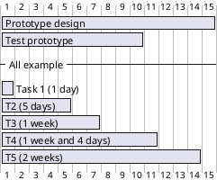

# Prova Gantt
!(Gantt)[http://www.plantuml.com/plantuml/png/PO_13e8m44JlVCKSyT144Exu1nwy4G-RT4CCjH1s4-NlRQdK68_JDs-QxKHfqO6yQj5VbaadNMU6PRaF_WP7eeAgXQLLYlxAefZtLiR7X8t1sJdmYnwpOnWJ198H5SegDWvPY2d06cLQpYH_T8hEatdCACM0cXs1l4NpE_17Wj2YhBVdR-sJYuwztOv_0m00.png]

